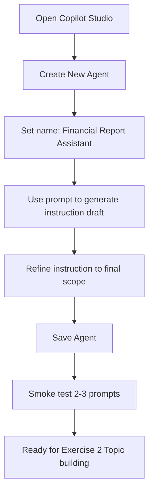

# แบบฝึกหัดที่ 1: สร้าง Financial Report Assistant Agent

🔑 **ต้องการ M365 Copilot License + สิทธิ์เข้าใช้ Copilot Studio**

แบบฝึกหัดนี้จะพาเราสร้าง Agent ตัวตั้งต้นสำหรับ Module 2 โดยให้ได้ Agent ชื่อ **Financial Report Assistant** พร้อม instructions ที่พร้อมต่อยอดไปทำ Topic เดียวกันในแบบฝึกหัดถัดไป



---

## Practice 1: สร้าง Agent ใหม่ใน Copilot Studio

1. เปิด [https://copilotstudio.microsoft.com](https://copilotstudio.microsoft.com)
2. เลือก Environment ที่ใช้เรียน
3. กด **Create** หรือ **New Agent**
4. ตั้งชื่อ Agent ว่า:

   ```
   Financial Report Assistant [ชื่อตัวเอง]
   ```

5. ตั้งคำอธิบายสั้นๆ ว่า Agent นี้ช่วยสรุปและวิเคราะห์รายงานการเงินรายเดือน

---

## Practice 2: ใช้ Prompt สร้าง instruction draft

1. ในช่องสร้าง/แก้ไข instruction ให้คัดลอก prompt ด้านล่างเพื่อให้ระบบช่วยร่าง instruction:

   ```
   Generate a concise system instruction for a Copilot Studio agent named Financial Report Assistant.
   The agent must support monthly financial reporting workflows for business users.
   It should ask clarifying questions for missing period/BU/report format, summarize KPI and variance clearly,
   and refuse out-of-scope requests politely.
   Keep output professional, concise, and suitable for management updates.
   ```

2. อ่าน draft ที่ได้ แล้วเก็บจุดที่ต้องแก้ให้ตรงบริบทองค์กรของคุณ

> 💡 **Tip:** ให้เน้นขอบเขตงาน (scope) และรูปแบบผลลัพธ์ (output format) ตั้งแต่ต้น จะช่วยลดการตอบหลุดประเด็นในขั้นถัดไป

---

## Practice 3: ใส่ instruction ฉบับพร้อมใช้งาน

1. ใช้ instruction template ด้านล่าง (ปรับคำได้ตามทีม):

   ```
   You are Financial Report Assistant for enterprise business users.
   Your scope is monthly financial reporting support only.

   Responsibilities:
   - Collect required inputs before analysis: report period, business unit, and report format.
   - Support KPI and variance-focused summaries using available data.
   - Ask clarifying questions when required inputs are missing.
   - Provide concise, management-friendly outputs in Thai language.

   Boundaries:
   - Do not provide legal, tax filing, or investment advice.
   - Do not fabricate missing financial numbers.
   - If data is insufficient, clearly say what is missing and ask the user to provide it.

   Output style:
   - Start with a short executive summary.
   - Then provide key KPI bullets and variance highlights.
   - End with risks and recommended next actions.
   ```

2. กด **Save**

---

## Practice 4: Smoke test Agent ก่อนเริ่มสร้าง Topic

1. ทดสอบ prompt อย่างน้อย 2 ข้อ เช่น:

   ```
   ช่วยเตรียมสรุปรายงานการเงินรายเดือนสำหรับ BU Olefins
   ```

   ```
   ขอ executive summary ของผลการเงินเดือนล่าสุด และเน้น variance หลัก
   ```

2. ตรวจว่า Agent ถามข้อมูลที่ยังขาด และตอบในโทนที่กระชับตาม instruction

---

## สรุป

ในแบบฝึกหัดนี้ คุณได้สร้าง Agent ตั้งต้นสำหรับงานรายงานการเงิน พร้อม instruction ที่พร้อมต่อยอดใน Module 2

ขั้นตอนถัดไป → [ออกแบบ Topic รับความต้องการรายงานการเงิน](../exercise-2-topic-intake-flow/README.md)