# แบบฝึกหัดที่ 2: ออกแบบ Topic รับความต้องการรายงานการเงิน

🔑 **ต้องการ M365 Copilot License + สิทธิ์เข้าใช้ Copilot Studio**

แบบฝึกหัดนี้จะพาเราสร้าง Topic แรกของ **Financial Monthly Report Agent** เพื่อรับข้อมูลจากผู้ใช้ให้ครบก่อนเริ่มวิเคราะห์ เช่น เดือน, หน่วยงาน, และเป้าหมายรายงาน และจะเป็นฐานเดียวกันที่เราเอาไปต่อยอดในแบบฝึกหัดถัดไป

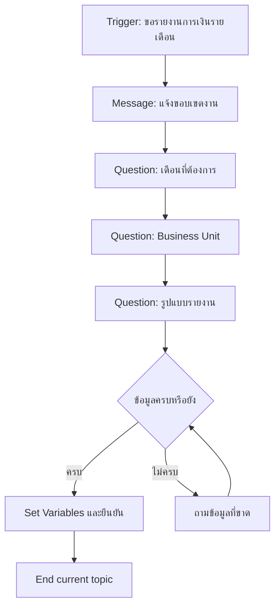

---

## Practice 1: สร้าง Topic และตั้ง Description สำหรับ Trigger

1. เข้า [https://copilotstudio.microsoft.com](https://copilotstudio.microsoft.com) แล้วเปิด Agent ของคุณ
2. ไปที่ **Topics** และกด **Add a topic** เลือก **Blank Topic**
   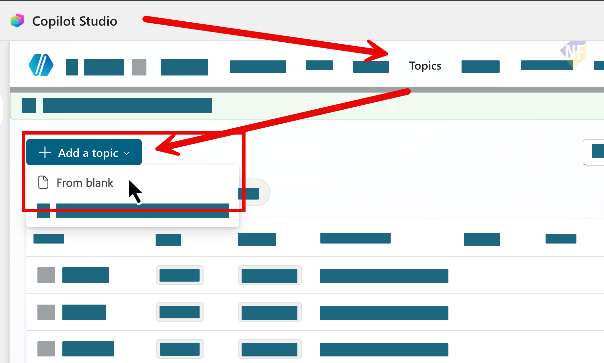
3. หลังจากนั้น ด้านบนขวา ให้คลิกตั้งชื่อ Topic ว่า `Monthly Report Intake`
   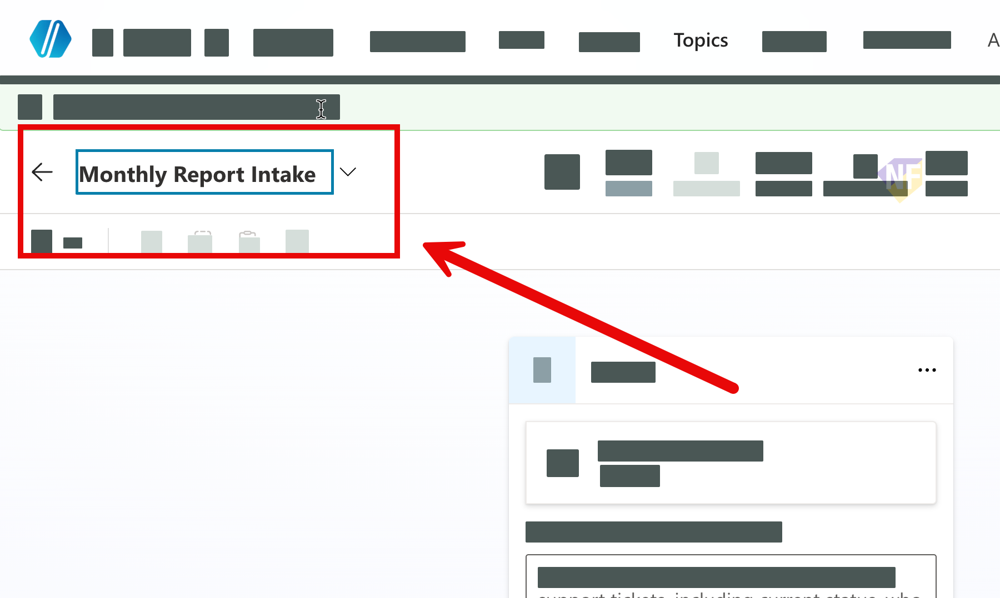
4. ลงมาที่ Trigger node และใส่ Description prompt เพื่อช่วยให้ Agent เลือก Topic นี้ได้แม่นขึ้น เช่น:

   ```
   Use this topic when the user asks for a monthly financial report or a financial summary for any Business Unit (BU).
   The user may provide incomplete details, such as missing month, BU name, or preferred report format.
   Typical requests include: "Please summarize the monthly financial report", "I need this month's report for BU GC", "Can you give me a monthly financial summary?"
   ```
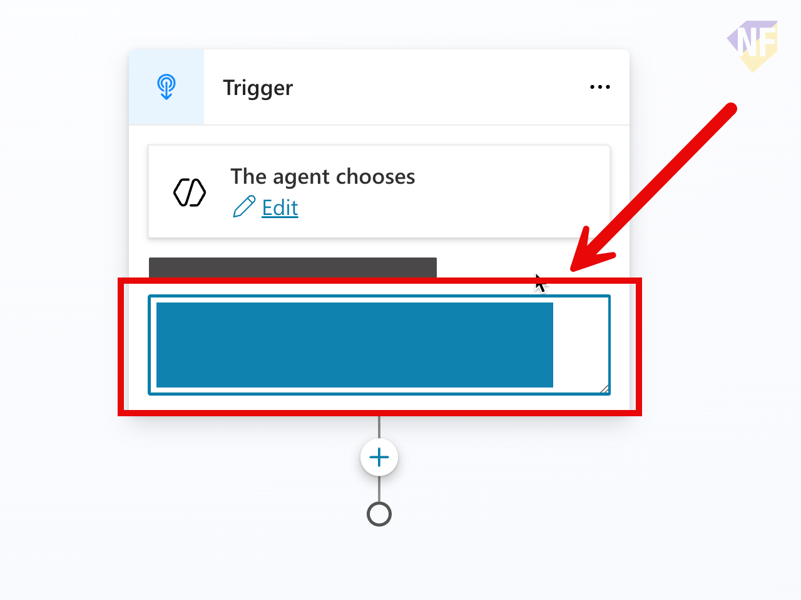

5. กดปุ่ม **Save** ด้านบนขวาเพื่อบันทึกการเปลี่ยนแปลงทั้งหมด
6. ทดสอบ prompt 

   ```
   ช่วยเตรียมสรุปรายงานการเงินรายเดือนสำหรับ BU Olefins
   ```
7. ตรวจสอบว่า Agent มีการเลือก Topic นี้หรือไม่

> 💡 **Tip:** ใน Description ให้ระบุเจตนาของผู้ใช้อย่างชัดเจน ระบุข้อมูลที่มักยังขาด (เดือน, BU, รูปแบบรายงาน) และใส่ตัวอย่างคำขอที่หลากหลาย 2-3 แบบ เพื่อช่วยให้ Agent เลือก Topic นี้ได้แม่นยำขึ้น

---

## Practice 2: ส่งข้อความแจ้งขอบเขตงานด้วย Message node

1. ด้านล่าง Trigger node ให้คลิกปุ่ม **+** แล้วเลือก **Send a message** node
   
2. เพิ่ม **Message** node เพื่อบอกผู้ใช้ว่า Agent จะเก็บข้อมูลก่อนสร้างรายงาน
3. คลิกที่ชื่อด้านบนของ Message node แล้วตั้งชื่อว่า 
   ```
   Inform about data collection
   ```
4. ในช่อง Message ให้ใส่ข้อความด้านล่างเพื่อแจ้งผู้ใช้
   ```
   ก่อนที่ฉันจะช่วยสรุปรายงานการเงินได้ ฉันขอเก็บข้อมูลเพิ่มเติมนิดหน่อยนะคะ
   ```
   

---

## Practice 3: ออกแบบคำถามเก็บข้อมูลด้วย Question node


1. จากด้านล่างของ Message node ให้กด **+** แล้วเลือก **Ask a question** node สำหรับคำถามข้อที่ 1 เพื่อถามเรื่องเดือนหรือช่วงเวลา
2. คลิกที่ชื่อด้านบนของ Question node แล้วตั้งชื่อว่า 
   ```
   Ask for report period
   ```
3. ใช้ข้อความด้านล่างสำหรับ ช่อง Message เพื่อแสดงขึ้นมาเป็นคำถาม

   ```
   ต้องการรายงานของเดือนไหน หรือช่วงเวลาไหนคะ
   ```
4. ให้เลือกประเภทการเก็บข้อมูลที่ลูกค้ากรอกเป็น **User's entire response** โดยเลือกจากส่วนที่ชื่อ **Identify** > กรอกคำว่า **User** ลงไปในช่องค้นหา และเลือก **User's entire response** 

   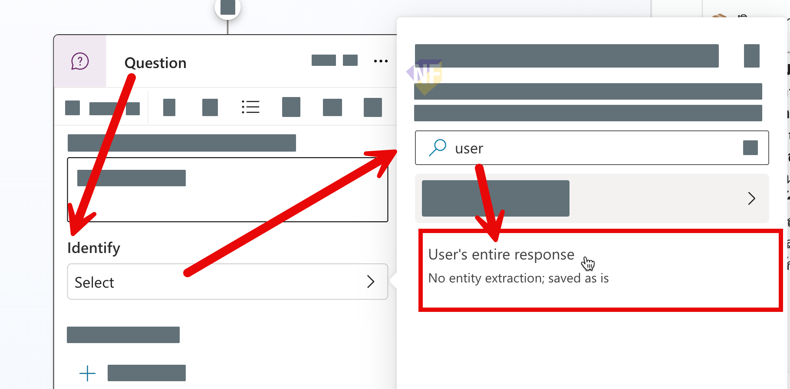

5. บันทึกคำตอบไว้ในตัวแปร โดยคลิกเลือก Save User's response as แล้วกรอกชื่อ `ReportPeriod` ลงไปในช่อง Variable name (ให้แน่ใจว่าในส่วนของ Usage เลือกเป็น **Topic** เพื่อให้ตัวแปรนี้ใช้ได้เฉพาะใน Topic นี้)
   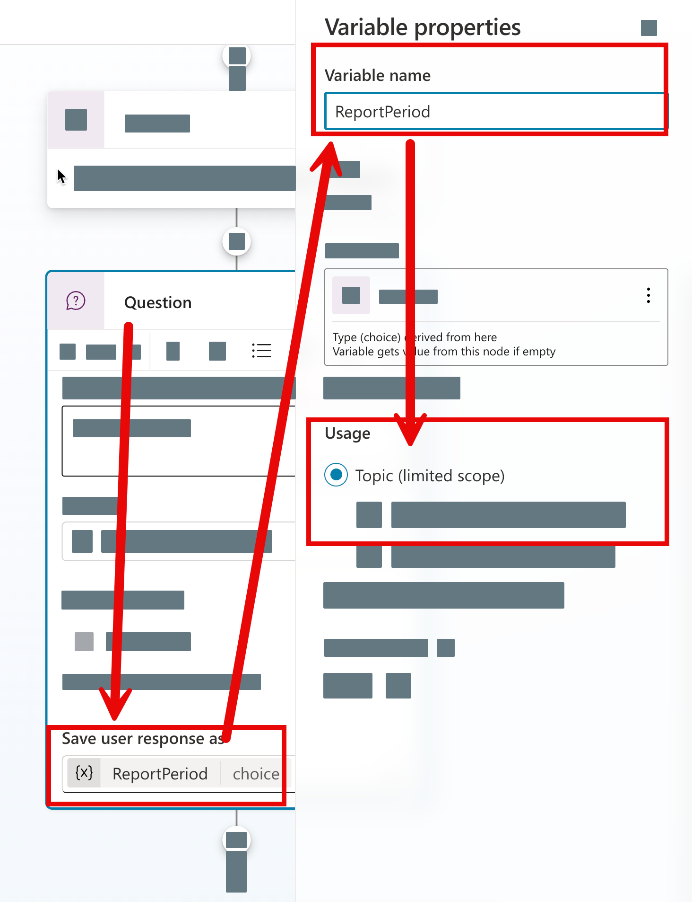

6. กดปุ่ม **Save** ด้านบนขวาเพื่อบันทึกการเปลี่ยนแปลงทั้งหมด

---

## Practice 4: เพิ่มคำถามเก็บข้อมูลอื่นๆ

1. จาก Question node ข้อแรก ให้กด **+** แล้วเลือก **Ask a question** node สำหรับคำถามข้อที่ 2 เพื่อถามชื่อหน่วยงานหรือ Business Unit และบันทึกคำตอบไว้ในตัวแปร `BusinessUnit`
   ### Node name:
   ```
   Ask for Business Unit
   ```
   ### Message:
   ```
   ต้องการรายงานของ Business Unit หรือ BU ไหนคะ
   ```
   ### Identify:
   ```
   User's entire response
   ```
   ### Variable:
   ```
   BusinessUnit
   ```

2. จาก Question node ข้อที่ 2 ให้กด **+** แล้วเลือก **Ask a question** node สำหรับคำถามข้อที่ 3 เพื่อถามรูปแบบผลลัพธ์ที่ต้องการ และบันทึกคำตอบไว้ในตัวแปร `ReportFormat`
   ### Node name:
   ```
   Ask for report format
   ```
   ### Message:
   ```
   ต้องการให้สรุปผลลัพธ์ในรูปแบบใดคะ: Executive summary, KPI summary หรือ Detailed
   ```
   ### Identify:
   ```
   User's entire response
   ```
   ### Variable:
   ```
   ReportFormat
   ```

3. ตรวจสอบว่าแต่ละ Question node บันทึกคำตอบลงในตัวแปรให้ถูกต้อง ดังนี้:
   - `ReportPeriod`
   - `BusinessUnit`
   - `ReportFormat`

4. กดปุ่ม **Save** ด้านบนขวาเพื่อบันทึกการเปลี่ยนแปลงทั้งหมด

---

## Practice 5: เช็คความครบถ้วนกับผู้ใช้ด้วย Condition node


1. จาก node ล่าสุดที่สร้างขึ้น ให้กด **+** แล้วเลือก **Add a condition** node
2. คลิกชื่อ node ด้านบนเพื่อตั้งชื่อ Condition node ว่า 
   ```
   Check if all info is collected
   ```
3. คลิกเลือก **Select a variable** เพื่อเลือกตัวแปรที่เราสร้างไว้ใน Question node ก่อนหน้านี้ 
   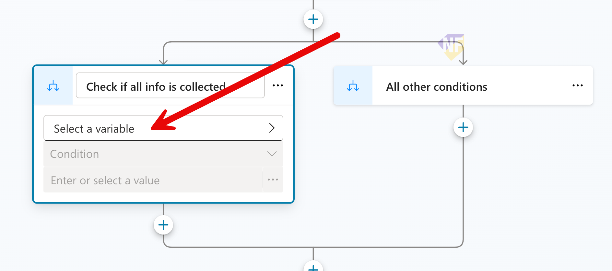

4. เลือกตัวแปร `Topic.BusinessUnit` มาเช็คก่อนว่าได้ข้อมูลเดือนหรือช่วงเวลามาหรือยัง โดยตั้งเงื่อนไขว่า ถ้า `Topic.BusinessUnit` ตรวจเงื่อนไขเป็น "is not Blank" 
   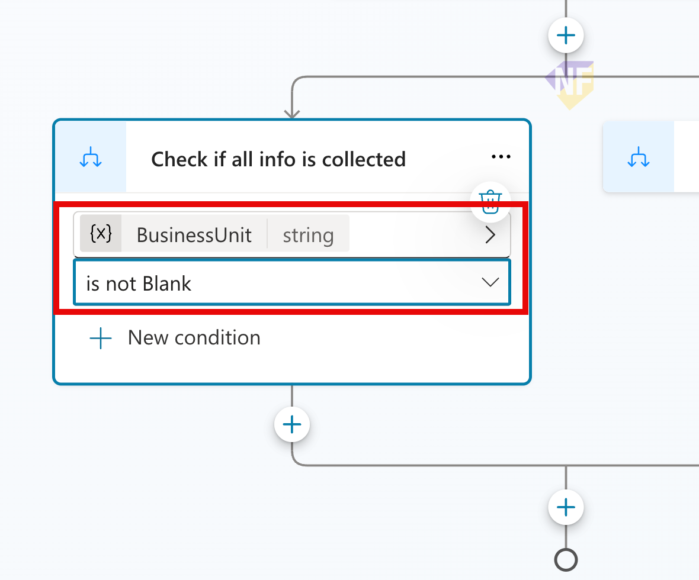
5. กดเลือก **+ New Condition** ด้านล่างของตัวแปรแรกใน Condition node เพื่อเพิ่มตัวแปรที่เหลือคือ `Topic.ReportPeriod` และ `Topic.ReportFormat` ตรวจเงื่อนไขเป็น "is not Blank" เช่นเดียวกัน
   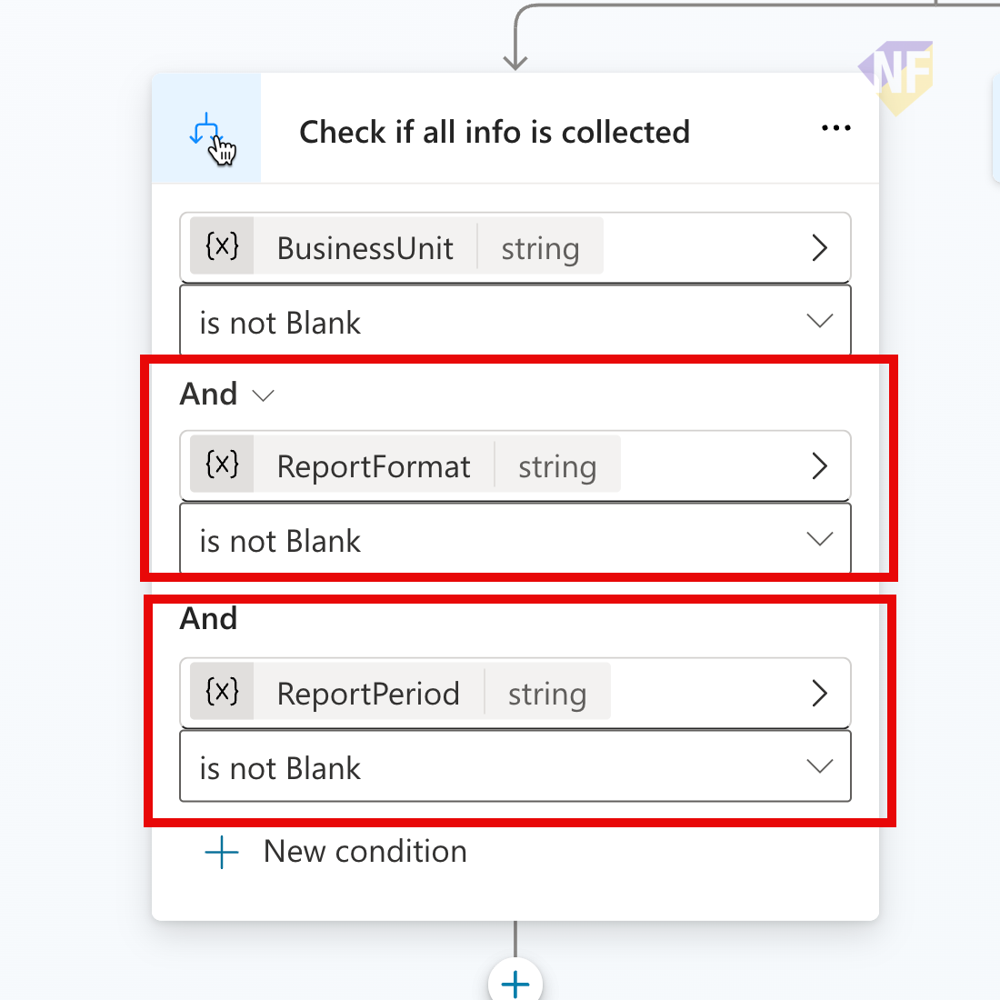
> 💡 **Tip:** การเช็คเงื่อนไขแบบนี้จะช่วยให้เรารู้ว่าข้อมูลส่วนไหนยังขาดอยู่ และสามารถส่งผู้ใช้กลับไปเติมข้อมูลที่ขาดได้อย่างตรงจุดมากขึ้น

> 💡 **Tip:** สามารถกำหนดเงื่อนไขการพิจารณาแบบ And หรือ Or ได้
   
6. ถ้าข้อมูลยังไม่ครบ (มีตัวใดตัวหนึ่งว่างหรือขาด) ให้ส่งผู้ใช้กลับไปเติมข้อมูลที่ขาด ตั้งแต่เริ่มต้น
7. ในฝั่ง All other conditions ให้คลิกปุ่ม **+** > **Topic management** > **Go to step** แล้วคลิกเลือก Node ที่ชื่อ **Ask for report period** เพื่อเชื่อมต่อกลับไปที่ Message node ที่แจ้งขอบเขตงาน (Inform about data collection) เพื่อให้ Agent แจ้งผู้ใช้และถามข้อมูลใหม่ทั้งหมดอีกครั้ง
   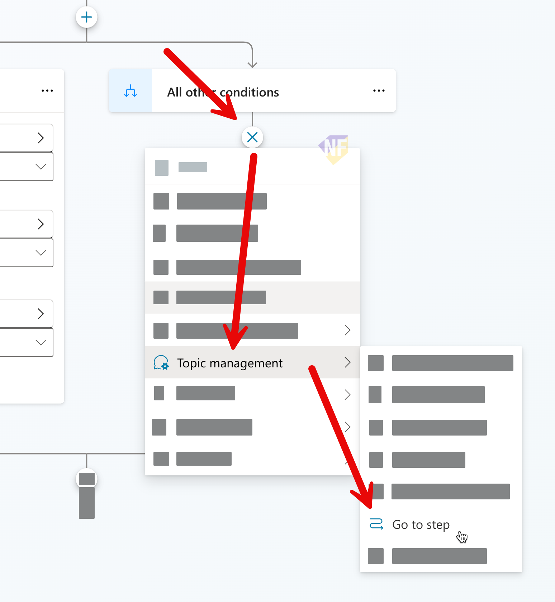
8. ในขณะเดียวกันถ้าข้อมูลครบ ให้เพิ่ม **Message** node ยืนยันค่าทั้งหมดก่อนจบ Topic

   ```
   รับข้อมูลเรียบร้อย: เดือน = {Topic.ReportPeriod}, BU = {Topic.BusinessUnit}, รูปแบบ = {Topic.ReportFormat}
   ```
   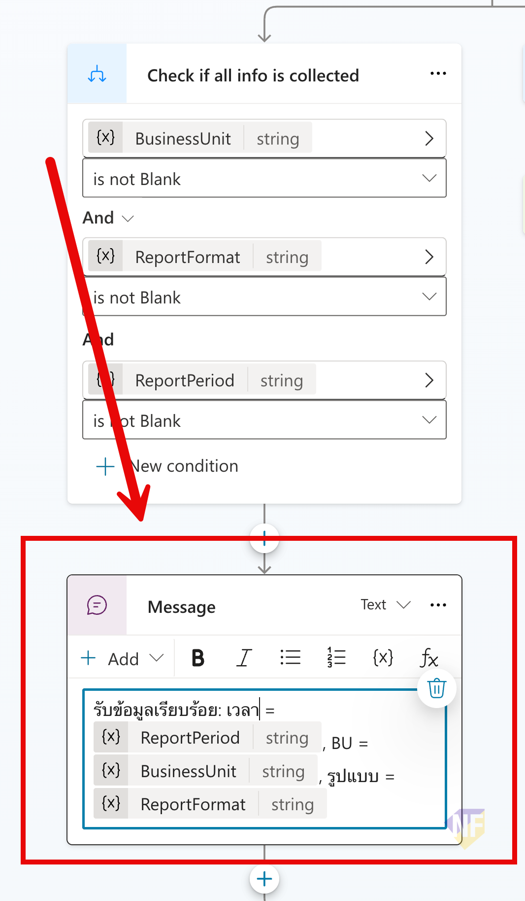
> ⚠️ **Note:** หากคำตอบผู้ใช้มีโอกาสชนกับ Trigger ของ Topic อื่น ให้ปรับ Question node interruption behavior ตามความเหมาะสม

## Practice 6: End current topic หลังจากยืนยันข้อมูลครบถ้วน

1. จาก Message node ที่ยืนยันข้อมูลครบถ้วน ให้กด **+** แล้วเลือก **Topic management** > **End current topic** เพื่อจบเส้นทางของ Topic นี้หลังจากที่ได้รับข้อมูลครบถ้วนแล้ว
   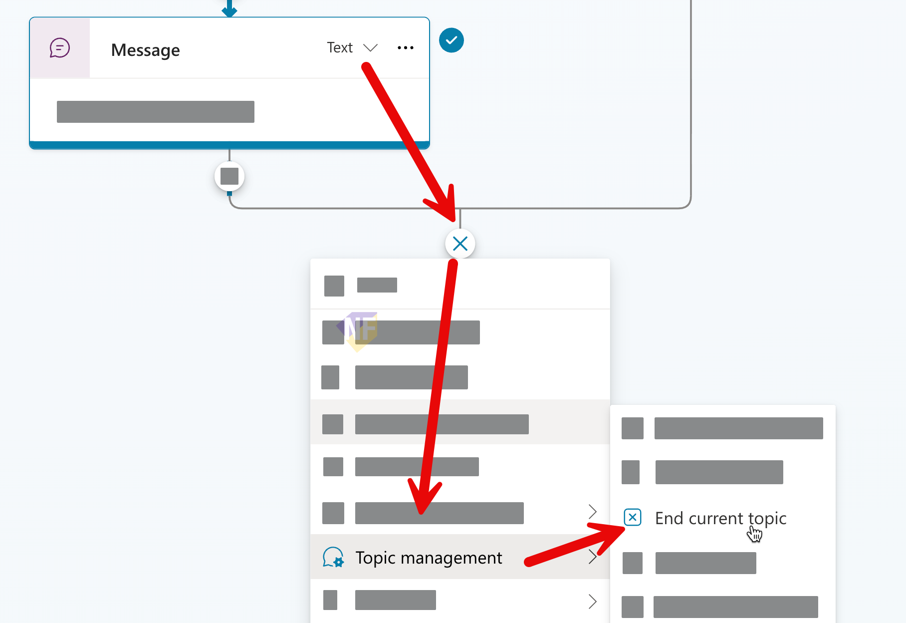
2. กดปุ่ม **Save** ด้านบนขวาเพื่อบันทึกการเปลี่ยนแปลงทั้งหมด

---

# Practice 7: ปรับ instructions ของ Agent ให้เรียกใช้งาน topic เมื่อตรงตามเงื่อนไข

1. ไปที่หน้า **Overview** ของ Agent แล้วลงมาด้านล่างที่ **Instructions**
2. กดปุ่ม **Edit** เพื่อแก้ไข Instructions
3. ด้านท้ายของ Instructions ให้เพิ่มข้อความเพื่อบอก Agent ว่าเมื่อใดควรเรียกใช้ Topic ที่เราสร้างขึ้น เช่น:

   ```
   - If User ask for monthly report analysis use 
   ```
4. พิมพ์ '/' และเลือก Topic ที่เราสร้างขึ้น `Monthly Report Intake` เพื่อให้ Agent เรียกใช้ Topic นี้เมื่อตรงกับเงื่อนไขที่เรากำหนดไว้ใน Description ของ Trigger
5. ดูตัวอย่างดังภาพ
   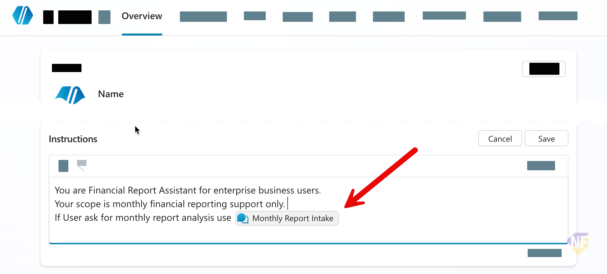
6. กดปุ่ม **Save** เพื่อบันทึกการเปลี่ยนแปลง


---

## Practice 8: ทดสอบ Topic รอบแรก

1. เปิดหน้าต่าง **Test** ด้านขวา
2. ทดสอบด้วยคำสั่ง:

   ```
   ช่วยทำรายงานการเงินรายเดือน
   ```

3. ตรวจสอบว่า Agent ถามข้อมูลที่ขาดครบและดำเนินการตาม node flow ที่อยู่ใน Topic หรือไม่
4. บันทึกสิ่งที่ต้องปรับ 2-3 จุด เช่น คำถามไม่ชัด, ตัวแปรชื่ออ่านยาก

---

## สรุป

ในแบบฝึกหัดนี้ คุณได้สร้าง Topic intake สำหรับงานรายงานการเงิน โดยใช้ Trigger, Question, Variable, และ Condition node ครบเส้นทางพื้นฐาน

ขั้นตอนถัดไป → [เชื่อมข้อมูล Excel และเรียก Action วิเคราะห์](../exercise-3-excel-analysis-action/README.md)