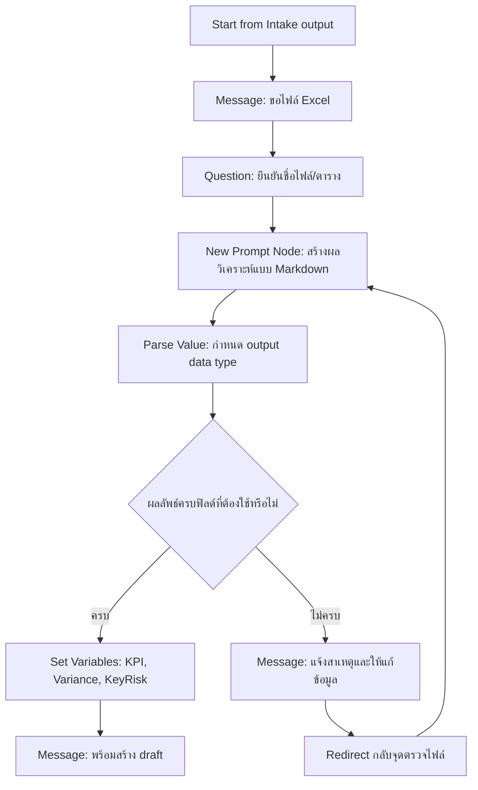
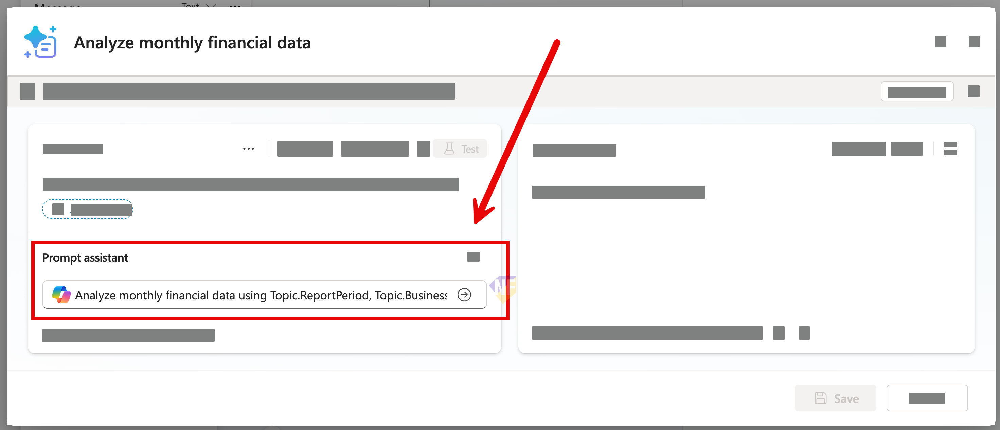
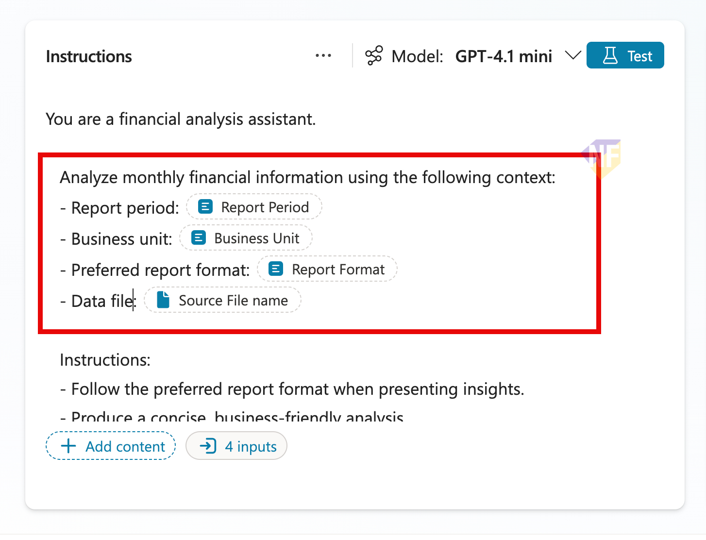
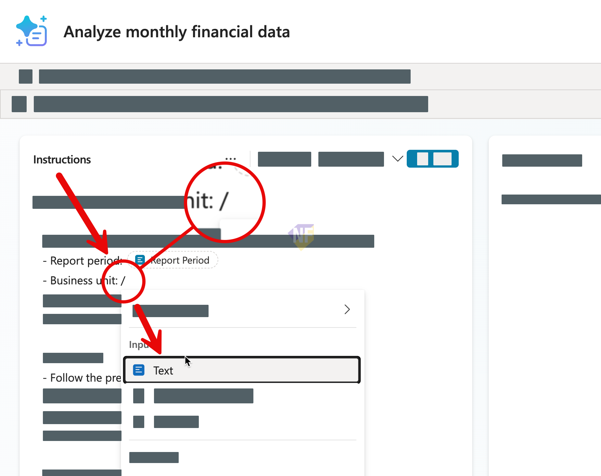
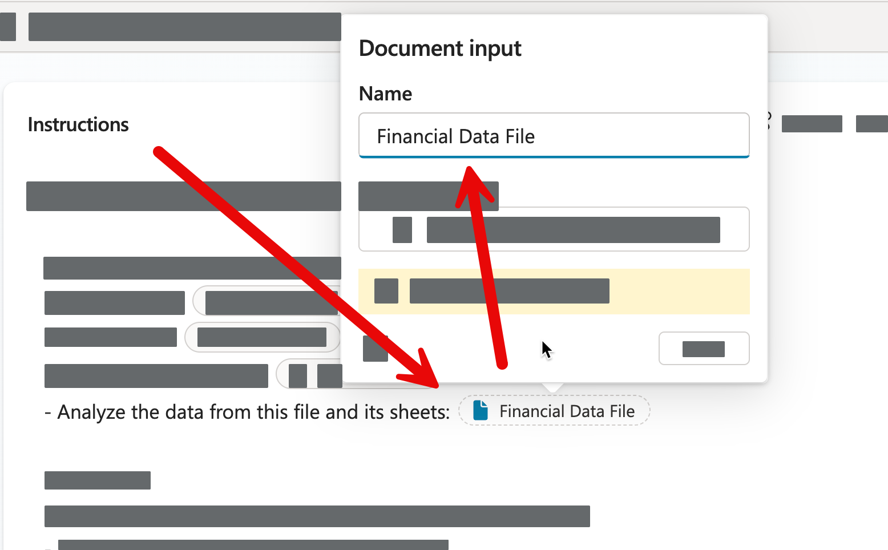
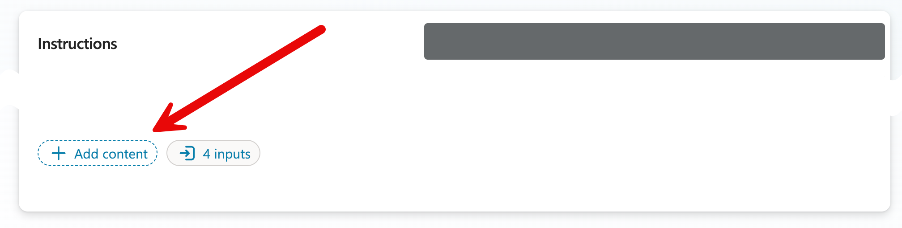
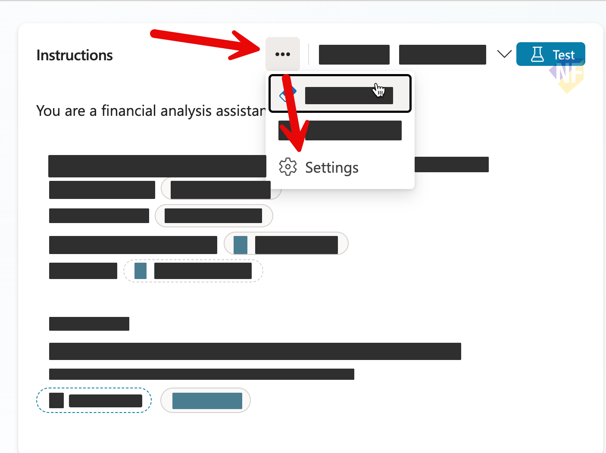
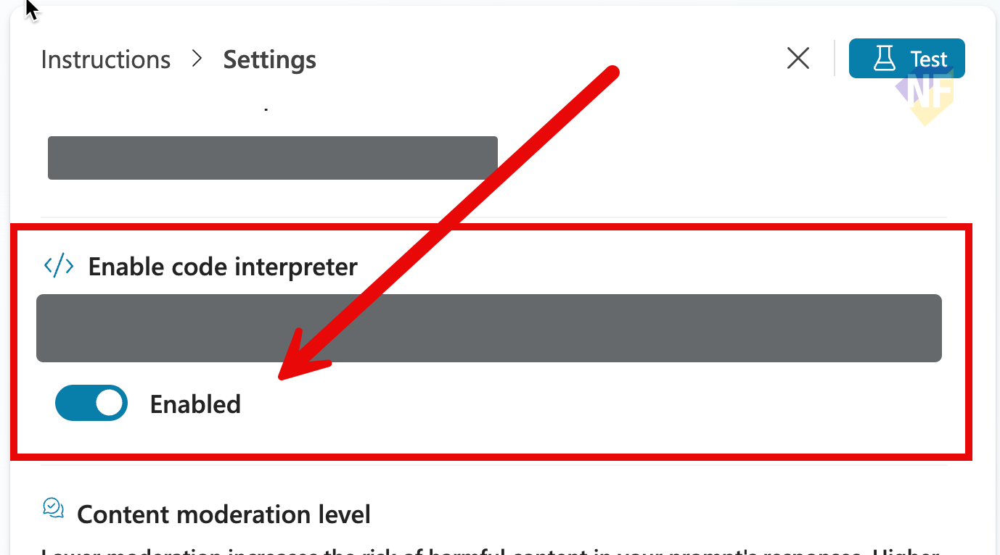

# แบบฝึกหัดที่ 3: เชื่อมข้อมูล Excel และใช้ New Prompt node วิเคราะห์

🔑 **ต้องการ M365 Copilot License + สิทธิ์เข้าใช้ Copilot Studio**

หลังจากได้ข้อมูลความต้องการรายงานแล้ว แบบฝึกหัดนี้จะให้เราเพิ่ม **New Prompt node** เข้าไปใน Topic เดิม เพื่อวิเคราะห์ข้อมูลจากไฟล์ Excel ที่ผู้ใช้อัปโหลด และจัดการเส้นทางสำเร็จ/ไม่สำเร็จด้วย Condition

## เตรียมไฟล์ที่ใช้ในแบบฝึกหัด

1. ใช้ไฟล์ตัวอย่างจาก repository นี้:
   - [../../../files/module-2/CPALL-Monthly-Financial-Report-May2026.xlsx](../../../files/module-2/CPALL-Monthly-Financial-Report-May2026.xlsx)
2. ตรวจสอบว่าไฟล์มี 4 sheets ต่อไปนี้:
   - `Summary`
   - `Revenue`
   - `Costs`
   - `Variance_Analysis`

> ⚠️ **Note:** ถ้า environment ของคุณไม่สามารถอัปโหลด `.xlsx` ได้ ให้ทดสอบ flow โดยใช้ชื่อไฟล์สมมติและจำลอง output ด้วย **Set variable value** node แทน



---

## Practice 1: เตรียมเส้นทางรับไฟล์และยืนยันข้อมูล

1. เปิด Topic `Monthly Report Intake` ที่สร้างจากแบบฝึกหัดก่อนหน้า แล้วเพิ่ม node ต่อจาก flow เดิม
2. จากฝั่งของ Condition Node ที่ได้รับข้อมูลครบถ้วน กดเพิ่ม **Question** node และกำหนดรายละเอียดดังนี้:
   
   ### Node name:
   ```
   Ask for Excel file 
   ```
   ### Message:
   ```
   กรุณาอัปโหลดไฟล์ Excel ที่มีข้อมูลการเงิน
   ```
   ### Identify:
   ```
   File
   ```
   ### Variable name:
   ```
   SourceFileName
   ```


---

## Practice 2: เพิ่ม New Prompt node เพื่อวิเคราะห์ข้อมูล

1. จาก node ล่าสุด ให้กด **+** แล้วเพิ่ม **Add a tools** > **New Prompt** node
2. หลังจากเพิ่ม Node แล้ว ให้ตั้งชื่อว่า 
   ```
   Analyze financial data
   ```
3. เข้า Prompt editor ของ node นี้ แล้วสังเกตส่วนที่ชื่อ **Prompt assistant**
   
4. ศึกษาและใช้ prompt ด้านล่างนี้ใน Prompt assistant และกดส่ง prompt:

   ```
   Analyze monthly financial data in the uploaded file, using ReportPeriod, BusinessUnit, ReportFormat as context. Return Markdown only. First provide a short Word-ready summary. Then append valid JSON with: TotalRevenue (number), TotalCost (number), VariancePercent (number), KeyRisk (string). If data is missing, state what is missing and return null values in JSON.
   ```

5. ตรวจสอบผลลัพธ์ของการสร้าง prompt ถ้า prompt ที่สร้างมีตัวแปร input ดังภาพ (แต่ไม่จำเป็นต้องมี เราสามารถใส่เพิ่มเองได้ในขั้นตอนถัดไป)
   
6. ไม่ว่าจะได้ prompt แบบไหน หลังจาก Assistant สร้าง prompt แล้ว **ให้ใช้ prompt ด้านล่างนี้ เพื่อให้เหมือนกันในการทำ exercise**:

   ```text
   You are a financial analysis assistant.

   Analyze monthly financial information using the following context:
   - Report period: {{Topic.ReportPeriod}}
   - Business unit: {{Topic.BusinessUnit}}
   - Preferred report format: {{Topic.ReportFormat}}
   - Analyze financial data from this file and its sheets: {{Topic.SourceFileName}}

   Instructions:
   - Follow the preferred report format when presenting insights.
   - Produce a concise, business-friendly analysis.
   - Identify key variance drivers and one key risk.
   - If data is incomplete, explicitly state assumptions.

   Output format rules:
   - Return Markdown only.
   - Use this structure:

   ## Monthly Financial Analysis
   - **Report Period:** <value>
   - **Business Unit:** <value>
   - **Report Format:** <value>

   ### KPI Summary
   - **Total Revenue:** <number>
   - **Total Cost:** <number>
   - **Variance Percent:** <number>%

   ### Key Risk
   - <short risk statement>

   ### Notes
   - <assumptions or missing-data notes>

   ```

7. จากข้อความ Prompt ให้ค่อยๆ แก้ส่วนที่เป็นเครื่องหมาย `{{...}}` ให้เป็นชื่อตัวแปรที่เราสามารถส่งค่าจาก Topic เข้ามาได้ เช่น `{{Topic.ReportPeriod}}` ให้แก้เป็น `Report period` โดยทำตามขั้นตอนด้านล่างตามลำดับ
   1. เลือกข้อความ `{{...}}` และพิมพ์ `/` แทนที่
   2. จากเมนูเลือก **Text**
   3. พิมพ์ชื่อ Report period และกด enter
   4. ทำซ้ำกับข้อความที่เหลือ โดยตั้งชื่อตามลำดับดังนี้ 
      1. `{{Topic.ReportPeriod}}` → `Report period`
      2. `{{Topic.BusinessUnit}}` → `Business unit`
      3. `{{Topic.ReportFormat}}` → `Preferred report format`
   
   
8. สำหรับตัวแปร `{{Topic.SourceFileName}}` ให้แก้เป็น `Financial data file` โดยทำตามขั้นตอนเดียวกันกับด้านบน แต่ให้เลือกประเภทตัวแปรเป็น **File** แทน Text
   

> 💡 **Tip:** เราสามารถใช้ปุ่ม **+ Add Content** ในการกำหนดตัวแปร input ต่างๆ ได้เช่นกัน
> 


9. จากด้านบนของ Instructions ให้กดปุ่ม More options (...) แล้วเลือก **Setting** 
   
10. เปิดตัวเลือก **Code Interpreter** และกดปุ่ม **x** เพื่อปิดหน้าต่าง Setting
    

11. ให้สังเกตปุ่มที่แสดงจำนวน input ด้านล่างนี้ ซึ่งจะบอกเราว่าตอนนี้ prompt นี้มีตัวแปร input อะไรบ้าง ถ้ากดดูก็จะสามารถบอกได้ว่าเป็นประเภทไหน (Text, File ฯลฯ) ในที่นี้ให้กดเปิด และเลือกใส่ค่าทดสอบสำหรับตัวแปร input ทั้งหมดเพื่อทดสอบ prompt นี้ก่อน เช่น
    - Report period: `May 2026`
    - Business unit: `Olefins`
    - Preferred report format: `Executive Summary`
    - Financial data file: อัปโหลดไฟล์ `CPALL-Monthly-Financial-Report-May2026.xlsx` 
12. กดปิดหน้าต่าง input แล้วกด **Save** เพื่อบันทึก prompt นี้
13. กดปุ่ม Test ด้านบนขวาใน Prompt editor เพื่อทดสอบ prompt นี้ด้วยค่าที่ใส่ไว้ในขั้นตอนที่แล้ว
14. ตรวจสอบผลลัพธ์ที่ได้ว่ามีทั้งส่วนสรุปครบถ้วนตาม prompt หรือไม่

> ⚠️ **Note:** ในการทดสอบครั้งแรก อาจจะได้ผลลัพธ์ที่ไม่สมบูรณ์หรือมีข้อความแจ้งว่าข้อมูลไม่ครบ ซึ่งเป็นไปตามเงื่อนไขใน prompt ที่เราตั้งไว้ ให้ทดสอบปรับ Model ให้มีขนาดใหญ่ถึง เช่นจาก GPT-4mini เป็น GPT-4.1 เพื่อดูว่าผลลัพธ์มีความสมบูรณ์มากขึ้นหรือไม่

1.  หลังจากได้ผลลัพธ์ที่ต้องการแล้ว ให้กด **Save** เพื่อกลับไปที่หน้า Topic flow

---

## Practice 3: กำหนด output data type ของ node (Parse value)

1. เพิ่ม **Parse value** node ถัดจาก New Prompt node
2. เลือก input เป็น output text ของ Prompt node
3. ใน Parse value ให้เลือก **Get schema from sample JSON** แล้ววางตัวอย่าง:

   ```json
   {
     "TotalRevenue": 120000000,
     "TotalCost": 98000000,
     "VariancePercent": 4.7,
     "KeyRisk": "Energy cost volatility may impact next-month margin."
   }
   ```

4. ตรวจว่าฟิลด์ถูกสร้างเป็นชนิดข้อมูลที่ใช้ต่อได้ (`number`, `number`, `number`, `string`)
5. map output ที่ parse แล้วกลับเข้า Topic variables:
   - `Topic.TotalRevenue`
   - `Topic.TotalCost`
   - `Topic.VariancePercent`
   - `Topic.KeyRisk`

> ⚠️ **Note:** ถ้าไม่ใช้ Parse value ให้ parse แบบข้อความล้วนได้ แต่มีความเสี่ยงที่รูปแบบเลขไม่สม่ำเสมอและทำให้เงื่อนไขในขั้นถัดไปตรวจสอบยากขึ้น

---

## Practice 4: จัดการผลลัพธ์สำเร็จ/ล้มเหลว

1. เพิ่ม **Condition** node เพื่อตรวจว่าผลลัพธ์ที่ต้องใช้ครบหรือไม่ (แทนการตรวจ status ของ Tool)
2. ตัวอย่างเงื่อนไขฝั่งสำเร็จ:
   - `Topic.TotalRevenue` is not blank
   - `Topic.TotalCost` is not blank
   - `Topic.VariancePercent` is not blank
   - `Topic.KeyRisk` is not blank
3. กรณีสำเร็จ:
   - ส่ง Message สรุปตัวเลขหลัก
   - บอกผู้ใช้ว่า Agent พร้อมสร้าง draft รายงาน
4. กรณีไม่สำเร็จ:
   - ส่ง Message อธิบายสาเหตุ (เช่น format ไม่ถูกต้อง)
   - แนะนำขั้นตอนแก้ไข
   - Redirect กลับไปถามข้อมูลไฟล์อีกครั้ง

---

## Practice 5: ทดสอบกรณีสำเร็จและกรณีผิดพลาด

1. ทดสอบเคสสำเร็จด้วยคำสั่ง:

   ```
   วิเคราะห์ไฟล์ CPALL-Monthly-Financial-Report-May2026.xlsx เดือน May ของ BU Olefins แล้วสรุป KPI ให้หน่อย
   ```

2. ทดสอบเคสผิดพลาดด้วยการใส่ชื่อไฟล์ที่ไม่มีอยู่ หรือส่งข้อมูลไม่ครบ
3. ตรวจว่า output เป็น Markdown ที่คัดลอกไป Word ได้โดยไม่เสียโครงสร้างหัวข้อ/รายการ
4. ตรวจว่า flow กลับไปถามข้อมูลใหม่ได้ และไม่จบการสนทนาแบบตัน

---

## สรุป

ในแบบฝึกหัดนี้ คุณได้เพิ่มความสามารถให้ Agent วิเคราะห์ข้อมูลด้วย New Prompt node, กำหนด output data type ด้วย Parse value, และควบคุมเส้นทางสำเร็จ/ล้มเหลวได้อย่างเป็นระบบ

ขั้นตอนถัดไป → [สร้าง Draft และ Revision Loop](../exercise-4-draft-and-revision-loop/README.md)