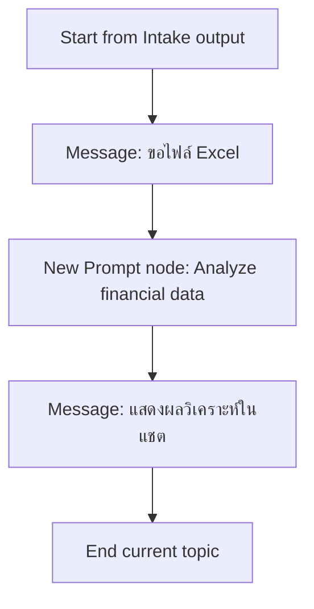
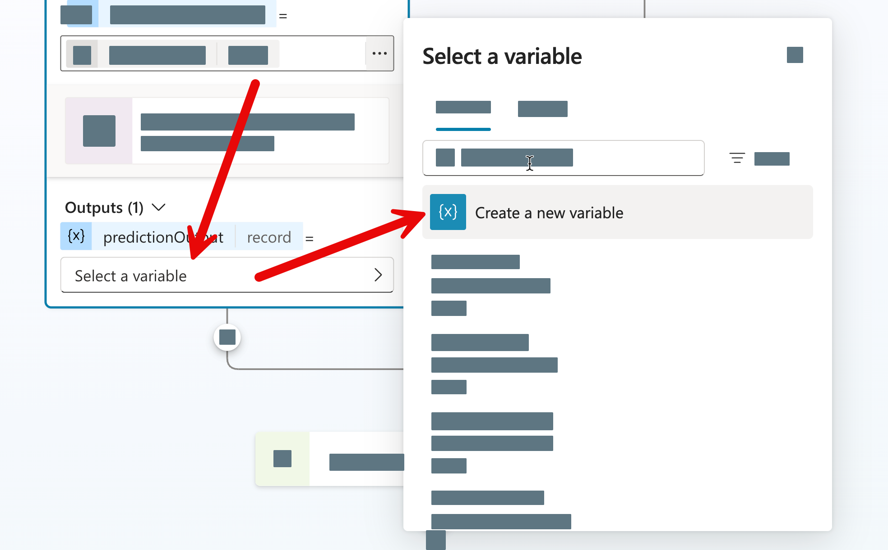
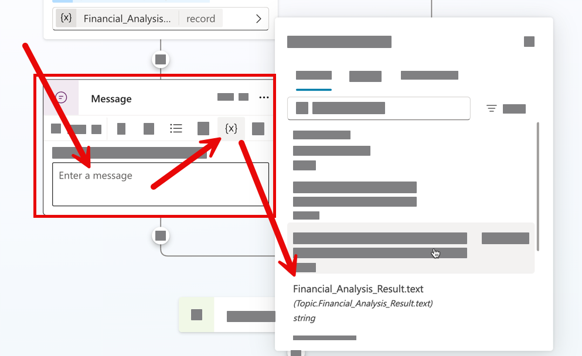

# แบบฝึกหัดที่ 3: เชื่อมข้อมูล Excel และใช้ New Prompt node วิเคราะห์

🔑 **ต้องการ M365 Copilot License + สิทธิ์เข้าใช้ Copilot Studio**

หลังจากได้ข้อมูลความต้องการรายงานแล้ว แบบฝึกหัดนี้จะให้เราเพิ่ม **New Prompt node** เข้าไปใน Topic เดิม เพื่อวิเคราะห์ข้อมูลจากไฟล์ Excel ที่ผู้ใช้อัปโหลด แล้วส่งผลลัพธ์แบบ Markdown กลับมาแสดงในแชตทันที

## เตรียมไฟล์ที่ใช้ในแบบฝึกหัด

1. ใช้ไฟล์ตัวอย่างจาก repository นี้:
   - [../../../files/module-2/CPALL-Monthly-Financial-Report-May2026.xlsx](../../../files/module-2/CPALL-Monthly-Financial-Report-May2026.xlsx)
2. ตรวจสอบว่าไฟล์มี 4 sheets ต่อไปนี้:
   - `Summary`
   - `Revenue`
   - `Costs`
   - `Variance_Analysis`

> ⚠️ **Note:** ถ้า environment ของคุณไม่สามารถอัปโหลด `.xlsx` ได้ ให้ทดสอบ flow โดยใช้ชื่อไฟล์สมมติและจำลอง output ด้วย **Set variable value** node แทน



---

## Practice 1: เตรียมเส้นทางรับไฟล์และยืนยันข้อมูล

1. เปิด Topic `Monthly Report Intake` ที่สร้างจากแบบฝึกหัดก่อนหน้า แล้วเพิ่ม node ต่อจาก flow เดิม
2. จากฝั่งของ Condition Node ที่ได้รับข้อมูลครบถ้วน กดเพิ่ม **Question** node และกำหนดรายละเอียดดังนี้:
   
   ### Node name:
   ```
   Ask for Excel file 
   ```
   ### Message:
   ```
   กรุณาอัปโหลดไฟล์ Excel ที่มีข้อมูลการเงิน
   ```
   ### Identify:
   ```
   File
   ```
   ### Variable name:
   ```
   SourceFileName
   ```


---

## Practice 2: เพิ่ม New Prompt node เพื่อวิเคราะห์ข้อมูล

1. จาก node ล่าสุด ให้กด **+** แล้วเพิ่ม **Add a tools** > **New Prompt** node
2. หลังจากเพิ่ม Node แล้ว ให้ตั้งชื่อ Prompt นี้ว่า 
   ```
   Analyze financial data from uploaded excel file
   ```
3. เข้า Prompt editor ของ node นี้ แล้วสังเกตส่วนที่ชื่อ **Prompt assistant**
   
4. ศึกษาและใช้ prompt ด้านล่างนี้ใน Prompt assistant และกดส่ง prompt:

   ```
   Analyze monthly financial data in the uploaded file, using ReportPeriod, BusinessUnit, ReportFormat as context. Return Markdown only. Start with a short Word-ready summary, then provide KPI summary, key risk, and notes about missing data or assumptions.
   ```

5. ตรวจสอบผลลัพธ์ของการสร้าง prompt ถ้า prompt ที่สร้างมีตัวแปร input ดังภาพ (แต่ไม่จำเป็นต้องมี เราสามารถใส่เพิ่มเองได้ในขั้นตอนถัดไป)
   
6. ไม่ว่าจะได้ prompt แบบไหน หลังจาก Assistant สร้าง prompt แล้ว **ให้ใช้ prompt ด้านล่างนี้ เพื่อให้เหมือนกันในการทำ exercise**:

   ```text
   You are a financial analysis assistant.

   Analyze monthly financial information using the following context:
   - Report period: {{Topic.ReportPeriod}}
   - Business unit: {{Topic.BusinessUnit}}
   - Preferred report format: {{Topic.ReportFormat}}
   - Analyze financial data from this file and its sheets: {{Topic.SourceFileName}}

   Instructions:
   - Follow the preferred report format when presenting insights.
   - Produce a concise, business-friendly analysis.
   - Identify key variance drivers and one key risk.
   - If data is incomplete, explicitly state assumptions.

   Output format rules:
   - Return Markdown only.
   - Use this structure:

   ## Monthly Financial Analysis
   - **Report Period:** <value>
   - **Business Unit:** <value>
   - **Report Format:** <value>

   ### KPI Summary
   - **Total Revenue:** <number>
   - **Total Cost:** <number>
   - **Variance Percent:** <number>%

   ### Key Risk
   - <short risk statement>

   ### Notes
   - <assumptions or missing-data notes>

   ```

7. จากข้อความ Prompt ให้ค่อยๆ แก้ส่วนที่เป็นเครื่องหมาย `{{...}}` ให้เป็นชื่อตัวแปรที่เราสามารถส่งค่าจาก Topic เข้ามาได้ เช่น `{{Topic.ReportPeriod}}` ให้แก้เป็น `Report period` โดยทำตามขั้นตอนด้านล่างตามลำดับ
   1. เลือกข้อความ `{{...}}` และพิมพ์ `/` แทนที่
   2. จากเมนูเลือก **Text**
   3. พิมพ์ชื่อ Report period และกด enter
   4. ทำซ้ำกับข้อความที่เหลือ โดยตั้งชื่อตามลำดับดังนี้ 
      1. `{{Topic.ReportPeriod}}` → `Report period`
      2. `{{Topic.BusinessUnit}}` → `Business unit`
      3. `{{Topic.ReportFormat}}` → `Preferred report format`
   
   
8. สำหรับตัวแปร `{{Topic.SourceFileName}}` ให้แก้เป็น `Financial data file` โดยทำตามขั้นตอนเดียวกันกับด้านบน แต่ให้เลือกประเภทตัวแปรเป็น **File** แทน Text
   

> 💡 **Tip:** เราสามารถใช้ปุ่ม **+ Add Content** ในการกำหนดตัวแปร input ต่างๆ ได้เช่นกัน
> 


9. จากด้านบนของ Instructions ให้กดปุ่ม More options (...) แล้วเลือก **Setting** 
   
10. เปิดตัวเลือก **Code Interpreter** และกดปุ่ม **x** เพื่อปิดหน้าต่าง Setting
    

11. ให้สังเกตปุ่มที่แสดงจำนวน input ด้านล่างนี้ ซึ่งจะบอกเราว่าตอนนี้ prompt นี้มีตัวแปร input อะไรบ้าง ถ้ากดดูก็จะสามารถบอกได้ว่าเป็นประเภทไหน (Text, File ฯลฯ) ในที่นี้ให้กดเปิด และเลือกใส่ค่าทดสอบสำหรับตัวแปร input ทั้งหมดเพื่อทดสอบ prompt นี้ก่อน เช่น
    - Report period: `May 2026`
    - Business unit: `Olefins`
    - Preferred report format: `Executive Summary`
    - Financial data file: อัปโหลดไฟล์ `CPALL-Monthly-Financial-Report-May2026.xlsx` 
12. กดปิดหน้าต่าง input แล้วกด **Save** เพื่อบันทึก prompt นี้
13. กดปุ่ม Test ด้านบนขวาใน Prompt editor เพื่อทดสอบ prompt นี้ด้วยค่าที่ใส่ไว้ในขั้นตอนที่แล้ว
14. ตรวจสอบผลลัพธ์ที่ได้ว่ามีส่วนสรุป, KPI summary, Key Risk, และ Notes ครบถ้วนตาม prompt หรือไม่

> ⚠️ **Note:** ในการทดสอบครั้งแรก อาจจะได้ผลลัพธ์ที่ไม่สมบูรณ์หรือมีข้อความแจ้งว่าข้อมูลไม่ครบ ซึ่งเป็นไปตามเงื่อนไขใน prompt ที่เราตั้งไว้ ให้ทดสอบปรับ Model ให้มีขนาดใหญ่ถึง เช่นจาก GPT-4mini เป็น GPT-4.1 เพื่อดูว่าผลลัพธ์มีความสมบูรณ์มากขึ้นหรือไม่

15. หลังจากได้ผลลัพธ์ที่ต้องการแล้ว ให้กด **Save** เพื่อกลับไปที่หน้า Topic flow
16. คลิกด้านบนของ node เพื่อตั้งชื่อ node นี้ว่า 
    ```
    Analyze financial data
    ```
17. คลิกตั้งชื่อตัวแปร Output ของ Prompt node > เลือก **Create new variable** และตั้งชื่อเป็น `FinancialAnalysisResult` เพื่อให้เราสามารถเรียกใช้ผลลัพธ์นี้ในขั้นตอนถัดไปได้


18. กด **Save** เพื่อบันทึกการเปลี่ยนแปลงทั้งหมด
---

## Practice 3: แสดงผลลัพธ์จาก Prompt node ในแชต

1. เพิ่ม **Message** node ถัดจาก New Prompt node
2. ในข้อความของ Message node ให้แทรก output ของ node `Analyze financial data` เพื่อให้ผลวิเคราะห์ที่ Prompt สร้างขึ้นถูกส่งกลับมาที่แชตโดยตรง
   

3. ตั้งชื่อ node นี้ให้สื่อความหมาย เช่น:

   ```
   Show financial analysis
   ```

4. กด **Save** 

> 💡 **Tip:** ถ้าต้องการใช้ผลลัพธ์นี้ต่อในแบบฝึกหัดถัดไป ให้ใช้ output เดิมของ Prompt node นี้เป็นฐานสำหรับการแก้ไขได้ทันที โดยไม่ต้องเพิ่มขั้นตอนแปลงข้อมูลก่อน

---

## Practice 4: ทดสอบ flow (Test phase)

1. กด **Test** เพื่อเริ่มทดสอบ flow ตั้งแต่ต้น
2. ตอบ 3 คำถามแรกใน flow ด้วยค่าดังนี้:
   - Report period: `May`
   - Business unit: `Aromatic`
   - Preferred report format: `Executive Summary`
3. เมื่อระบบถามหาไฟล์ ให้ upload ไฟล์:
   - `CPALL-Monthly-Financial-Report-May2026.xlsx`
4. ตรวจว่า Prompt node ส่งผลลัพธ์วิเคราะห์แบบ Markdown กลับมาแสดงในแชตได้
5. ถ้าผลลัพธ์ว่างหรือไม่สมบูรณ์ ให้ตรวจ input ทั้ง 3 ค่าและไฟล์ที่อัปโหลด แล้วทดสอบใหม่อีกครั้ง

---

## สรุป

ในแบบฝึกหัดนี้ คุณได้เพิ่มความสามารถให้ Agent วิเคราะห์ข้อมูลด้วย New Prompt node และส่งผลลัพธ์แบบ Markdown กลับมาแสดงในแชตโดยตรง เพื่อเตรียมต่อยอดไปสู่ revision loop ในแบบฝึกหัดถัดไป

ขั้นตอนถัดไป → [สร้าง Draft และ Revision Loop](../exercise-4-draft-and-revision-loop/README.md)