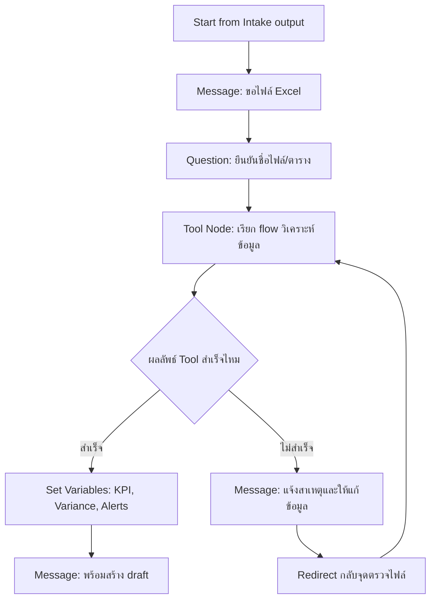

# แบบฝึกหัดที่ 3: เชื่อมข้อมูล Excel และเรียก Action วิเคราะห์

🔑 **ต้องการ M365 Copilot License + สิทธิ์เข้าใช้ Copilot Studio**

หลังจากได้ข้อมูลความต้องการรายงานแล้ว แบบฝึกหัดนี้จะให้เราเพิ่ม **Tool/Action** เข้าไปใน Topic เดิม เพื่อวิเคราะห์ข้อมูลจากไฟล์ Excel ที่ผู้ใช้อัปโหลด และจัดการเส้นทางสำเร็จ/ไม่สำเร็จด้วย Condition

## เตรียมไฟล์ที่ใช้ในแบบฝึกหัด

1. ใช้ไฟล์ตัวอย่างจาก repository นี้:
   - [../../../files/module-2/CPALL-Monthly-Financial-Report-May2026.xlsx](../../../files/module-2/CPALL-Monthly-Financial-Report-May2026.xlsx)
2. ตรวจสอบว่าไฟล์มี 4 sheets ต่อไปนี้:
   - `Summary`
   - `Revenue`
   - `Costs`
   - `Variance_Analysis`

> ⚠️ **Note:** ถ้า environment ของคุณไม่สามารถอัปโหลด `.xlsx` ได้ ให้ทดสอบ flow โดยใช้ชื่อไฟล์สมมติและจำลอง output ด้วย **Set variable value** node แทน



---

## Practice 1: เตรียมเส้นทางรับไฟล์และยืนยันข้อมูล

1. เปิด Topic `Monthly Report Intake` ที่สร้างจากแบบฝึกหัดก่อนหน้า แล้วเพิ่ม node ต่อจาก flow เดิม
2. เพิ่ม **Message** node เพื่อแจ้งว่า Agent ต้องใช้ไฟล์ Excel raw data ชื่อ `CPALL-Monthly-Financial-Report-May2026.xlsx`
3. เพิ่ม **Question** node ให้ผู้ใช้ระบุชื่อไฟล์หรือช่วงข้อมูลที่ต้องการวิเคราะห์
4. เก็บค่าลงตัวแปร เช่น `Topic.SourceFileName` และ `Topic.DataRange`

---

## Practice 2: เพิ่ม Tool node เพื่อเรียกการวิเคราะห์

1. ไปที่ **Tools** แล้วเพิ่ม Action ที่ใช้วิเคราะห์ข้อมูล (เช่น Power Automate flow)
2. กลับมาที่ Topic แล้วเพิ่ม **Tool node**
3. map input จากตัวแปรใน Topic ไปยัง Tool:
   - `ReportPeriod`
   - `BusinessUnit`
   - `SourceFileName`
4. map output จาก Tool กลับมา เช่น:
   - `Topic.TotalRevenue`
   - `Topic.TotalCost`
   - `Topic.VariancePercent`

> ⚠️ **Note:** ถ้าองค์กรยังไม่พร้อมเชื่อม Tool จริง ให้จำลอง output ด้วย Set variable value node ก่อน เพื่อฝึก flow logic ต่อได้

---

## Practice 3: จัดการผลลัพธ์สำเร็จ/ล้มเหลว

1. เพิ่ม **Condition** node ตรวจค่า status จาก Tool
2. กรณีสำเร็จ:
   - ส่ง Message สรุปตัวเลขหลัก
   - บอกผู้ใช้ว่า Agent พร้อมสร้าง draft รายงาน
3. กรณีไม่สำเร็จ:
   - ส่ง Message อธิบายสาเหตุ (เช่น format ไม่ถูกต้อง)
   - แนะนำขั้นตอนแก้ไข
   - Redirect กลับไปถามข้อมูลไฟล์อีกครั้ง

---

## Practice 4: ทดสอบกรณีสำเร็จและกรณีผิดพลาด

1. ทดสอบเคสสำเร็จด้วยคำสั่ง:

   ```
   วิเคราะห์ไฟล์ CPALL-Monthly-Financial-Report-May2026.xlsx เดือน May ของ BU Olefins แล้วสรุป KPI ให้หน่อย
   ```

2. ทดสอบเคสผิดพลาดด้วยการใส่ชื่อไฟล์ที่ไม่มีอยู่
3. ตรวจว่า flow กลับไปถามข้อมูลใหม่ได้ และไม่จบการสนทนาแบบตัน

---

## สรุป

ในแบบฝึกหัดนี้ คุณได้เพิ่มความสามารถให้ Agent เรียก Action วิเคราะห์จาก Excel และควบคุมเส้นทางสำเร็จ/ล้มเหลวได้อย่างเป็นระบบ

ขั้นตอนถัดไป → [สร้าง Draft และ Revision Loop](../exercise-4-draft-and-revision-loop/README.md)