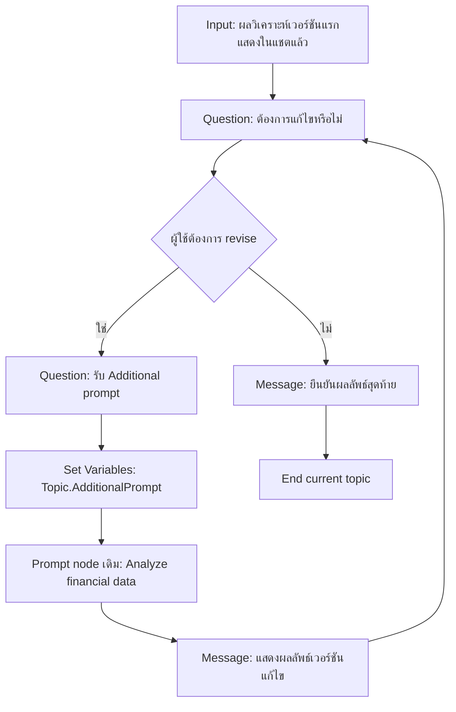

# แบบฝึกหัดที่ 4: สร้าง Draft และ Revision Loop

🔑 **ต้องการ M365 Copilot License + สิทธิ์เข้าใช้ Copilot Studio**

แบบฝึกหัดนี้จะต่อยอดจาก Topic เดิมที่แสดงผลวิเคราะห์ในแชตแล้ว โดยเพิ่มรอบแก้ไขตาม feedback ของผู้ใช้ผ่าน **Question**, **Condition**, และการเรียก **Prompt node เดิม** ซ้ำด้วย input เพิ่มเติม

> ⚠️ **Note:** แบบฝึกหัดนี้คาดหวังว่าแบบฝึกหัดที่ 3 มี node `Analyze financial data` และมีการแสดงผลวิเคราะห์จาก Prompt node นั้นในแชตเรียบร้อยแล้ว



---

## Practice 1: เพิ่ม input สำหรับคำสั่งแก้ไขใน Prompt node เดิม

1. เปิด node `Analyze financial data` จากแบบฝึกหัดที่ 3
2. เพิ่ม input ใหม่อีก 1 ตัวใน Prompt node โดยกำหนดเป็นประเภท **Text** และตั้งชื่อว่า

   ```
   Additional prompt
   ```

3. แก้ prompt เดิมให้รองรับ input ใหม่นี้ โดยเพิ่ม context ลักษณะนี้เข้าไป:

   ```text
   - Additional prompt from user: {{Topic.AdditionalPrompt}}
   ```

4. เพิ่ม instructions ต่อท้ายว่า ถ้ามี additional prompt ให้ใช้คำสั่งนั้นในการปรับน้ำหนัก, รูปแบบการเขียน, หรือประเด็นที่ต้องเน้น โดยยังอ้างอิงข้อมูลจากไฟล์เดิม
5. บันทึก Prompt node แล้วทดสอบสั้นๆ ว่าเมื่อยังไม่ส่ง additional prompt ระบบยังสร้างผลลัพธ์เวอร์ชันแรกได้ตามปกติ

---

## Practice 2: สร้าง Revision Loop

1. เพิ่ม **Question** node ถามว่าอยากแก้ไขรายงานหรือไม่
2. เพิ่ม **Condition** node แตกเส้นทางเป็น:
   - ต้องการแก้ไข
   - ไม่ต้องการแก้ไข
3. เส้นทางแก้ไข ให้เพิ่ม **Question** node รับ feedback รายละเอียดจากผู้ใช้ และบันทึกลงตัวแปร

   ```
   Topic.AdditionalPrompt
   ```

4. ส่งค่าตัวแปรนี้กลับเข้า node `Analyze financial data` ตัวเดิม เพื่อสร้างผลลัพธ์รอบใหม่
5. หลังจาก Prompt node ทำงานเสร็จ ให้เพิ่ม **Message** node เพื่อแสดงผลลัพธ์เวอร์ชันแก้ไขในแชต
6. วนกลับไปถามอีกครั้งว่าต้องการแก้ไขต่อหรือไม่

> 💡 **Tip:** ตั้งชื่อ node ให้สื่อความชัดเจน เช่น `Ask_Revision_Intent`, `Capture_Additional_Prompt`, `Show_Revised_Analysis`

---

## Practice 3: ปิดงานเมื่อผู้ใช้ยอมรับผลลัพธ์

1. ในเส้นทาง "ไม่ต้องการแก้ไข" ให้ส่ง Message ยืนยันว่า draft นี้เป็น final
2. ใช้ **End current topic** หรือ redirect ไป topic ปิดบทสนทนา
3. ถ้าต้องการ ให้เก็บสถานะ final ลงตัวแปร เช่น `Topic.ReportApproved = true`

---

## Practice 4: ทดสอบอย่างน้อย 2 รอบ revision

1. ทดสอบคำสั่งเริ่มต้น:

   ```
   สร้าง draft รายงานการเงินรายเดือนของ BU Performance Chemicals
   ```

2. ในรอบที่ 1 ให้ feedback เช่น:

   ```
   ขอเน้นประเด็นต้นทุนพลังงานให้มากขึ้น และสรุปแบบผู้บริหารอ่านเร็ว
   ```

3. ในรอบที่ 2 ให้ feedback เพิ่ม เช่น:

   ```
   เพิ่มข้อเสนอแนะสั้นๆ ตอนท้าย และลดรายละเอียดเชิงเทคนิคลง
   ```

4. จบด้วยการยืนยัน final
5. ตรวจว่า flow วนรอบได้จริง, Prompt node เดิมถูกเรียกซ้ำได้, และผลลัพธ์แต่ละรอบเปลี่ยนตาม additional prompt ที่ผู้ใช้ส่งมา

---

## สรุป

ในแบบฝึกหัดนี้ คุณได้ต่อยอด Prompt node เดิมให้รองรับการแก้ไขหลายรอบผ่าน additional prompt จากผู้ใช้ ทำให้ Agent ปรับผลลัพธ์ตาม feedback ได้ต่อเนื่องโดยไม่ต้องสร้าง flow วิเคราะห์ใหม่

ขั้นตอนถัดไป → [ทำ Hybrid Topic: Structured + Generative](../exercise-5-hybrid-topic-with-generative/README.md)