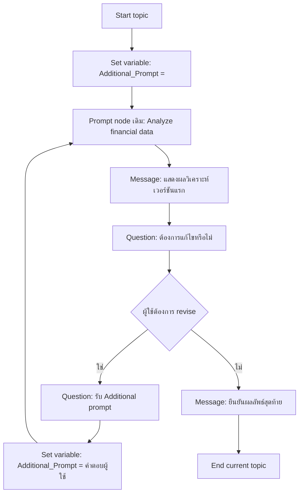

# แบบฝึกหัดที่ 4: สร้าง Draft และ Revision Loop

🔑 **ต้องการ M365 Copilot License + สิทธิ์เข้าใช้ Copilot Studio**

แบบฝึกหัดนี้จะต่อยอดจาก Topic เดิมที่แสดงผลวิเคราะห์ในแชตแล้ว โดยเพิ่มรอบแก้ไขตาม feedback ของผู้ใช้ผ่าน **Question**, **Condition**, และการเรียก **Prompt node เดิม** ซ้ำด้วย input เพิ่มเติม

> ⚠️ **Note:** แบบฝึกหัดนี้คาดหวังว่าแบบฝึกหัดที่ 3 มี node `Analyze financial data` อยู่แล้ว และในแบบฝึกหัดนี้เราจะต่อ flow เพื่อให้รองรับการ revise หลายรอบ



---

## Practice 1: เพิ่ม input สำหรับคำสั่งแก้ไขใน Prompt node เดิม

1. เปิด prompt ใน node `Analyze financial data` จากแบบฝึกหัดที่ 3
2. ด้านล่างสุดของ prompt ให้เพิ่ม input ใหม่อีก 1 ตัวใน Prompt node โดยกำหนดเป็นประเภท **Text** และตั้งชื่อว่า

   ```
   Additional prompt
   ```

3. แก้ prompt เดิมให้รองรับ input ใหม่นี้ โดยเพิ่ม context ลักษณะนี้เข้าไป
   ⚠️ ด้านล่างของหัวข้อ **Instruction** และหัวข้อ **Output format rules**:
   ```text
   Additional Instructions:
   - Additional request from user, use this as first priority: {{Topic.AdditionalPrompt}}
   ```
  
1. ทดสอบสั้นๆ ว่าเมื่อเรายังไม่มีการส่งอะไรลงไปใน additional prompt ระบบยังสร้างผลลัพธ์เวอร์ชันแรกได้ตามปกติ
2. บันทึก Prompt node

---

## Practice 2: เตรียมตัวแปร Additional_Prompt ก่อนเรียก Prompt ครั้งแรก

1. ใน flow หลัก ก่อนเข้า node `Analyze financial data` ให้กดเพิ่ม Node: **Variable Management** > **Set a variable value** node
2. ตั้งค่า node ดังนี้
   1. Node Name:
      ```
      Initialize Additional Prompt for customization report
      ```
   2. Set Variable: (ให้กดสร้างใหม่จากเมนู Crate a variable)
      ```
      AdditionalPrompt
      ```
      
   3. to value:
      1. คลิกเลือก **...**
      2. เลือก tab **Formula** 
      3. ใส่ค่าเป็นข้อความว่าง `""`
      4. กดปุ่ม **Save** เพื่อบันทึกค่า
   
3. node นี้จะทำงานก่อน `Analyze financial data` เสมอ เพื่อให้ Prompt node มีค่า input เริ่มต้นแม้ผู้ใช้ยังไม่ได้ส่ง feedback
4. ลงมาที่ node `Analyze financial data` ให้เชื่อมต่อ input ที่ชื่อ `Additional prompt` เข้ากับตัวแปร `AdditionalPrompt` ที่เราเพิ่งตั้งค่าไว้ใน node นี้
   
5. กด **Save** เพื่อบันทึกการเปลี่ยนแปลงทั้งหมด
6. ทดสอบรอบแรกว่าระบบยังสร้าง draft แรกได้ปกติ โดยไม่ error เรื่องตัวแปรว่าง

---

## Practice 3: สร้าง Revision Loop

1. เพิ่ม **Question** node ถามว่าอยากปรับปรุงหรือแก้ไขรายงานหรือไม่
   1. Node name: 
      ```
      Ask Revision
      ```
   2. Message:
      ```
      คุณต้องการปรับปรุงรายงานนี้หรือไม่?
      ```
   3. Identify:
       ```
       Multiple choice of options
       ```
   4. Options for user:
      ```
      Yes
      ```
      ```
      No
      ```
   5. Save user response as:
      ```
      RevisionAnswer
      ```
1. เปลี่ยนชื่อ **Condition** node ที่แตกเส้นทางเป็น:
   - Request revision (Yes)
   - Finalize report (No)
2. เส้นทางแก้ไข ให้เพิ่ม **Ask a Question** node รับ feedback รายละเอียดจากผู้ใช้ และบันทึกลงตัวแปร
   1. Node name:
      ```
      Ask for Additional Prompt
      ```
   2. Message:
      ```
      กรุณาให้รายละเอียดเพิ่มเติมว่าต้องการปรับปรุงหรือแก้ไขอะไรในรายงานนี้
      ```
   3. Identify:
      ```
      User's entire response
      ```
   4. Save user response as: (ในขั้นตอนนี้ให้สร้างตัวแปรใหม่สำหรับเก็บคำตอบชั่วคราวก่อน)
      ```
      UserRequest
      ```
   

3. ใต้ node `Ask for Additional Prompt` ในเส้นทาง **Request revision (Yes)** ให้เพิ่ม **Set a variable value** node เพื่อส่งค่าจากคำตอบล่าสุดกลับไปเก็บในตัวแปรหลัก `AdditionalPrompt` ก่อนวนกลับเข้า Prompt node อีกครั้ง
   1. เส้นทางคลิก:
      ```
      Add node > Variable management > Set a variable value
      ```
   2. Node name:
      ```
      Update Additional Prompt from User Request
      ```
   3. Set variable:
      ```
      UserRequest
      ```
   4. To value:
      ```
      AdditionalPrompt
      ```

4. ใต้ node `Update Additional Prompt from revision` ให้เพิ่ม node สำหรับย้อนกลับไปประมวลผลใหม่ด้วยเส้นทางคลิก:
   **Add node** > **Topic management** > **Go to step**
5. ใน `Go to step` ให้เลือกปลายทางเป็น node `Analyze financial data` (เลือกชื่อให้ตรงตัวสะกด)

> 💡 Notes: รอบถัดไป Prompt node เดิมจะถูกเรียกซ้ำ โดยรอบนี้ `AdditionalPrompt` ถูกอัปเดตจาก `Topic.RevisionDetail` แล้ว จึงสามารถปรับ draft ตาม feedback ล่าสุดได้

1. กด **Save** แล้วทดสอบใน **Test** panel ตามลำดับนี้:
   1. เริ่มจากการสร้าง draft ครั้งแรก
   2. ตอบ `Yes` ที่คำถามแก้ไข
   3. กรอก feedback ใหม่
   ```
   add 5 interesting insights in the analysis and make it more concise for executives
   ```
   4. สังเกตว่า flow วิ่งผ่าน `Go to step` กลับไป `Analyze financial data` และผลลัพธ์เปลี่ยนตาม `AdditionalPrompt`
2. หลังจาก Prompt node ทำงานเสร็จ ให้เพิ่ม **Message** node เพื่อแสดงผลลัพธ์เวอร์ชันแก้ไขในแชต
3. วนกลับไปถามอีกครั้งว่าต้องการแก้ไขต่อหรือไม่

> 💡 **Tip:** ตั้งชื่อ node ให้สื่อความชัดเจน เช่น `Ask_Revision_Intent`, `Capture_Additional_Prompt`, `Show_Revised_Analysis`

---

## Practice 4: ปิดงานเมื่อผู้ใช้ยอมรับผลลัพธ์

1. ในเส้นทาง **Finalize report (No)** ให้ส่ง Message ยืนยันว่า draft นี้เป็น final
2. ใช้ **End current topic**  ปิดบทสนทนา

---

## Practice 5: ทดสอบอย่างน้อย 2 รอบ revision

1. ทดสอบคำสั่งเริ่มต้น:

   ```
   สร้าง draft รายงานการเงินรายเดือนของ BU Performance Chemicals
   ```

2. ในรอบที่ 1 ให้ feedback เช่น:

   ```
   ขอเน้นประเด็นต้นทุนพลังงานให้มากขึ้น และสรุปแบบผู้บริหารอ่านเร็ว
   ```

3. ในรอบที่ 2 ให้ feedback เพิ่ม เช่น:

   ```
   เพิ่มข้อเสนอแนะสั้นๆ ตอนท้าย และลดรายละเอียดเชิงเทคนิคลง
   ```

4. จบด้วยการยืนยัน final
5. ตรวจว่า flow วนรอบได้จริง, Prompt node เดิมถูกเรียกซ้ำได้, และผลลัพธ์แต่ละรอบเปลี่ยนตาม additional prompt ที่ผู้ใช้ส่งมา

---

## สรุป

ในแบบฝึกหัดนี้ คุณได้ต่อยอด Prompt node เดิมให้รองรับการแก้ไขหลายรอบผ่าน additional prompt จากผู้ใช้ ทำให้ Agent ปรับผลลัพธ์ตาม feedback ได้ต่อเนื่องโดยไม่ต้องสร้าง flow วิเคราะห์ใหม่

ขั้นตอนถัดไป → [ทำ Hybrid Conversation ด้วย Agent Orchestration + Knowledge](../exercise-5-hybrid-topic-with-generative/README.md)