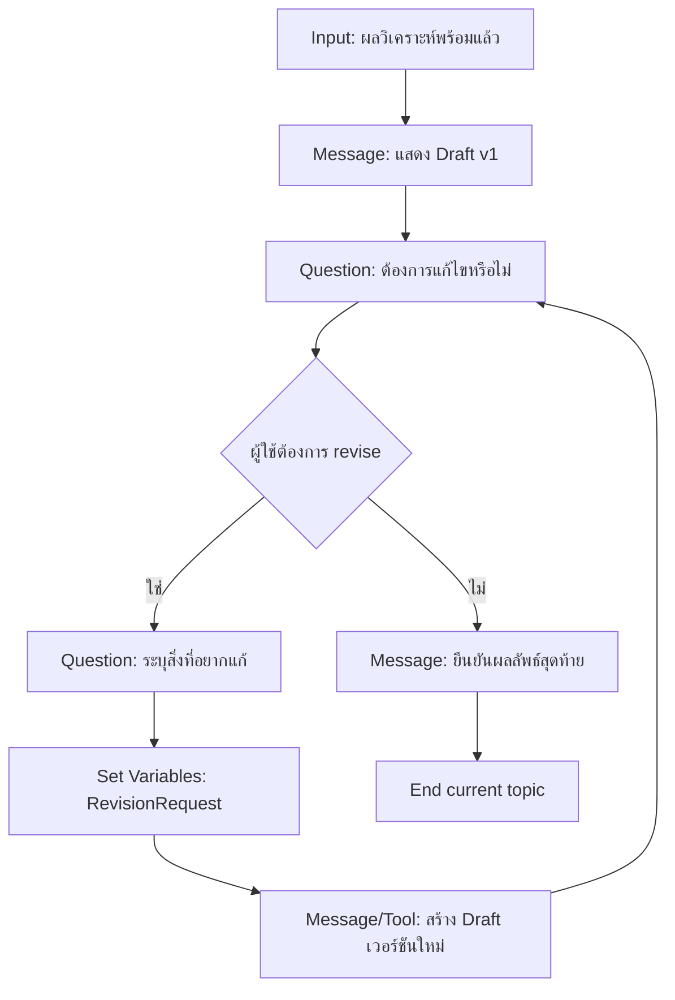

# แบบฝึกหัดที่ 4: สร้าง Draft และ Revision Loop

🔑 **ต้องการ M365 Copilot License + สิทธิ์เข้าใช้ Copilot Studio**

แบบฝึกหัดนี้จะทำให้ Topic เดิมสร้าง draft รายงานเบื้องต้น และเปิดรอบแก้ไขตาม feedback ของผู้ใช้ โดยใช้ **Topic management** และ **Condition** เพื่อวนกลับอย่างควบคุมได้



---

## Practice 1: สร้างข้อความ Draft รายงาน

1. เพิ่ม **Message** node เพื่อแสดง draft สรุปจากตัวแปรที่วิเคราะห์ได้
2. รูปแบบ draft อาจเป็น bullet points เช่น:

   ```
   - Revenue: {Topic.TotalRevenue}
   - Cost: {Topic.TotalCost}
   - Variance: {Topic.VariancePercent}%
   - Key risk: {Topic.KeyRisk}
   ```

3. เพิ่มข้อความปิดท้ายว่า "หากต้องการแก้ไข สามารถบอกจุดที่ต้องการปรับได้"

---

## Practice 2: สร้าง Revision Loop

1. เพิ่ม **Question** node ถามว่าอยากแก้ไขรายงานหรือไม่
2. เพิ่ม **Condition** node แตกเส้นทางเป็น:
   - ต้องการแก้ไข
   - ไม่ต้องการแก้ไข
3. เส้นทางแก้ไข ให้เพิ่ม Question รับ feedback รายละเอียด และบันทึกลง `Topic.RevisionRequest`
4. ส่งต่อให้ node ที่สร้าง draft รอบใหม่ แล้ววนกลับมาถามอีกครั้ง

> 💡 **Tip:** ตั้งชื่อ node ให้สื่อความชัดเจน เช่น `Ask_Revision_Intent`, `Capture_Revision_Detail`, `Generate_Draft_v2`

---

## Practice 3: ปิดงานเมื่อผู้ใช้ยอมรับผลลัพธ์

1. ในเส้นทาง "ไม่ต้องการแก้ไข" ให้ส่ง Message ยืนยันว่า draft นี้เป็น final
2. ใช้ **End current topic** หรือ redirect ไป topic ปิดบทสนทนา
3. ถ้าต้องการ ให้เก็บสถานะ final ลงตัวแปร เช่น `Topic.ReportApproved = true`

---

## Practice 4: ทดสอบอย่างน้อย 2 รอบ revision

1. ทดสอบคำสั่งเริ่มต้น:

   ```
   สร้าง draft รายงานการเงินรายเดือนของ BU Performance Chemicals
   ```

2. ในรอบที่ 1 ให้ feedback เช่น:

   ```
   ขอเน้นประเด็น variance ของต้นทุนพลังงานมากขึ้น
   ```

3. ในรอบที่ 2 ให้ feedback เพิ่ม แล้วจบด้วยการยืนยัน final
4. ตรวจว่า flow วนรอบได้จริงและออกจาก loop ได้ชัดเจน

---

## สรุป

ในแบบฝึกหัดนี้ คุณได้ออกแบบ revision loop ที่ใช้งานได้จริง ทำให้ Agent ไม่เพียงตอบครั้งเดียว แต่ปรับผลลัพธ์ตาม feedback ได้ต่อเนื่อง

ขั้นตอนถัดไป → [ทำ Hybrid Topic: Structured + Generative](../exercise-5-hybrid-topic-with-generative/README.md)