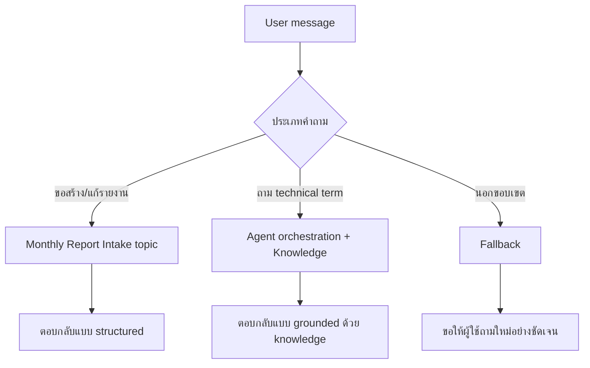

# แบบฝึกหัดที่ 5: ทำ Hybrid Conversation ด้วย Agent Orchestration + Knowledge

🔑 **ต้องการ M365 Copilot License + สิทธิ์เข้าใช้ Copilot Studio**

แบบฝึกหัดนี้จะพาเราเปลี่ยนจากการคุยแบบโฟลว์อย่างเดียว ไปสู่ **Hybrid Conversation** ที่ผู้ใช้สามารถสลับบทสนทนาได้ทั้ง
- งานแบบ structured: ขอให้สร้าง/ปรับรายงานการเงินรายเดือน
- งานแบบ generative: ถามความหมายของ technical term ในรายงาน

จุดสำคัญของแบบฝึกหัดนี้คือ **ไม่ต้องสร้าง Topic ใหม่** ใน Module 2 แต่ใช้การปรับ Agent instruction + orchestration ให้ Agent ตอบในบริบทเดียวกันได้ลื่นขึ้น



---

## ก่อนเริ่ม

1. ต้องทำ Exercise 1-4 ของ Module 2 มาก่อน
2. ต้องมี Agent เดิมที่มี Topic `Monthly Report Intake` พร้อมใช้งาน
3. ในแบบฝึกหัดนี้ ให้ใช้ไฟล์ความรู้เดิมเฉพาะ technical terms:
   - `financial-report-technical-terms-knowledge.docx`

> ⚠️ **Note:** การสร้าง Topic แยกเพื่อ route หลายโดเมน (เช่น technical terms/policy) จะถูกย้ายไปฝึกใน Module 4

---

## Practice 1: เตรียม Knowledge ให้พร้อม (Technical Terms)

1. ไปที่แท็บ **Knowledge** ของ Agent
2. กด **Add knowledge** 
    
   

3. แล้วอัปโหลดไฟล์
   ```text
   financial-report-technical-terms-knowledge.docx
   ```
   
4. กด **Add to agent**
   
5. ตรวจสถานะให้เป็น **Ready** ก่อนเริ่มทดสอบ
    
> 💡 Tip: ถ้า status ของไฟล์ยังเป็น `In Progress` ตัว knowledge จะยังไม่สามารถนำมาใช้ได้

---

## Practice 2: ปรับ Agent Instructions ให้รองรับ hybrid conversation

1. ไปที่หน้า **Overview** ของ Agent แล้วแก้ส่วน **Instructions**
2. เพิ่มข้อความให้ชัดว่า Agent รองรับทั้งการทำรายงานรายเดือน และการอธิบาย technical term
3. ใช้ตัวอย่างนี้แล้วปรับให้เหมาะกับบริบททีมของคุณ

```text
You are Financial Report Assistant for enterprise business users.

Scope:
- Help users create and revise monthly financial report analysis.
- Explain financial reporting technical terms using approved knowledge.

Rules:
- If user asks to create or revise a monthly report, use the structured flow in Monthly Report Intake.
- If user asks the meaning of financial reporting technical terms, answer with grounded knowledge and keep explanation concise.
- If request is outside finance reporting scope, ask user to rephrase within scope.
```

4. กด **Save**

> ⚠️ **Note:** ในแบบฝึกหัดนี้ยังไม่ต้องเพิ่ม trigger ใหม่หรือสร้าง Topic ใหม่

---

## Practice 3: เปิด orchestration เพื่อให้คุยแบบผสมได้

1. ไปที่ **Settings** ของ Agent
2. ตรวจส่วน **Orchestration** ให้เป็นโหมด generative (เปิดให้ Agent ตัดสินใจเส้นทางบทสนทนาได้)
3. บันทึกการตั้งค่า

> 💡 Tip: ใน Exercise 6 เราจะย้อนมาทดสอบผลต่างระหว่างเปิด/ปิด orchestration เพื่อดูผลกับ Fallback

---

## Practice 4: ทดสอบ hybrid conversation (structured + generative)

ให้ทดสอบใน **Test your agent** ตามลำดับนี้

1. เริ่มด้วย structured request

   ```text
   สร้าง draft รายงานการเงินเดือน May ของ BU Aromatics
   ```

2. สลับเป็นคำถามเชิง technical term ในบทสนทนาเดียวกัน

   ```text
   Variance Percent คืออะไร และควรตีความอย่างไรในรายงานรายเดือน
   ```

3. ทดสอบอีกคำถามเชิงความรู้

   ```text
   EBITDA margin ต่างจาก gross margin อย่างไร
   ```

4. ทดสอบ out-of-scope 1 เคส

   ```text
   ช่วยแนะนำร้านกาแฟใกล้ออฟฟิศ
   ```

สิ่งที่ต้องสังเกต:
- Agent ยังทำ structured flow สำหรับงานรายงานได้
- Agent ตอบคำถาม technical term ได้โดยอิง knowledge
- คำถามนอกขอบเขตไม่ควรถูกตอบมั่ว


---

## สรุป

ในแบบฝึกหัดนี้ คุณได้เปิดประสบการณ์ hybrid conversation โดยใช้ Agent orchestration และ knowledge เดิม ทำให้ผู้ใช้คุยได้ทั้งงานโครงสร้างและคำถามความรู้ในบริบทเดียวกัน โดยยังไม่ต้องสร้าง Topic ใหม่ใน Module 2

ขั้นตอนถัดไป → [ออกแบบ Fallback และ Mini Test Cycle](../exercise-6-fallback-and-mini-test/README.md)
