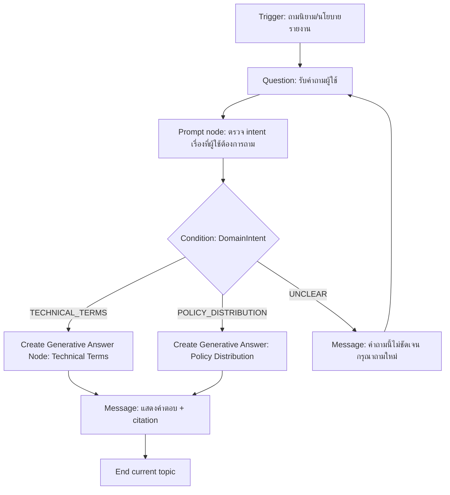
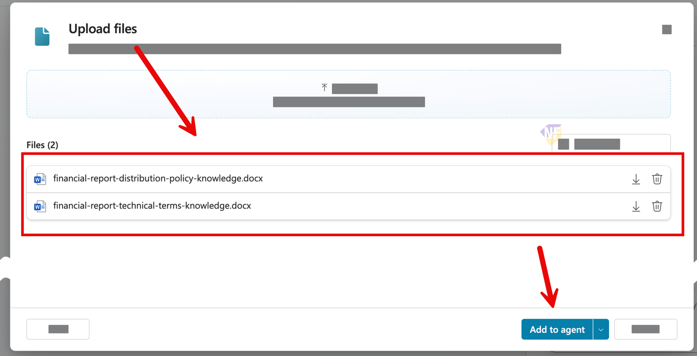
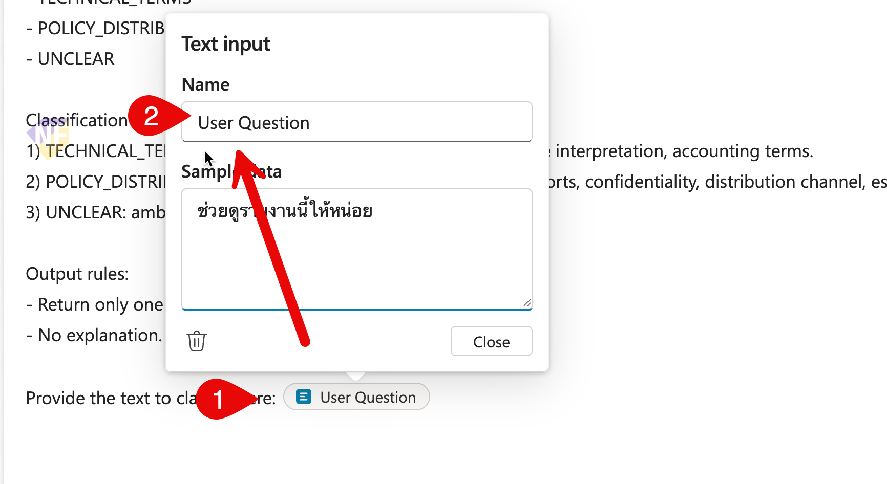
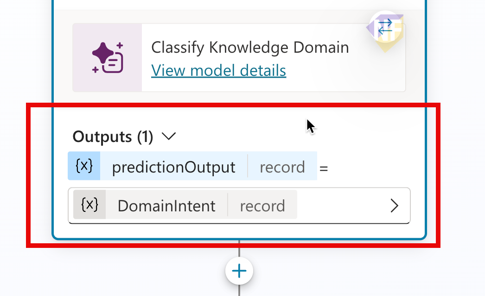
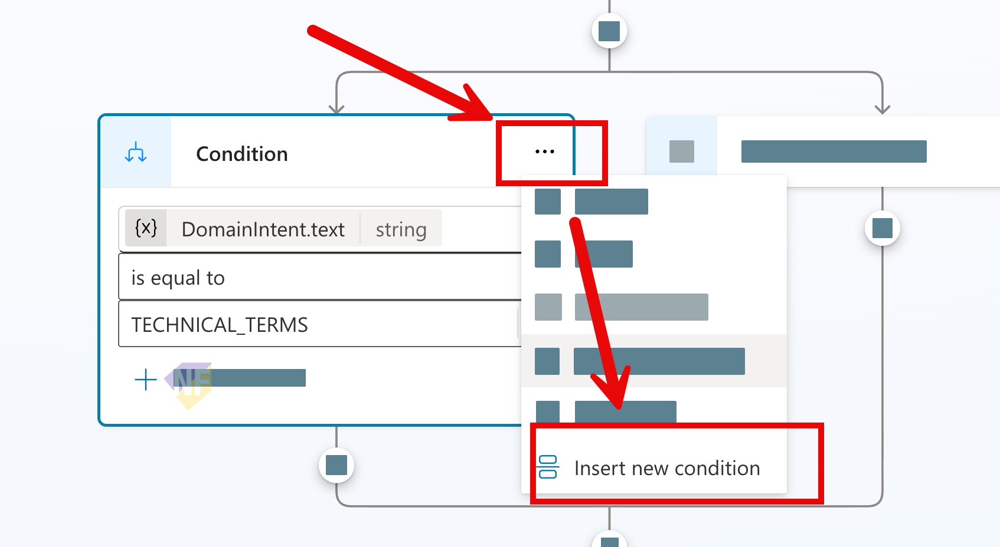
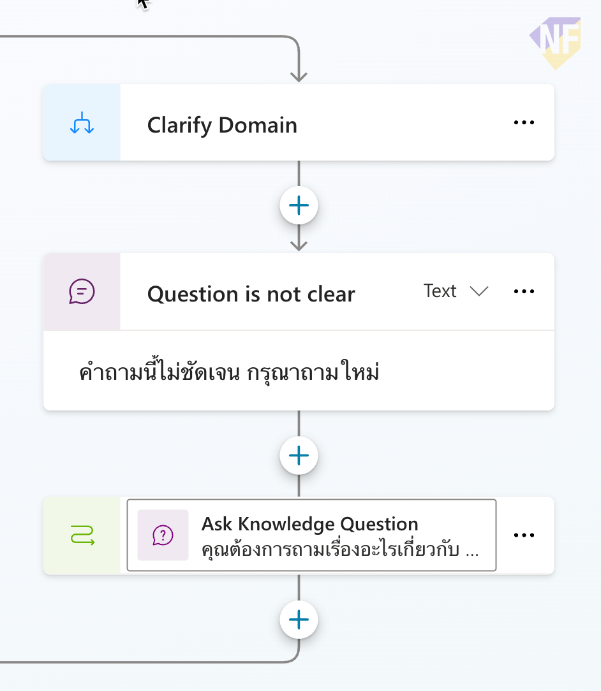
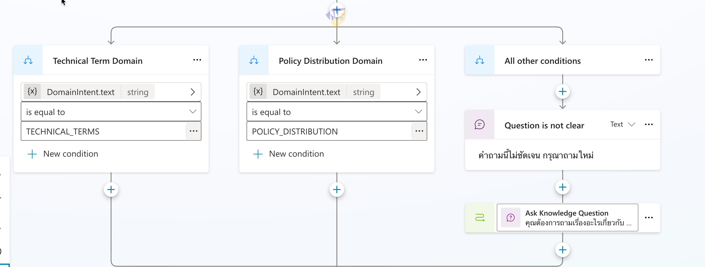
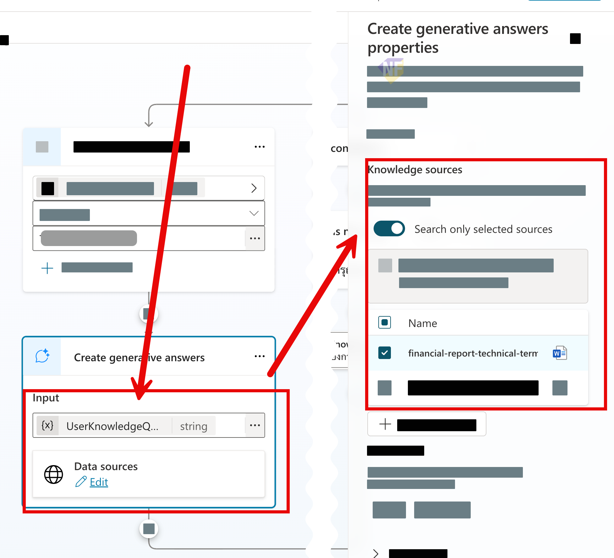
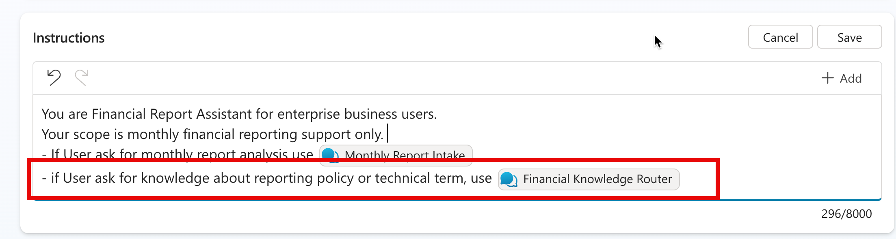

# แบบฝึกหัดที่ 5: สร้าง Dual-Domain Generative Topic ด้วย Create Generative Answer Node

🔑 **ต้องการ M365 Copilot License + สิทธิ์เข้าใช้ Copilot Studio**

แบบฝึกหัดนี้จะให้เรา **สร้าง Topic ใหม่** เพื่อรับคำถามความรู้ 2 โดเมน (Technical Terms และ Company Policy) แล้ว route ด้วย Prompt + Condition ไปยัง **Create Generative Answer Node** คนละเส้นทาง โดยแต่ละเส้นทางผูกกับ knowledge source เฉพาะโดเมน



---

## Practice 1: เตรียม Knowledge Sources (2 ไฟล์ DOCX)

1. เปิด Agent
2. ไปที่ **Knowledge** ของ Agent แล้วกด **Add knowledge**
   
3. คลิกเลือกอัปโหลดไฟล์จากโฟลเดอร์ `files/module-2/`
   - `financial-report-technical-terms-knowledge.docx`
   - `financial-report-distribution-policy-knowledge.docx`
   
1. หน้าต่างจะแสดงรายการไฟล์ที่อัปโหลด ให้กด **Add to agent** เพื่อเริ่มกระบวนการสร้างอัพโหลดไฟล์และแปลงเป็น knowledge source
   
2. หลังจากอัพโหลดแล้ว จะยังเห็นว่า Status เป็น **"In Progress"** อยู่  ซึ่งอาจใช้เวลาหลายนาที ขึ้นกับขนาดไฟล์และคิวการประมวลผลของระบบ **ถ้า status ยังแสดงเป็น In Progress จะหมายความว่า knowledge ดังกล่าวจะยังไม่สามารถใช้งานได้**
   
3. ให้รอจนกว่าจะขึ้นเป็น **"Ready"**
> 💡 Tip: สามารถศึกษาประเภทของ Knowledge และข้อจำกัดต่างๆ ได้ที่ [Microsoft Learn: Knowledge in Copilot Studio](https://learn.microsoft.com/en-us/microsoft-copilot-studio/knowledge-copilot-studio)


---

## Practice 2: สร้าง Topic ใหม่สำหรับงานความรู้ 2 โดเมน

1. ไปที่ **Topics** > **Add a topic** > **Blank Topic**
2. ตั้งชื่อ Topic ว่า

   ```text
   Financial Knowledge Router
   ```

3. ใส่ Trigger Description

   ```text
   Use this topic when the user asks about financial reporting knowledge, especially technical terms or company policy for report distribution. 
   ```

4. เพิ่ม **Set Variable VAlue** node เพื่อเก็บคำถามที่ผู้ใช้ถาม และ trigger topic นี้ให้ทำงาน
   - Node name:

      ```text
      Store Knowledge Question
      ```
   - Set variable (กดสร้างตัวแปรใหม่โดยการเลือก **Create a new variable** และตั้งชื่อตัวแปรว่า):
      ```
      UserKnowledgeQuestion
      ```
   - to value (เลือก System Variable และค้นหาชื่อตัวแปรด้านล่าง):
      ```
      LastMessage.text
      ```
---

## Practice 3: ใช้ Prompt node เพื่อแยก intent domain

1. เพิ่ม **New Prompt** node ต่อจาก `Ask Knowledge Question` โดยการเลือกคลิกปุ่ม + ที่ปลายลูกศร แล้วเลือก **Add a tool** > **New Prompt**
2. ตั้งชื่อ Prompt:

   ```text
   Classify Knowledge Domain
   ```

3. ใช้ prompt ด้านล่างนี้เพื่อให้ LLM ช่วยจำแนกโดเมนของคำถามผู้ใช้ โดยให้ตอบกลับมาเป็น 1 ใน 3 label ที่กำหนดเท่านั้น โดย copy ไปใส่ในส่วนของ **Instruction**

```text
You are an intent classifier. Your task is to classify the user's question into one of the following knowledge domains based on the content of the question.

Classify into one of these labels only:
- TECHNICAL_TERMS
- POLICY_DISTRIBUTION
- UNCLEAR

Classification rules:
1) TECHNICAL_TERMS: definitions, formulas, KPI meaning, variance interpretation, accounting terms.
2) POLICY_DISTRIBUTION: approval workflow, who can receive reports, confidentiality, distribution channel, escalation.
3) UNCLEAR: ambiguous or mixed with insufficient detail.

Output rules:
- Return only one uppercase label.
- No explanation.

Provide the text to classify here: {{User Question}}
```

4. ที่ท้าย instruction ให้พิมพ์ "/" แทนที่ข้อความ `{{User Question}}` และสร้าง input variable ใหม่ชื่อ

   ```text
   User Question
   ```
   

5. เพิ่มค่า example สำหรับ input variable `User Question` เพื่อทดสอบ prompt เช่น

   ```text
   Variance Percent คืออะไร และควรตีความอย่างไรใน Finnancial Report
   ```
   ซึ่งควรได้ผลลัพธ์เป็น `TECHNICAL_TERMS`

6. กด **Test** ใน Prompt editor และตรวจผลลัพธ์ที่โมเดลตอบกลับว่าเป็น 1 ใน 3 label นี้เท่านั้น

   ```text
   TECHNICAL_TERMS
   POLICY_DISTRIBUTION
   UNCLEAR
   ```

7. ทดสอบเคสที่ควรได้ผลลัพธ์เป็น `POLICY_DISTRIBUTION` โดยใส่ตัวอย่าง prompt นี้ใน `User Question` แล้วกด **Test**

   ```text
   รายงานการเงินฉบับเต็มส่งให้ใครได้บ้าง และต้องขออนุมัติก่อนส่งหรือไม่
   ```

8. ต่อด้วยการทดสอบเคสที่ควรได้ผลลัพธ์เป็น `UNCLEAR` โดยใส่ตัวอย่าง prompt นี้ใน `User Question` แล้วกด **Test**

   ```text
   ช่วยดูรายงานนี้ให้หน่อย
   ```

9.  ถ้าผลลัพธ์ยังไม่คงที่ ให้ปรับ instruction เพิ่มความชัดเจน แล้วกด **Test** ซ้ำจนได้ผลลัพธ์ตามกติกา

10. เมื่อทดสอบผ่านแล้ว ให้กด **Save** เพื่อบันทึก Prompt

11. กลับไปที่ Topic flow ในส่วน Prompt Node map input `User Question` ให้รับค่าจากตัวแปรใน Topic
      ```text
      User Question = UserKnowledgeQuestion
      ```
12. แล้วเปลี่ยนชื่อในส่วนของ Output ของ Prompt node `predictionOutput = ` โดยเลือก **Create a new variable** และคลิกเพื่อตั้งชื่อตัวแปรใหม่ว่า
      ```text
      DomainIntent
      ```
   
> ⚠️ **Note:** ถ้า Prompt node ตอบอย่างอื่นนอกจาก 3 label ที่กำหนด ให้กลับไปปรับ Output rules ให้เข้มขึ้น

---

## Practice 4: เพิ่ม Condition node เพื่อ route ไป 2 Custom Search Nodes และ loop back สำหรับกรณี UNCLEAR

1. เพิ่ม **Condition** node ต่อจาก `Classify Knowledge Domain`
2. ตั้งชื่อ Condition node แรกว่า:

   ```text
   Technical Term Domain
   ```

3. ในตอนแรกจะมีแค่ 1 condition node และ **"All other conditions"** node ให้คลิกปุ่ม more option (...) ที่ condition node แรกแล้วเลือก **insert new condition** เพื่อเพิ่ม condition node อีกอัน จากนั้นตั้งค่าเงื่อนไขให้ครบตามที่กำหนด
   

4. ตั้งชื่อ condition node ที่ 2 ว่า:

   ```text
   Policy Distribution Domain
   ```

5. ตั้งเงื่อนไขใน 2 node แรกตามนี้

   ##### Node 1: Technical Term Domain
   ###### ช่อง 1:
   ```
   DomainIntent.text
   ```
   ###### ช่อง 2 (เงื่อนไข):
   ```
   is equal to
   ```
   ###### ช่อง 3:
   ```
   TECHNICAL_TERMS
   ```   
   ##### Node 2: Policy Distribution Domain
   ###### ช่อง 1:
   ```
   DomainIntent.text
   ```
   ###### ช่อง 2 (เงื่อนไข):
   ```
   is equal to
   ```
   ###### ช่อง 3:
   ```
   POLICY_DISTRIBUTION
   ```

6. ใน **"All other conditions"** node เพิ่ม **Message** node เพื่อแสดงข้อความแจ้งผู้ใช้ว่าคำถามไม่ชัดเจน 
   1. Node name:
      ```
      Question is not clear
      ```
   2. Message:
      ```
      คำถามนี้ไม่ชัดเจน กรุณาถามใหม่
      ```
7. ต่อจาก Message node ให้เพิ่ม **Go to step** node เพื่อวนกลับไปที่ `Ask Knowledge Question`
   
8. ตรวจสอบว่า condition node ทั้งหมดเชื่อมต่อกันตามภาพ
   
   
---

## Practice 5: ตั้งค่า 2 Create Generative Answers Nodes พร้อม data source ในแต่ละโดเมน

ในแบบฝึกหัดนี้ **Create generative answers node** จะถูกใช้ในการ search เฉพาะ knowledge source ที่เราเลือกใน node นั้น

1. ใน flow ที่ต่อจาก `Technical Term Domain` node ให้กด **Add node** แล้วเลือก **Advanced** > **Generative answers** เพื่อเพิ่ม **Create generative answers** node
   - Node name:

      ```text
      Custom Search - Technical Terms
      ```

   - Query input:

      ```text
      UserKnowledgeQuestion
      ```

   - คลิกเลือก Edit ในส่วนของ Data source:
     - กำหนดค่า Search only selected sources = ON
     - เลือก source เป็นไฟล์ `financial-report-technical-terms-knowledge.docx` ที่เราอัปโหลดไว้ใน Practice 1 เท่านั้น

   

2. ใน flow ที่ต่อจาก `Policy Distribution Domain` node ให้เพิ่ม **Create generative answers** node อีก 1 อัน เพื่อค้นข้อมูลเฉพาะฝั่งนโยบายการแจกจ่ายรายงาน
   - Node name:

      ```text
      Custom Search - Distribution Policy
      ```

   - Query input:

      ```text
      UserKnowledgeQuestion
      ```

   - คลิก **Edit** ในส่วนของ **Data source** แล้วตั้งค่าตามนี้
     - กำหนดค่า Search only selected sources = ON
     - เลือก source เป็นไฟล์ `financial-report-distribution-policy-knowledge.docx` ที่เราอัปโหลดไว้ใน Practice 1 เท่านั้น
   

   > 💡 Tip: ถ้ายังไม่เห็น knowledge source สำหรับ policy ให้ตรวจสอบก่อนว่าไฟล์ `financial-report-distribution-policy-knowledge.docx` ใน Practice 1 มีสถานะเป็น **Ready** แล้ว เพราะถ้ายังเป็น **In Progress** node นี้จะยังค้นข้อมูลไม่ได้

   > ⚠️ Note: ในแบบฝึกหัดนี้ให้ใช้ `UserKnowledgeQuestion` เหมือนกับ branch แรก เพื่อให้ทั้ง 2 เส้นทางรับคำถามจากตัวแปรเดียวกัน และเปรียบเทียบผลการ route ได้ง่าย


3. ปิดท้ายด้วย **End current topic** node

> 💡 **Tip:** ถ้าต้องการให้ branch ตอบสั้น/ยาวต่างกัน ให้เพิ่ม instructions ในแต่ละ Custom Search Node แยกกัน

---

## Practice 6: อัพเดต Agent Instruction ให้เรียกใช้ Topic นี้ในกรณีที่ผู้ใช้ถามเกี่ยวกับความรู้ใน 2 โดเมนนี้

1. ไปที่หน้า **Overview** ของ Agent 
2. ลงมาด้านล่างในส่วน **Instruction** แล้วคลิก **Edit**
3. ทำการเพิ่ม instruction เพื่อให้ Agent เรียกใช้ Topic `Financial Knowledge Router` เมื่อผู้ใช้ถามคำถามที่เกี่ยวข้องกับความรู้ใน 2 โดเมน
   ```text
   if User ask for knowledge about reporting policy or technical term, use (Financial Knowledge Router))
   ```
   

## Practice 7: ทดสอบพร้อมเกณฑ์ผ่าน (Pass Criteria)

ทดสอบคำถามตัวอย่างต่อไปนี้

1. Technical Terms

   ```text
   Variance Percent คืออะไร และควรตีความอย่างไรในรายงานรายเดือน
   ```

2. Policy Distribution

   ```text
   รายงานการเงินฉบับเต็มส่งให้ใครได้บ้าง และต้องขออนุมัติก่อนส่งหรือไม่
   ```

3. Ambiguous

   ```text
   รายงานนี้ควรทำยังไงให้ถูกต้อง
   ```

4. Out-of-scope

   ```text
   ช่วยแนะนำร้านกาแฟใกล้ออฟฟิศ
   ```

---

## สรุป

ในแบบฝึกหัดนี้ คุณได้สร้าง Topic ใหม่ที่ route คำถามไป 2 โดเมนด้วย Prompt + Condition แล้วค้นจาก knowledge เฉพาะโดเมนผ่าน Custom Search Node ทำให้คำตอบแม่นขึ้นและควบคุมแหล่งข้อมูลได้ชัดเจน

ขั้นตอนถัดไป → [ออกแบบ Fallback และ Mini Test Cycle](../exercise-6-fallback-and-mini-test/README.md)