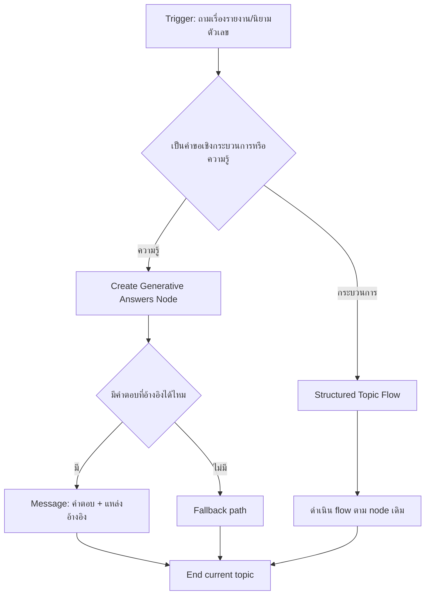

# แบบฝึกหัดที่ 5: ทำ Hybrid Topic: Structured + Generative

🔑 **ต้องการ M365 Copilot License + สิทธิ์เข้าใช้ Copilot Studio**

แบบฝึกหัดนี้จะฝึกการผสม **structured flow** กับ **generative answers** ลงใน Topic เดิม เพื่อให้ Agent ตอบทั้งงานเชิงกระบวนการและคำถามเชิงความรู้ เช่นนิยาม KPI, กติกา accounting policy, หรือเหตุผลของ variance



---

## Practice 1: แยกเจตนาแบบ structured vs knowledge

1. ใน Topic เดิม เพิ่ม **Condition** node ตรวจประเภทคำถาม
2. กำหนดเงื่อนไขตัวอย่าง:
   - ถ้ามีคำว่า "สร้างรายงาน", "วิเคราะห์", "ปรับ draft" ให้เข้าทาง structured
   - ถ้ามีคำว่า "คืออะไร", "นิยาม", "ทำไม" ให้เข้าทาง generative
3. ตั้งชื่่อเส้นทางให้ชัด เช่น `Path_Structured` และ `Path_Generative`

---

## Practice 2: เพิ่ม Create generative answers node

1. เพิ่ม **Create generative answers** node ในเส้นทางความรู้
2. เลือกแหล่งข้อมูลที่เชื่อถือได้ (Knowledge) ที่เกี่ยวข้องกับการเงิน
3. ตั้งค่าให้ตอบแบบสั้น กระชับ และระบุแหล่งอ้างอิงเมื่อมี

> ⚠️ **Note:** ถ้ามีการปรับแต่งคำตอบเองใน Teams ให้ตรวจเรื่องการแสดง citations เพิ่มเติม

---

## Practice 3: ออกแบบ fallback สำหรับคำถามความรู้ที่ตอบไม่ได้

1. หลัง generative node ให้เพิ่ม **Condition** ตรวจว่ามีคำตอบเพียงพอหรือไม่
2. ถ้าตอบไม่ได้ ให้ส่งผู้ใช้ไป fallback path เช่น:

   ```
   ตอนนี้ยังไม่มีข้อมูลยืนยันเพียงพอสำหรับคำถามนี้
   กรุณาระบุแหล่งข้อมูลที่ต้องการให้ใช้ หรือให้ฉันส่งต่อให้ผู้เชี่ยวชาญ
   ```

3. ถ้าตอบได้ ให้แสดงคำตอบพร้อมบริบทที่เหมาะสมกับผู้บริหาร

---

## Practice 4: ทดสอบทั้ง 2 เส้นทาง

1. ทดสอบ structured prompt:

   ```
   สร้างรายงานการเงินรายเดือนของ BU Olefins และเน้น cost variance
   ```

2. ทดสอบ knowledge prompt:

   ```
   Variance analysis ในรายงานรายเดือนคืออะไร และใช้ตัดสินใจอย่างไร
   ```

3. ตรวจว่า Agent เข้าเส้นทางถูกต้องทั้งสองแบบ

---

## สรุป

ในแบบฝึกหัดนี้ คุณได้สร้าง Hybrid Topic ที่ทำให้ Agent ทำงานได้ทั้งแบบ process-driven และ knowledge-driven โดยไม่เสียความชัดเจนของ flow

ขั้นตอนถัดไป → [ออกแบบ Fallback และ Mini Test Cycle](../exercise-6-fallback-and-mini-test/README.md)