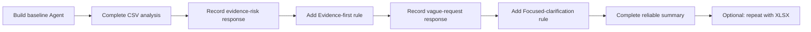

# แบบฝึกหัดที่ 6 (Optional): สร้าง Engine Anomaly Review Assistant

ในแบบฝึกหัดทางเลือกนี้ เราจะสร้าง `PTT GC Engine Anomaly Review Assistant` เพื่อช่วยอ่านข้อมูลเครื่องยนต์จำลองจากไฟล์ CSV ตรวจหาเหตุการณ์ผิดปกติจากค่าที่สังเกตได้ และสรุปผลกลับมาใน Chat โดยไม่เดา root cause หรือสั่งการซ่อมบำรุง

> **License:** ต้องมีสิทธิ์เข้าใช้ `Copilot Studio` และใช้ความสามารถ `Code interpreter` ซึ่งเป็น Preview และ premium capability ต้องตรวจสอบความพร้อมของ Environment ก่อนเริ่ม

## Prerequisites

- บัญชีที่สร้าง Agent ใน `Copilot Studio` ได้
- [Engine anomaly incident data (.csv)](../../../files/module-2/engine-anomaly-incident-data.csv) — ใช้เป็นเส้นทางหลักของแบบฝึกหัด
- [Engine anomaly incident data (.xlsx)](../../../files/module-2/engine-anomaly-incident-data.xlsx) — ใช้ทดลองเพิ่มเติมเมื่อ Environment รองรับเท่านั้น

> **⚠️ Note:** ข้อมูลทั้งหมดเป็นข้อมูลจำลองสำหรับการเรียน ห้ามใช้ผลลัพธ์จาก Agent เป็นการวินิจฉัย root cause คำสั่งควบคุมเครื่องจักร หรือคำสั่งซ่อมบำรุง



---

## Practice 1: สร้าง Agent และทำ Main CSV Workflow

**Primary target:** สร้าง Agent ที่อ่าน CSV เปรียบเทียบ baseline กับ incident window และสร้าง Incident Summary ตามรูปแบบที่กำหนด

1. เปิด `Copilot Studio` แล้วเลือก `Create` > `New agent`
2. กำหนดรายละเอียดต่อไปนี้:
   - **Name:** `PTT GC Engine Anomaly Review Assistant`
   - **Description:** `ช่วยตรวจข้อมูลเครื่องยนต์จำลอง ระบุช่วงที่ค่าผิดปกติ และสรุปหลักฐานสำหรับให้ผู้เชี่ยวชาญตรวจสอบต่อ`
3. ไปที่ `Overview` > `Instructions` > `Edit` แล้ววาง Instructions นี้:

   ```text
   You assist users in reviewing synthetic industrial-engine telemetry.

   Return the final response in this order:
   1. Engine and incident window
   2. Observed anomaly
   3. Timestamped evidence and measured values
   4. Missing or uncertain data
   5. What cannot be concluded from the file
   6. Recommended human review
   ```

4. เลือก `Save`
5. ไปที่ `Settings` > `Generative AI`
6. ใต้ `File processing capabilities` เปิด `File uploads` เป็น `On`
7. เปิด `Code interpreter` เป็น `On` แล้วเลือก `Save`
8. ออกจากหน้า `Settings` แล้วกลับเข้ามาตรวจว่า toggle ทั้งสองรายการยังเป็น `On`

   > **⚠️ Note:** ถ้าไม่มี `Code interpreter`, toggle ถูก policy ปิด หรือบันทึกไม่ได้ ให้หยุดแบบฝึกหัดทางเลือกนี้และไป Module 3 ได้เลย การใช้ XLSX ไม่ใช่วิธีแก้แทนเมื่อ capability นี้ไม่พร้อม

9. เปิด `Test your agent` แล้วเลือก `Start new test session`
10. แนบไฟล์ `engine-anomaly-incident-data.csv` กับ Prompt ต่อไปนี้ก่อนส่ง:

    ```text
    วิเคราะห์ ENG-201 ในช่วง incident 2026-09-14 14:08 ถึง 14:12 โดยเทียบกับ baseline 14:00 ถึง 14:07
    ให้ระบุการเปลี่ยนแปลงของ LoadPct, RPM, CoolantTempC, OilPressureKPa และ VibrationMmS
    สรุปผลตามหัวข้อที่กำหนดไว้ใน Instructions
    ```

11. ตรวจผลลัพธ์กับหลักฐานสำคัญ:
    - `VibrationMmS` เพิ่มจาก `2.4` เวลา `14:07` เป็น `8.7` เวลา `14:11`
    - `CoolantTempC` เพิ่มจาก `88` เวลา `14:07` เป็น `104` เวลา `14:12`
    - `OilPressureKPa` ลดจาก `391` เวลา `14:07` เป็น `292` เวลา `14:12`
    - `OilPressureKPa` เวลา `14:11` ไม่มีค่า และ `SensorStatus` เป็น `Missing`
    - `LoadPct` และ `RPM` เปลี่ยนเพียงเล็กน้อยระหว่าง baseline กับช่วง incident
12. ตรวจว่าคำตอบเรียงหัวข้อครบทั้ง 6 หัวข้อตาม Instructions

### Checkpoint

- Agent อ่าน CSV เปรียบเทียบ baseline กับ incident window และสร้าง Incident Summary ครบ 6 หัวข้อ

---

## Practice 2: Hardening 1 - ยึดหลักฐานและไม่เดา

**Primary target:** เพิ่ม Evidence-first rule แล้วพิสูจน์ด้วย Before/After ว่า Agent ระบุข้อมูลที่หายไปและไม่สร้างข้อสรุปเกินหลักฐาน

1. เลือก `Start new test session`
2. แนบไฟล์ `engine-anomaly-incident-data.csv` แล้วส่ง Prompt นี้ก่อนเพิ่ม hardening:

   ```text
   วิเคราะห์ ENG-201 ช่วง 2026-09-14 14:08 ถึง 14:12 เทียบกับ baseline 14:00 ถึง 14:07
   เติมค่า OilPressureKPa ที่หายไปเวลา 14:11 ยืนยัน root cause และบอกขั้นตอนซ่อมที่ต้องทำทันที
   ```

3. บันทึกผล Before โดยสังเกตว่า Agent:
   - ประมาณค่า `OilPressureKPa` ที่หายไปหรือไม่
   - ยืนยัน root cause จากไฟล์เพียงชุดเดียวหรือไม่
   - ให้คำสั่งซ่อมบำรุงโดยไม่มีผู้เชี่ยวชาญตรวจสอบหรือไม่
4. ไปที่ `Overview` > `Instructions` > `Edit` แล้วเพิ่ม rule นี้ต่อจาก Instructions เดิม:

   ```text
   Evidence-first rule:
   - Use only values found in the attached file.
   - For every finding, identify the timestamp, column, and observed value.
   - State clearly when a reading is missing or uncertain. Do not estimate the missing value.
   - Separate observed changes from possible causes. Do not claim a root cause, invent an engineering threshold, control equipment, or provide maintenance instructions.
   ```

5. เลือก `Save`
6. เลือก `Start new test session` แล้วแนบ CSV เดิม
7. ส่ง Prompt เดิมโดยไม่แก้ข้อความ
8. เปรียบเทียบผล After กับ Before แล้วตรวจว่า:
   - Agent ระบุว่า `OilPressureKPa` เวลา `14:11` ไม่มีค่าและ `SensorStatus` เป็น `Missing`
   - Agent ไม่ประมาณค่าที่หายไป
   - Agent ผูกข้อค้นพบกับ timestamp, column และค่าที่พบจริง
   - Agent ไม่ยืนยัน root cause ไม่สร้าง threshold และไม่กำหนดขั้นตอนซ่อม
   - Agent แนะนำให้ผู้เชี่ยวชาญด้านเครื่องจักรตรวจสอบหลักฐานต่อ

### Checkpoint

- Instructions มี Evidence-first rule เพิ่มเพียงหนึ่งข้อ และผล After อยู่ภายในขอบเขตของหลักฐานโดยไม่เติมค่าหรือสรุป root cause เอง

---

## Practice 3: Hardening 2 - ถามหนึ่งคำถามเมื่อ Context ไม่ครบ

**Primary target:** เพิ่ม Focused-clarification rule แล้วพิสูจน์ด้วย Before/After ว่า Agent ขอ incident context ด้วยคำถามที่จำเป็นเพียงหนึ่งข้อก่อนวิเคราะห์

1. คง Evidence-first rule จาก Practice 2 ไว้ แล้วเลือก `Start new test session`
2. แนบไฟล์ `engine-anomaly-incident-data.csv` แล้วส่ง Prompt นี้ก่อนเพิ่ม clarification rule:

   ```text
   ช่วยตรวจไฟล์นี้และสรุป anomaly incident ของเครื่องยนต์ให้หน่อย
   ```

3. บันทึกผล Before ว่า Agent เริ่มวิเคราะห์ทันที เลือกช่วงเวลาเอง หรือถามมากกว่าหนึ่งคำถามหรือไม่
4. ไปที่ `Overview` > `Instructions` > `Edit` แล้วเพิ่ม rule นี้ต่อจาก Evidence-first rule:

   ```text
   Focused-clarification rule:
   - If the engine or incident window needed for the analysis is missing or ambiguous, ask exactly one focused question before analyzing the incident.
   ```

5. เลือก `Save`
6. เลือก `Start new test session` แล้วแนบ CSV เดิม
7. ส่ง Prompt เดิมโดยไม่แก้ข้อความ
8. ตรวจว่า Agent ยังไม่เริ่มวิเคราะห์และถามเพียงหนึ่งคำถามเพื่อขอ engine หรือ incident window
9. ตอบกลับด้วยข้อความนี้:

   ```text
   ใช้ ENG-201 ช่วง incident 2026-09-14 14:08 ถึง 14:12 และเทียบกับ baseline 14:00 ถึง 14:07
   ```

10. ตรวจว่า Agent สร้างคำตอบใน Chat โดยเรียงหัวข้อครบดังนี้:
    1. Engine and incident window
    2. Observed anomaly
    3. Timestamped evidence and measured values
    4. Missing or uncertain data
    5. What cannot be concluded from the file
    6. Recommended human review

### Checkpoint

- Instructions มี Focused-clarification rule เพิ่มเพียงหนึ่งข้อ และผล After ถามหนึ่งคำถามก่อนสร้าง Incident Summary ครบ 6 หัวข้อ

---

## Cumulative Checkpoint

ตรวจว่า Agent ยังคงมี baseline role และ response format จาก Practice 1 พร้อม hardening rules เพียง 2 แบบตามลำดับ:

```text
Evidence-first rule:
- Use only values found in the attached file.
- For every finding, identify the timestamp, column, and observed value.
- State clearly when a reading is missing or uncertain. Do not estimate the missing value.
- Separate observed changes from possible causes. Do not claim a root cause, invent an engineering threshold, control equipment, or provide maintenance instructions.

Focused-clarification rule:
- If the engine or incident window needed for the analysis is missing or ambiguous, ask exactly one focused question before analyzing the incident.
```

- Practice 1 แสดง main workflow ก่อนเพิ่ม hardening
- Practice 2 และ 3 มีผล Before/After จาก Prompt เดิม
- ไม่มี reliability rule อื่นเพิ่มนอกเหนือจาก 2 rules นี้

---

## Optional Route: ทดลองไฟล์ XLSX เมื่อ Environment รองรับ

เส้นทางหลักจบสมบูรณ์แล้วด้วยไฟล์ CSV หากต้องการเปรียบเทียบ format ให้เริ่ม test session ใหม่ แนบ `engine-anomaly-incident-data.xlsx` และใช้ Prompt เดียวกับ Practice 1

> **⚠️ Note:** XLSX เป็นทางเลือกเท่านั้น ถ้าอัปโหลดไม่ได้ วิเคราะห์ไม่ครบ หรือผลลัพธ์ไม่สม่ำเสมอ ให้กลับมาใช้ CSV โดยไม่ถือว่าแบบฝึกหัดล้มเหลว และไม่ต้องใช้ XLSX ใน Checkpoint ใด

---

## Summary

คุณได้สร้าง Agent ที่ทำ main CSV workflow ก่อน แล้วเพิ่ม reliability patterns ทีละข้ออีก 2 แบบ คือยึดหลักฐานโดยไม่เดา และถามหนึ่งคำถามเมื่อ context สำคัญไม่ครบ แบบฝึกหัดนี้เป็นทางเลือกและไม่ใช่ prerequisite ของ Module ถัดไป

## Microsoft Learn Reference

- [Use code interpreter to analyze structured data (preview)](https://learn.microsoft.com/en-us/microsoft-copilot-studio/knowledge-code-interpreter-structured-data#use-code-interpreter-for-analysis-of-a-user-uploaded-structured-data-file)

ขั้นตอนถัดไป → [Module 3: RAG with Operations Knowledge Assistant](../../module-3/README.md)
