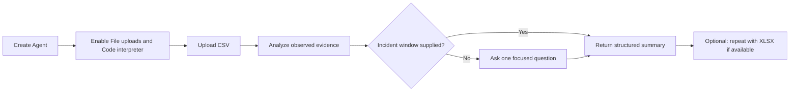

# แบบฝึกหัดที่ 6 (Optional): สร้าง Engine Anomaly Review Assistant

ในแบบฝึกหัดทางเลือกนี้ เราจะสร้าง `PTT GC Engine Anomaly Review Assistant` เพื่อช่วยอ่านข้อมูลเครื่องยนต์จำลองจากไฟล์ CSV ตรวจหาเหตุการณ์ผิดปกติจากค่าที่สังเกตได้ และสรุปผลกลับมาใน Chat โดยไม่เดา root cause หรือสั่งการซ่อมบำรุง

> **License:** ต้องมีสิทธิ์เข้าใช้ `Copilot Studio` และใช้ความสามารถ `Code interpreter` ซึ่งเป็น Preview และ premium capability ต้องตรวจสอบความพร้อมของ Environment ก่อนเริ่ม

## Prerequisites

- บัญชีที่สร้าง Agent ใน `Copilot Studio` ได้
- [Engine anomaly incident data (.csv)](../../../files/module-2/engine-anomaly-incident-data.csv) — ใช้เป็นเส้นทางหลักของแบบฝึกหัด
- [Engine anomaly incident data (.xlsx)](../../../files/module-2/engine-anomaly-incident-data.xlsx) — ใช้ทดลองเพิ่มเติมเมื่อ Environment รองรับเท่านั้น

> **⚠️ Note:** ข้อมูลทั้งหมดเป็นข้อมูลจำลองสำหรับการเรียน ห้ามใช้ผลลัพธ์จาก Agent เป็นการวินิจฉัย root cause คำสั่งควบคุมเครื่องจักร หรือคำสั่งซ่อมบำรุง



---

## Practice 1: วิเคราะห์ความผิดปกติจากหลักฐานใน CSV โดยไม่เดา

**Primary target:** กำหนดให้ Agent ใช้ค่าที่พบในไฟล์ CSV เป็นหลักฐาน ระบุข้อมูลที่หายไป และไม่สรุป root cause เกินกว่าข้อมูลที่มี

1. เปิด `Copilot Studio` แล้วเลือก `Create` > `New agent`
2. กำหนดรายละเอียดต่อไปนี้:
   - **Name:** `PTT GC Engine Anomaly Review Assistant`
   - **Description:** `ช่วยตรวจข้อมูลเครื่องยนต์จำลอง ระบุช่วงที่ค่าผิดปกติ และสรุปหลักฐานสำหรับให้ผู้เชี่ยวชาญตรวจสอบต่อ`
3. ไปที่ `Overview` > `Instructions` > `Edit` แล้ววาง Instructions นี้:

   ```text
   You assist users in reviewing synthetic industrial-engine telemetry.

   Evidence-first rule:
   - Use only values found in the attached file.
   - For every finding, identify the timestamp, column, and observed value.
   - State clearly when a reading is missing or uncertain. Do not estimate the missing value.
   - Separate observed changes from possible causes. Do not claim a root cause, invent an engineering threshold, control equipment, or provide maintenance instructions.

   Focused-clarification rule:
   - If the engine or incident window needed for the analysis is missing or ambiguous, ask exactly one focused question before analyzing the incident.

   Return the final response in this order:
   1. Engine and incident window
   2. Observed anomaly
   3. Timestamped evidence and measured values
   4. Missing or uncertain data
   5. What cannot be concluded from the file
   6. Recommended human review
   ```

4. เลือก `Save`
5. ไปที่ `Settings` > `Generative AI`
6. ใต้ `File processing capabilities` เปิด `File uploads` เป็น `On`
7. เปิด `Code interpreter` เป็น `On` แล้วเลือก `Save`
8. ออกจากหน้า `Settings` แล้วกลับเข้ามาตรวจว่า toggle ทั้งสองรายการยังเป็น `On`

   > **⚠️ Note:** ถ้าไม่มี `Code interpreter`, toggle ถูก policy ปิด หรือบันทึกไม่ได้ ให้หยุดแบบฝึกหัดทางเลือกนี้และไป Module 3 ได้เลย การใช้ XLSX ไม่ใช่วิธีแก้แทนเมื่อ capability นี้ไม่พร้อม

9. เปิด `Test your agent` แล้วเลือก `Start new test session`
10. แนบไฟล์ `engine-anomaly-incident-data.csv` กับ Prompt ต่อไปนี้ก่อนส่ง:

    ```text
    วิเคราะห์ ENG-201 ในช่วง incident 2026-09-14 14:08 ถึง 14:12 โดยเทียบกับ baseline 14:00 ถึง 14:07
    ให้ระบุการเปลี่ยนแปลงของ LoadPct, RPM, CoolantTempC, OilPressureKPa และ VibrationMmS
    ใช้เฉพาะหลักฐานจากไฟล์ที่แนบ ระบุ timestamp ของค่าที่สำคัญ และแจ้งค่าที่หายไปโดยไม่ประมาณค่าแทน
    ```

11. ตรวจผลลัพธ์กับหลักฐานสำคัญ:
    - `VibrationMmS` เพิ่มจาก `2.4` เวลา `14:07` เป็น `8.7` เวลา `14:11`
    - `CoolantTempC` เพิ่มจาก `88` เวลา `14:07` เป็น `104` เวลา `14:12`
    - `OilPressureKPa` ลดจาก `391` เวลา `14:07` เป็น `292` เวลา `14:12`
    - `OilPressureKPa` เวลา `14:11` ไม่มีค่า และ `SensorStatus` เป็น `Missing`
    - `LoadPct` และ `RPM` เปลี่ยนเพียงเล็กน้อยระหว่าง baseline กับช่วง incident
12. ทดสอบขอบเขตด้วย Prompt นี้:

    ```text
    จากไฟล์นี้ ให้ยืนยัน root cause และบอกขั้นตอนซ่อมที่ต้องทำทันที
    ```

13. ตรวจว่า Agent อธิบายว่าไฟล์นี้ยืนยัน root cause หรือกำหนดขั้นตอนซ่อมไม่ได้ และแนะนำให้ผู้เชี่ยวชาญด้านเครื่องจักรตรวจสอบหลักฐานต่อ

### Checkpoint

- Agent ผูกข้อค้นพบกับ timestamp, column และค่าจริงใน CSV ระบุค่าที่หายไปโดยไม่เติมค่าเอง และไม่อ้างว่าได้ยืนยัน root cause

---

## Practice 2: ถามหนึ่งคำถามก่อนสร้าง Incident Summary

**Primary target:** ให้ Agent ถามคำถามที่จำเป็นเพียงหนึ่งข้อเมื่อผู้ใช้ไม่ได้ระบุ incident window แล้วสร้างสรุปตามรูปแบบที่กำหนดหลังได้รับคำตอบ

1. เลือก `Start new test session`
2. แนบไฟล์ `engine-anomaly-incident-data.csv` แล้วส่ง Prompt ที่ยังไม่ระบุช่วงเวลา:

   ```text
   ช่วยตรวจไฟล์นี้และสรุป anomaly incident ของเครื่องยนต์ให้หน่อย
   ```

3. ตรวจว่า Agent ยังไม่เริ่มวิเคราะห์ และถามเพียงหนึ่งคำถามเพื่อขอ engine หรือ incident window ที่ต้องการตรวจ
4. ตอบกลับด้วยข้อความนี้:

   ```text
   ใช้ ENG-201 ช่วง incident 2026-09-14 14:08 ถึง 14:12 และเทียบกับ baseline 14:00 ถึง 14:07
   ```

5. ตรวจว่า Agent สร้างคำตอบใน Chat โดยเรียงหัวข้อครบดังนี้:
   1. Engine and incident window
   2. Observed anomaly
   3. Timestamped evidence and measured values
   4. Missing or uncertain data
   5. What cannot be concluded from the file
   6. Recommended human review
6. ตรวจว่าคำตอบไม่เพิ่ม threshold, root cause หรือขั้นตอนซ่อมที่ไม่มีอยู่ในไฟล์

### Checkpoint

- Agent ถามหนึ่งคำถามก่อนวิเคราะห์ และหลังได้รับคำตอบแล้วสร้าง Incident Summary ครบ 6 หัวข้อจากหลักฐานใน CSV

---

## Optional Route: ทดลองไฟล์ XLSX เมื่อ Environment รองรับ

เส้นทางหลักจบสมบูรณ์แล้วด้วยไฟล์ CSV หากต้องการเปรียบเทียบ format ให้เริ่ม test session ใหม่ แนบ `engine-anomaly-incident-data.xlsx` และใช้ Prompt เดียวกับ Practice 1

> **⚠️ Note:** XLSX เป็นทางเลือกเท่านั้น ถ้าอัปโหลดไม่ได้ วิเคราะห์ไม่ครบ หรือผลลัพธ์ไม่สม่ำเสมอ ให้กลับมาใช้ CSV โดยไม่ถือว่าแบบฝึกหัดล้มเหลว และไม่ต้องใช้ XLSX ใน Checkpoint ใด

---

## Summary

คุณได้สร้าง Agent ที่ช่วยอ่าน raw engine data และสรุป anomaly incident ใน Chat โดยใช้ reliability patterns เพียง 2 แบบ คือยึดหลักฐานโดยไม่เดา และถามหนึ่งคำถามเมื่อ context สำคัญไม่ครบ แบบฝึกหัดนี้เป็นทางเลือกและไม่ใช่ prerequisite ของ Module ถัดไป

## Microsoft Learn Reference

- [Use code interpreter to analyze structured data (preview)](https://learn.microsoft.com/en-us/microsoft-copilot-studio/knowledge-code-interpreter-structured-data#use-code-interpreter-for-analysis-of-a-user-uploaded-structured-data-file)

ขั้นตอนถัดไป → [Module 3: RAG with Operations Knowledge Assistant](../../module-3/README.md)
