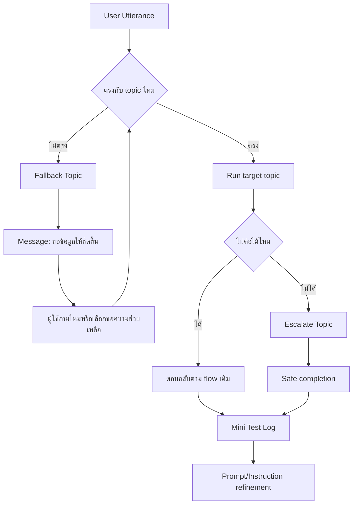
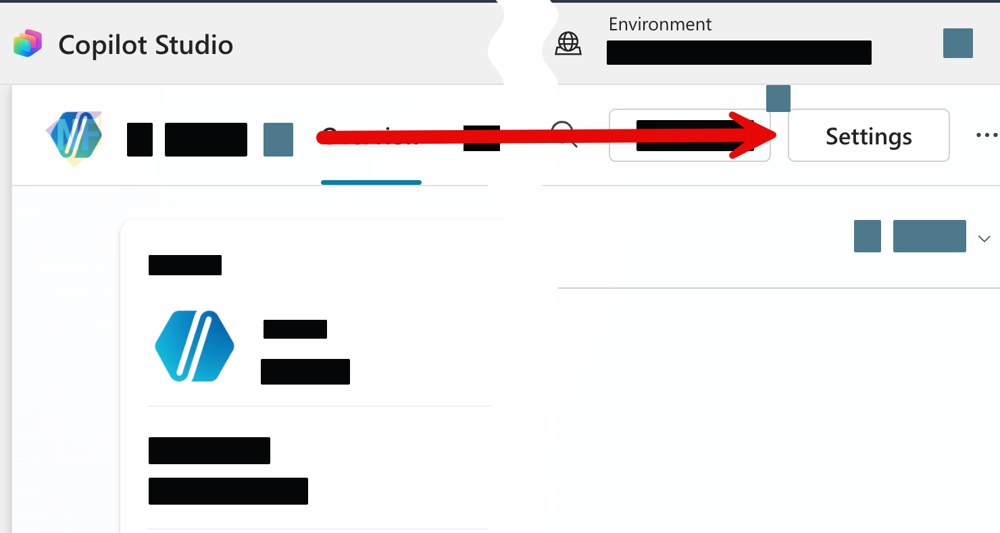
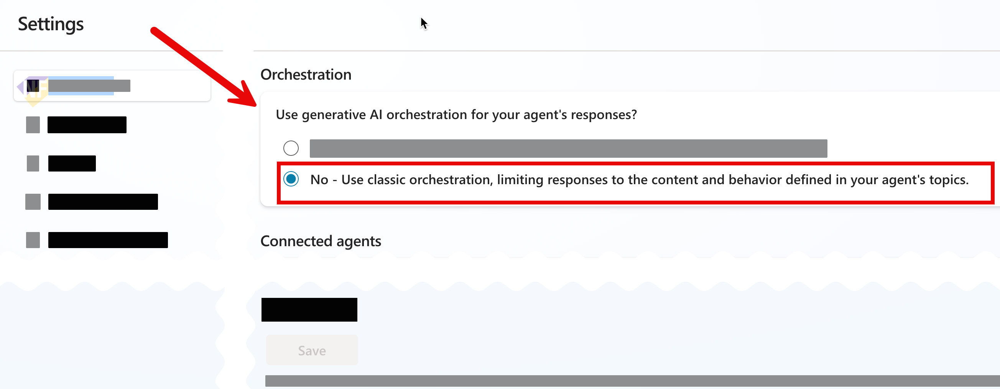

# แบบฝึกหัดที่ 6: ออกแบบ Fallback และ Mini Test Cycle

🔑 **ต้องการ M365 Copilot License + สิทธิ์เข้าใช้ Copilot Studio**

แบบฝึกหัดสุดท้ายของ Module 2 จะพาเรา harden Agent เดิมให้พร้อมใช้งานจริงมากขึ้น โดยเน้น 3 เรื่องสำคัญคือ **Fallback**, **Escalation**, และ **Mini test cycle** เพื่อให้ Agent ไม่ตอบมั่วเมื่อคำถามไม่ชัดเจน และรู้ว่าควรจบการสนทนาอย่างปลอดภัยเมื่ออยู่นอกขอบเขต หลังจากที่เราเพิ่งเปิด hybrid conversation ด้วย orchestration + knowledge ใน Exercise 5

แบบฝึกหัดนี้ต่อยอดจาก Exercise 1-5 โดยสมมติว่าเรามี Agent สำหรับช่วยวิเคราะห์รายงานการเงินอยู่แล้ว พร้อมตอบคำถาม technical terms ได้ในแชตเดียวกัน และตอนนี้ต้องเตรียม Agent ให้พร้อมก่อนพาไปสู่แนวคิดด้าน reliability ใน Module ถัดไป



---

## ก่อนเริ่ม

1. ให้แน่ใจก่อนว่าได้ทำ Exercise 1-5 แล้ว และยังมี Agent เดิมที่ใช้โจทย์วิเคราะห์รายงานการเงินอยู่
2. ใน Agent ควรมี Topic หลักที่รับคำขอรายงานรายเดือน และเปิดให้ตอบคำถาม technical terms ด้วย knowledge แล้ว
3. แบบฝึกหัดนี้จะไม่ได้เพิ่มความสามารถใหม่ขนาดใหญ่ แต่จะช่วยให้ Agent ตอบอย่างปลอดภัยและคาดเดาได้มากขึ้น

> ⚠️ **Note:** ใน Agent `Fallback` และ `Escalate` เป็น **system topics** ที่มีมาให้ใน Agent อยู่แล้ว เราปรับแต่งได้ แต่ควรปรับอย่างระมัดระวังและทดสอบทุกครั้งหลังแก้ไข

---

## Practice 1: ปรับ Fallback system topic ให้ถามกลับอย่างมีบริบท

1. จาก Menu Agent ด้านบนไปที่ **Topics > System > Fallback**
   
2. เปิด Topic Fallback แล้วดูข้อความเดิมของระบบว่าแจ้งผู้ใช้อย่างไรเมื่อ Agent จับคู่คำถามกับ topic ไม่ได้
   
3. ปรับข้อความใน **Message node** ให้เหมาะกับงานวิเคราะห์รายงานการเงิน โดยบอกผู้ใช้ชัดเจนว่าควรระบุอะไรเพิ่ม เช่น เดือน, Business Unit, หรือเป้าหมายของรายงาน

   ตัวอย่างข้อความ:

   ```text
   ขอโทษครับ ผมยังจับคำขอนี้ไปยังหัวข้อที่ถูกต้องไม่ได้
   ลองพิมพ์ใหม่โดยระบุเดือน, Business Unit และสิ่งที่ต้องการ เช่น
   - สรุปรายงานเดือน April ของ BU Performance Chemicals
   - วิเคราะห์ต้นทุนเทียบเดือนก่อนหน้า
   - อธิบายความหมายของ EBITDA
   ```

4. กด **Save** 
5. กลับมาที่ Overview ของ Agent และแก้ 2 บรรทัดแรกของ Instructions ให้สอดคล้องกับข้อความใน Fallback มากขึ้น เช่น

   ```text
   You are Financial Report Assistant for enterprise business users.   
   Only answer questions about financial report analysis, financial reporting terminology, and report distribution policy. Do not answer HR, leave, travel, food, facilities, or general office questions. If a request is outside this scope, do not search for an answer.
   ```
6. กดปุ่ม **Save** ในส่วน instruction
7. จากด้านบนของหน้า Agent ให้กด **Setting** ที่อยู่ด้านขวาสุด เพื่อเปิด setting ของ Agent
   
8. กดเปลี่ยนการตั้งค่าในส่วน Orchestration > Use generative AI ochrestration for your agent response ให้เป็น **No** เพื่อให้ Agent พยายามจับคู่กับ topic ที่มีมากขึ้น และถ้าไม่เจอจะเข้า Fallback ทันที แทนที่จะพยายามเดาเองว่าผู้ใช้ต้องการอะไร
   

> ⚠️ **Note:** การปิด generative orchestration จะทำให้ Agent พยายามจับคู่กับ topic ที่มีอยู่มากขึ้น และถ้าไม่เจอจะเข้า Fallback ทันที แทนที่จะพยายามเดาเองว่าผู้ใช้ต้องการอะไร ซึ่งเหมาะกับกรณีที่เราต้องการความแม่นยำและควบคุมคำตอบได้ดีขึ้นในช่วงแรกของการใช้งานจริง และเราต้องไปกำหนด trigger phrase ในแต่ละ topic ให้ครอบคลุมคำถามที่คาดว่าจะเจอให้มากที่สุด

9.  เปิดไปที่หน้า **Test your agent**
10. ใช้ **Test your agent** ลองพิมพ์คำถามเพื่อดูว่าข้อความใหม่ช่วยให้ผู้ใช้รู้ว่าควรถามต่ออย่างไรหรือไม่

   ลองทดสอบด้วย prompt ตัวอย่างนี้:

   ```text
   ขอข้อมูลร้านกาแฟใกล้ออฟฟิศ
   ```

   **Expected result:** ระบบควรเข้า `Fallback` topic และตอบกลับด้วยข้อความที่ขอรายละเอียดเพิ่ม ไม่ควรเดาเองว่าผู้ใช้ต้องการสรุปรายงานประเภทไหน

11. กลับไปที่ Agent Setting > เปิด **Use generative AI orchestration for your agent response** กลับเป็น **Yes** เพื่อให้ Agent พยายามเดาเองถ้าไม่เจอ topic ที่ตรงกับคำถาม และทดสอบ prompt เดิมอีกครั้งเพื่อดูความแตกต่าง   

> 💡 Tip: ข้อความ Fallback ที่ดีไม่ควรบอกแค่ว่า “กรุณาถามใหม่” แต่ควรยกตัวอย่างคำถามที่ดีให้ผู้ใช้เห็นทันที

---

## Practice 2: ปรับ Escalate system topic ให้จบการสนทนาอย่างปลอดภัย

1. ไปที่ **Topics > System > Escalate**
2. ตรวจดูว่า topic นี้สื่อสารกับผู้ใช้อย่างไรเมื่อ Agent ต้องพาไปสู่การคุยกับคนหรือหยุดตอบในเรื่องที่เกินขอบเขต
3. ปรับข้อความให้เหมาะกับบริบทธุรกิจจริง โดยหลีกเลี่ยงการสัญญาว่าระบบจะเปิด ticket หรือส่งต่ออัตโนมัติ ถ้ายังไม่ได้สร้าง flow นั้นใน Agent

   ตัวอย่างข้อความ:

   ```text
   คำขอนี้อาจต้องให้ผู้รับผิดชอบตรวจสอบเพิ่มเติมครับ
   หากเป็นประเด็นเชิงนโยบาย การอนุมัติการเผยแพร่รายงาน หรือข้อมูลที่ต้องการการยืนยันอย่างเป็นทางการ
   กรุณาติดต่อทีม Finance Analyst หรือ Shared Services ตามช่องทางขององค์กร finance@mail.com หรือโทร 123-4567
   ```

4. สังเกด trigger phrase ใน Escalate topic ที่เกี่ยวกับการขอคุยกับคน เช่น “ขอคุยกับเจ้าหน้าที่” หรือ “ให้คนช่วยต่อ” ให้ตรวจสอบว่าถ้อยคำสอดคล้องกับผู้ใช้งานจริงในองค์กร
5. กลับไปที่ Topic หลักของงานวิเคราะห์รายงานการเงิน แล้วตรวจว่าในกรณีที่ตอบต่อไม่ได้จริง Agent ควรไปจบที่ข้อความลักษณะนี้ แทนที่จะพยายามตอบนอกขอบเขต
6. กด **Save** แล้วทดสอบอย่างน้อย 2 เคส:
   - เคสที่ผู้ใช้ขอให้คุยกับคนโดยตรง
   - เคสที่คำถามเป็นเรื่องนโยบายหรือการอนุมัติที่ Agent ไม่ควรตอบแทนคน

> 💡 **Tip:** Escalation ที่ดีควรบอกทั้ง “ทำไม Agent จึงหยุดตรงนี้” และ “ผู้ใช้ควรไปต่ออย่างไร” เพื่อไม่ให้ผู้ใช้รู้สึกว่าระบบค้าง

---

## Practice 3: ทำ Mini test cycle ด้วย Test your agent (อย่างน้อย 10 test prompts)

ดาวน์โหลดไฟล์ template สำหรับบันทึกผลการทดสอบได้ที่:
- [mini-test-log-template.xlsx](../../../files/module-2/mini-test-log-template.xlsx)

1. วิเคราะห์
2. เปิด **Test your agent** ที่ด้านบนของหน้าใน Copilot Studio
3. ถ้าต้องการตามดูว่า conversation วิ่งไป topic ไหน ให้เปิดเมนูสามจุดใน test panel แล้วเปิด **Track between topics**
4. ถ้าต้องการดูค่าตัวแปรระหว่างทดสอบ ให้เปิด **Variables** และสลับมาที่แท็บ **Test**
5. สร้างชุดทดสอบ 3 กลุ่มรวมอย่างน้อย 10 เคส ดังนี้:
   - Happy path 4 เคส
   - Edge cases 4 เคส (edge case คือเคสที่คำถามยังไม่ชัดเจนหรือขาดข้อมูลบางอย่าง แต่ยังอยู่ในขอบเขตที่ Agent ควรตอบได้)
   - Unknown intent / out-of-scope 2 เคส
6. ใช้ตารางนี้เป็น template ในการสร้าง test prompt และบันทึกผลการทดสอบ
   | No. | Test Prompt | กลุ่ม | ผลลัพธ์จริง | ผ่าน/ไม่ผ่าน | สิ่งที่ต้องปรับ |
   |---|---|---|---|---|---|
   | 1 | สร้างรายงานเดือน May ... | Happy path | เข้า topic ถูกและสรุปได้ | ✅ ผ่าน | - |
   | 2 | สร้างรายงาน ... | Edge case | ตอบข้อมูลสรุปมาไม่ตรง | ❌ ไม่ผ่าน | เพิ่ม instruction ให้ถาม clarification |
   | 3 | สั่งอาหารกลางวันให้ทีม finance | Out-of-scope | ตอบนอกขอบเขต | ไม่ผ่าน | เพิ่ม boundary และ fallback message |
   | 4 | ... | ... | ... | ... | ... |
### ตัวอย่าง test prompts สำหรับ Monthly Report Intake topic:

   #### Happy path
   ##### Trigger phrase
   ```text
   สร้างรายงานเดือน May 
   ```
   ##### Time Period
   ```
   May
   ```
   ##### Business Unit
   ```
   Aromatics
   ```
   ##### Style
   ```
   Business Executive
   ```
   ##### Revise?
   ```
   Yes
   ```
   ##### Prompt for revise
   ```text
   วิเคราะห์ต้นทุนเทียบเดือนก่อนหน้าและสรุปความเสี่ยงสำคัญ
   ช่วยสรุปประเด็นที่ผู้บริหารควรจับตาในรายงานเดือน May ของ BU Aromatics
   อธิบายผลต่างของ gross margin เดือนนี้เทียบเดือนก่อนหน้าแบบสั้นๆ
   ```

   #### Edge cases
   ##### Trigger phrase
   ```text
   สร้างรายงาน
   ```
   ##### Time Period 
   ```
   May
   ```
   ##### Business Unit (⚠️ ไม่มีในรายงาน)
   ```
   Probitics
   ```
   ##### Style
   ```
   Business Executive
   ```
   ##### Revise?
   ```
   No
   ```
   
   
   #### Unknown intent / out-of-scope

   ```
   สั่งอาหารกลางวันให้ทีม finance
   ```
### Tips
ระหว่างทดสอบ ให้สังเกต 4 อย่างนี้ทุกเคส:
   - ระบบเข้า topic ที่ถูกหรือไม่
   - ถ้าคำถามไม่ชัดเจน ระบบใช้ Fallback แบบที่ช่วยผู้ใช้ถามใหม่ได้หรือไม่
   - ถ้าคำถามอยู่นอกขอบเขต Agent หยุดการทำงาน หรือหรือยังพยายามตอบมั่ว
   - output format สม่ำเสมอหรือไม่ เช่นสรุปเป็น bullet, executive summary, หรือ risk highlights


> ⚠️ **Note:** Microsoft Learn ระบุว่า Test your agent panel เหมาะกับการ validate ระหว่างออกแบบ แต่ไม่ถือเป็นตัวแทนพฤติกรรมของทุก published channel โดยเฉพาะกรณี event หรือ behavior บางแบบที่ขึ้นกับ channel จริง


---

## สรุป

ในแบบฝึกหัดนี้ คุณได้ทำให้ Agent แข็งแรงขึ้นด้วยการปรับ **Fallback** และ **Escalate** system topics ให้เหมาะกับงานจริง พร้อมฝึก **mini test cycle** เพื่อหา failure pattern และปรับ Instructions/Prompt อย่างเป็นระบบก่อนใช้งานจริง

อ่านเพิ่มเติมได้ที่:
- [Microsoft Learn: Use system topics](https://learn.microsoft.com/en-us/microsoft-copilot-studio/authoring-system-topics)
- [Microsoft Learn: Test your agent](https://learn.microsoft.com/en-us/microsoft-copilot-studio/authoring-test-bot)

ขั้นตอนถัดไป → [Module 3: Hardening and Deployment Preparation](../../module-3/README.md)
