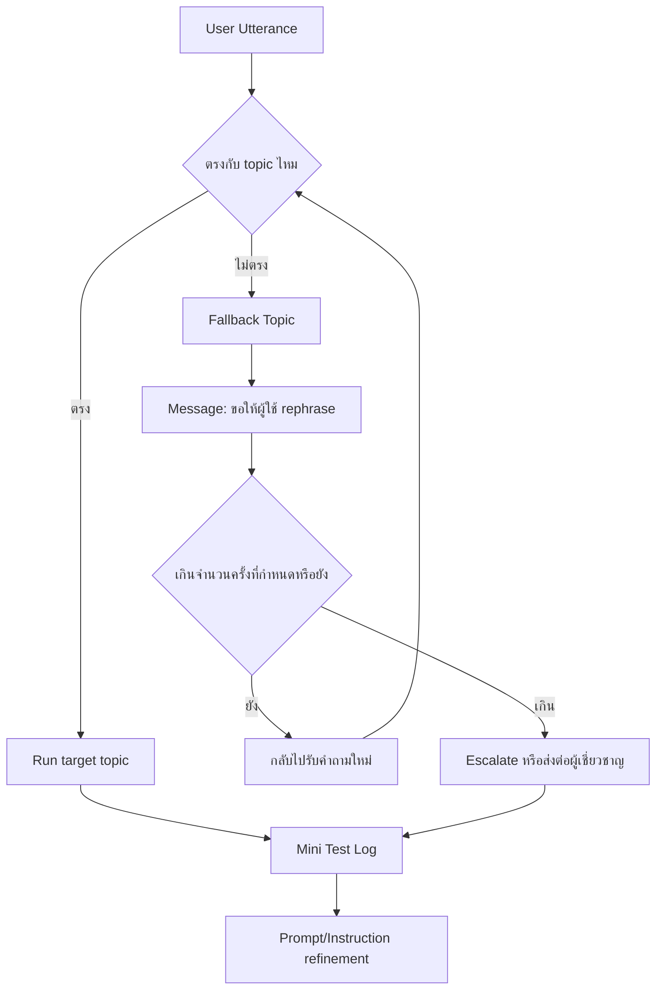

# แบบฝึกหัดที่ 6: ออกแบบ Fallback และ Mini Test Cycle

🔑 **ต้องการ M365 Copilot License + สิทธิ์เข้าใช้ Copilot Studio**

แบบฝึกหัดสุดท้ายของ Module 2 จะ harden Topic เดิมให้ปลอดภัยขึ้นเมื่อไม่เข้าใจคำถาม และฝึก mini test cycle เพื่อปรับ Instruction/Prompt ก่อนไป Module ถัดไป



---

## Practice 1: ปรับ Fallback system topic

1. ไปที่ **Topics > System > Fallback**
2. ปรับข้อความให้เข้ากับบริบทรายงานการเงิน เช่นให้ผู้ใช้ระบุเดือน/BU หรือเป้าหมายที่ชัดขึ้น
3. กำหนดจำนวนครั้งในการขอ rephrase ก่อน escalation

---

## Practice 2: ออกแบบ Escalation path ที่ชัดเจน

1. เมื่อถึงเงื่อนไขที่ต้องส่งต่อ ให้แจ้งผู้ใช้ว่า Agent จะโอนเรื่องให้ผู้รับผิดชอบ
2. ถ้าองค์กรมีช่องทางชัดเจน ให้ระบุ เช่นทีม Finance Analyst หรือ Shared Services
3. ทดสอบว่า escalation ไม่ทำให้ผู้ใช้ค้างใน flow

> 💡 **Tip:** ใช้ข้อความ escalation ที่บอกทั้ง "เกิดอะไรขึ้น" และ "ขั้นตอนถัดไปคืออะไร" เพื่อลดความสับสน

---

## Practice 3: Mini test cycle (อย่างน้อย 10 test prompts)

1. สร้างชุดทดสอบ 3 กลุ่ม:
   - Happy path (4 เคส)
   - Edge cases (3 เคส)
   - Unknown intent / out-of-scope (3 เคส)
2. ตัวอย่าง test prompts:

   ```
   สรุปรายงานเดือน April ของ BU Performance Chemicals แบบผู้บริหาร
   วิเคราะห์ต้นทุนเทียบเดือนก่อนหน้าและสรุปความเสี่ยง
   ขอสูตรคำนวณ EBITDA แบบละเอียด
   สั่งอาหารกลางวันให้ทีม finance
   ```

3. บันทึกผลว่าเคสไหนผ่าน/ไม่ผ่าน พร้อมเหตุผล

---

## Practice 4: ปรับ Instruction และ Prompt จากผลทดสอบ

1. เปิดส่วน **Instructions** แล้วปรับตามจุดที่พบบ่อย เช่น:
   - บังคับ scope ให้ชัดเจนขึ้น
   - บอก format output ให้สม่ำเสมอ
   - ระบุหลักการปฏิเสธคำขอนอกขอบเขต
2. ทดสอบซ้ำ 3 เคสที่เคยไม่ผ่าน และเปรียบเทียบผลก่อน-หลัง

---

## สรุป

ในแบบฝึกหัดนี้ คุณได้ทำให้ Agent แข็งแรงขึ้นด้วย fallback/escalation และฝึก mini test cycle เพื่อยกระดับคุณภาพก่อนใช้งานจริง

ขั้นตอนถัดไป → [กลับไปสารบัญ Module 2](../README.md)