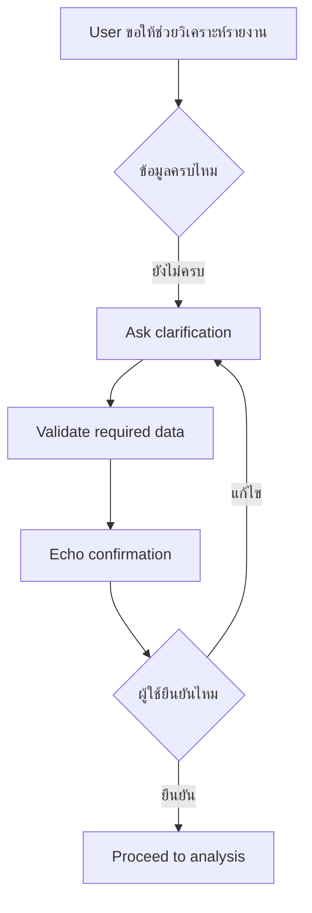

# แบบฝึกหัดที่ 1: Identify the key data

แบบฝึกหัดนี้จะพาเราฝึกออกแบบบทสนทนาให้ Agent ไม่เดาคำตอบเองเมื่อข้อมูลยังไม่ครบ โดยใช้สถานการณ์ของ **Financial Report Assistant** ที่สร้างและทำ mini test cycle มาแล้วใน Module 2 เป็นฐาน และทำกิจกรรมผ่าน Microsoft Teams ได้โดยไม่ต้องแก้ Agent ใน Copilot Studio

> **⚠️ Note:** แบบฝึกหัดนี้เน้นการออกแบบ reliability pattern ไม่จำเป็นต้องเปิด Copilot Studio



---

## Practice 1: Fix the Wrong Answer

Practice นี้ช่วยให้ Agent หยุดการเดาความต้องการของผู้ใช้ และถามเฉพาะข้อมูลที่จำเป็นก่อนเริ่มงาน


1. ให้ลองอ่านข้อความตัวอย่างนี้

   ```text
   User: ช่วยสรุปรายงานให้หน่อย
   Agent: ได้ครับ ผมจะสรุปรายงานการเงินเดือนพฤษภาคมของทุก BU ให้ทันที
   ```

2. ให้ตอบในช่องทางที่กำหนด ว่า Agent เดาอะไรไปเองบ้าง
3. ทดลองคิดคำตอบใหม่ให้ Agent ถามกลับ 1 คำถามก่อนเริ่มงาน **Agent ควรจะถามว่าอะไร?**

4. นี่คือตัวอย่างคำตอบที่เหมาะสมกว่า

   <details>
   <summary>ตัวอย่างคำตอบที่เหมาะสมกว่า</summary>

   ```text
   ได้ครับ เพื่อให้สรุปรายงานได้ตรงความต้องการ
   ต้องการรายงานช่วงเวลาใด และสำหรับ Business Unit ไหนครับ
   ```

   </details>

5. ใช้รูปแบบคำถามนี้เป็นแนวทาง

   - ตอบรับคำขอของผู้ใช้อย่างสั้นและเป็นมิตร
   - ถามเฉพาะข้อมูลที่จำเป็นต่อขั้นตอนถัดไป
   - ไม่ระบุช่วงเวลา ขอบเขต หรือผลลัพธ์แทนผู้ใช้

6. ลองแก้คำตอบของ Agent ใน 3 challenge ต่อไปนี้ โดยในแต่ละข้อให้ระบุว่า Agent เดาอะไรไปเอง แล้วเขียนคำตอบใหม่ที่ถามเฉพาะข้อมูลที่จำเป็นก่อนเริ่มงาน

   <details>
   <summary>Challenge A: Product Operations Agent</summary>

   ```text
   User: ช่วยวิเคราะห์ปัญหาการผลิตให้หน่อย
   Agent: ได้ครับ ผมจะวิเคราะห์ปัญหาของสายการผลิตที่โรงงาน A ในสัปดาห์นี้ และสรุปสาเหตุที่ทำให้ output ลดลงให้ทันที
   ```

   </details>

   <details>
   <summary>Challenge B: Marketing Agent</summary>

   ```text
   User: ช่วยดูผล campaign นี้ให้หน่อย
   Agent: ได้ครับ Campaign นี้ทำผลงานต่ำกว่าเป้าหมายในกลุ่มลูกค้า Gen Z และผมจะแนะนำให้เพิ่มงบโฆษณาบน Instagram ทันที
   ```

   </details>

   <details>
   <summary>Challenge C: Researcher Agent</summary>

   ```text
   User: ช่วยหาข้อมูลเกี่ยวกับตลาดนี้ให้หน่อย
   Agent: ได้ครับ ตลาดนี้มีแนวโน้มเติบโตสูงในปีหน้า และคู่แข่งหลักกำลังลงทุนด้านเทคโนโลยีใหม่ ผมจะสรุปผลวิจัยสำหรับการตัดสินใจลงทุนให้ทันที
   ```

   </details>

   ไม่มีคำตอบตัวอย่างสำหรับ challenge เหล่านี้ ให้แต่ละทีมออกแบบคำถามตามเหตุผลของตนเอง

7. แชร์คำตอบที่ทีมคิดว่าดีที่สุดในช่องทางที่เตรียมไว้ แล้วอธิบายว่าคำถามนั้นช่วยลดความเสี่ยงจากการเดาคำตอบได้อย่างไร

> **💡 Tip:** คำถามที่ดีควรถามเฉพาะข้อมูลที่จำเป็นต่อขั้นตอนถัดไป ไม่ควรถามหลายเรื่องจนผู้ใช้ตอบยาก

---

## Practice 2: Missing Info Detective

Practice นี้ช่วยให้ Agent รวบรวมข้อมูลขั้นต่ำที่จำเป็นต่อการทำงาน โดยไม่ถามผู้ใช้มากเกินไป


1. ลองดู ข้อความตัวอย่างนี้

   ```text
   User: ช่วยวิเคราะห์ไฟล์รายงานนี้เป็น executive summary ให้หน่อย
   ```

2. ให้ช่วยกันระบุข้อมูลที่ยังขาดก่อน Agent จะวิเคราะห์ และทำงานได้อย่างปลอดภัย ลองส่งไอเดียที่คิดออกมาคุยกัน

3. เขียนข้อความที่เหมาะสมใหม่ ให้ Agent เพื่อให้ Agent ถามกลับแบบสั้น กระชับ และเป็นมิตร

4. มาลองดูตัวอย่างคำถามที่เหมาะสมสำหรับเก็บข้อมูลขั้นต่ำที่จำเป็นกัน

   <details>
   <summary>ตัวอย่างคำถามสำหรับเก็บข้อมูล</summary>

   ```text
   ได้ครับ ก่อนเริ่มวิเคราะห์ ขอข้อมูลเพิ่ม 3 อย่างครับ
   1. Report period ที่ต้องการวิเคราะห์
   2. Business Unit หรือขอบเขตข้อมูล
   3. ชื่อไฟล์หรือไฟล์ที่ต้องการให้ใช้เป็น source
   ```

   </details>

5. ใช้รูปแบบนี้เป็นแนวทางในการปรับปรุงการถามกลับของ Agent

   - ระบุข้อมูลขั้นต่ำที่ Agent ต้องใช้ก่อนทำงาน
   - ถามข้อมูลนั้นอย่างชัดเจนและรวมคำถามที่เกี่ยวข้องไว้ด้วยกัน
   - อธิบายเฉพาะสิ่งที่จำเป็นต่อการไปขั้นตอนถัดไป

6. ลองระบุข้อมูลที่ยังขาดและเขียนคำถามถามกลับสำหรับ 3 challenge ต่อไปนี้

   <details>
   <summary>Challenge A: Product Operations Agent</summary>

   ```text
   User: สายการผลิตมีปัญหา ช่วยวิเคราะห์ให้หน่อย
   ```

   </details>

   <details>
   <summary>Challenge B: Marketing Agent</summary>

   ```text
   User: ช่วยดูผล campaign นี้ให้หน่อยว่าควรปรับอะไร
   ```

   </details>

   <details>
   <summary>Challenge C: Researcher Agent</summary>

   ```text
   User: ช่วยหาข้อมูลพฤติกรรมลูกค้าในตลาดนี้ให้หน่อย
   ```

   </details>
   

7. แชร์คำถามถามกลับที่ทีมคิดว่าดีที่สุดในช่องทางที่เตรียมไว้พร้อมอธิบายสั้นๆ ว่าข้อมูลใดที่ Agent ต้องรู้ก่อนเริ่มงาน

---

## Practice 3: Echo Confirmation

Practice นี้ช่วยให้ Agent ทวนข้อมูลที่ผู้ใช้ให้มาอย่างถูกต้อง และให้ผู้ใช้ยืนยันก่อน Agent เริ่มทำงาน


1. ในสถานการณ์ที่​​ Agent ถามเพื่อขอข้อมูลเพิ่มเติม สมมติว่าผู้ใช้ตอบกลับมาแบบนี้

   ```text
   May 2026, BU Trading, ขอเป็น Executive Summary จากไฟล์ PTT-Monthly-Financial-Report-May2026.xlsx
   ```

2. ลองออกไอเดีย คิดข้อความเพื่่อ**ยืนยันข้อมูลก่อน Agent เดินหน้าทำงานต่อ** โดยให้ Agent ทวนข้อมูลสำคัญที่ผู้ใช้ให้มาอย่างถูกต้อง

3. ลองดูตัวอย่าง echo confirmation ที่เหมาะสม

   <details>
   <summary>ตัวอย่าง Echo Confirmation</summary>

   ```text
   เพื่อยืนยันนะครับ
   - Report period: May 2026
   - Business Unit: BU Trading
   - Format: Executive Summary
   - Source file: PTT-Monthly-Financial-Report-May2026.xlsx

   ต้องการให้ผมเริ่มวิเคราะห์ตามข้อมูลนี้เลยไหมครับ
   ```

   </details>

4. ใช้รูปแบบ echo confirmation นี้เป็นแนวทาง

   - สะท้อนข้อมูลสำคัญที่ผู้ใช้ให้มาอย่างถูกต้อง
   - ระบุงานที่ Agent ตั้งใจจะทำ โดยไม่สัญญาเกิน capability
   - ปิดท้ายด้วยคำถามที่ผู้ใช้ตอบ Yes/No ได้ง่าย

5. ลองแก้ echo confirmation ของ Agent ใน​ challenge ต่อไปนี้ โดยให้ทวนข้อมูลที่ผู้ใช้ให้มาอย่างถูกต้อง และถามยืนยันก่อนเริ่มงาน

   สิ่งที่ต้องตอบ
   - Agent ตัวปัจจุบันระบุข้อมูลผิดหรือขาดอะไรไปบ้าง
   - เขียนข้อความ echo confirmation ใหม่ที่สะท้อนข้อมูลที่ผู้ใช้ให้มาอย่างถูกต้อง และถามยืนยันก่อนเริ่มงาน

   <details>
   <summary>Challenge A: Product Operations Agent</summary>

   ```text
   User: ช่วยสรุป downtime ของ Line 2 โรงงาน A วันที่ 17 June สำหรับหัวหน้ากะ โดยใช้ไฟล์ downtime report ที่แนบ

   Agent: เพื่อยืนยันนะครับ ผมจะสรุป downtime ของ Line 3 โรงงาน A ตลอดเดือน June เป็นรายงานสำหรับผู้บริหาร และจะระบุสาเหตุของปัญหาให้ทันที
   ```

   </details>

   <details>
   <summary>Challenge B: Marketing Agent</summary>

   ```text
   User: ขอวิเคราะห์ conversion ของ Summer Campaign 2026 บน TikTok สำหรับนักศึกษาในกรุงเทพฯ แล้วทำ dashboard สำหรับ Marketing Manager

   Agent: เพื่อยืนยันนะครับ ผมจะวิเคราะห์ engagement ของ Summer Campaign 2025 บน Instagram สำหรับลูกค้าทั่วประเทศ และ publish dashboard ให้ทันที
   ```

   </details>

   <details>
   <summary>Challenge C: Researcher Agent</summary>

   ```text
   User: ช่วยสรุปตลาดรถยนต์ไฟฟ้าในประเทศไทยปี 2026 จาก customer survey ที่แนบ เป็น executive summary ภาษาไทย 1 หน้า สำหรับทีม Strategy

   Agent: เพื่อยืนยันนะครับ ผมจะจัดทำรายงานภาษาอังกฤษแบบละเอียดเกี่ยวกับตลาดรถยนต์ไฟฟ้าในอินโดนีเซียปี 2025 และแนะนำการลงทุนให้ทีม Strategy
   ```

   </details>

   ไม่มีคำตอบตัวอย่างสำหรับ challenge เหล่านี้ ให้แต่ละทีมออกแบบ echo confirmation ที่ถูกต้องตามข้อมูลผู้ใช้ และตัดคำสัญญาที่เกิน capability ของ Agent ออก

6. แชร์ echo confirmation ที่ทีมแก้ไขแล้วในช่องทางที่กำหนด พร้อมอธิบาย 1 จุดที่ Agent เดิมสะท้อนข้อมูลผิดหรือสัญญาเกินจริง

---

## สรุป

ในแบบฝึกหัดนี้ คุณได้ฝึก 3 reliability pattern สำคัญคือ **Clarification**, **Validation** และ **Echo confirmation** เพื่อให้ Agent ถามข้อมูลที่จำเป็นก่อนวิเคราะห์ และลดโอกาสเกิดคำตอบผิดจากข้อมูลไม่ครบ

ขั้นตอนถัดไป → [ออกแบบ Escalation และ Safe Completion](../exercise-2-escalation-and-safe-completion/README.md)
