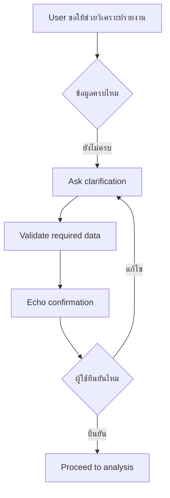

# แบบฝึกหัดที่ 1: ถามให้ชัดและยืนยันข้อมูลก่อนวิเคราะห์

แบบฝึกหัดนี้จะพาเราฝึกออกแบบบทสนทนาให้ Agent ไม่เดาคำตอบเองเมื่อข้อมูลยังไม่ครบ โดยใช้สถานการณ์ของ **Financial Report Assistant** ที่สร้างและทำ mini test cycle มาแล้วใน Module 2 เป็นฐาน และทำกิจกรรมผ่าน Microsoft Teams ได้โดยไม่ต้องแก้ Agent ใน Copilot Studio

> **⚠️ Note:** แบบฝึกหัดนี้เน้นการออกแบบ reliability pattern ไม่จำเป็นต้องเปิด Copilot Studio



---

## Practice 1: Fix the Wrong Answer

1. ให้ลองอ่านข้อความตัวอย่างนี้

   ```text
   User: ช่วยสรุปรายงานให้หน่อย
   Agent: ได้ครับ ผมจะสรุปรายงานการเงินเดือนพฤษภาคมของทุก BU ให้ทันที
   ```

2. ให้ตอบใน Teams chat ว่า Agent เดาอะไรไปเองบ้าง
3. Rewrite คำตอบใหม่ให้ Agent ถามกลับ 1 คำถามที่ชัดเจนก่อน เช่น

   ```text
   ได้ครับ ต้องการให้สรุปรายงานช่วงเวลาใด และสำหรับ Business Unit ไหนครับ

   ตัวอย่างคำตอบ:
   - May 2026, BU Trading
   - Q2 2026, ทุก Business Unit
   ```

4. ลองแก้คำตอบของ Agent ใน challenge ต่อไปนี้ โดยในแต่ละข้อให้ระบุว่า Agent เดาอะไรไปเอง แล้วเขียนคำตอบใหม่ที่ถามเฉพาะข้อมูลที่จำเป็นก่อนเริ่มงาน

   <details>
   <summary>Challenge A: Product Operations Agent</summary>

   ```text
   User: ช่วยวิเคราะห์ปัญหาการผลิตให้หน่อย
   Agent: ได้ครับ ผมจะวิเคราะห์ปัญหาของสายการผลิตที่โรงงาน A ในสัปดาห์นี้ และสรุปสาเหตุที่ทำให้ output ลดลงให้ทันที
   ```

   </details>

   <details>
   <summary>Challenge B: Marketing Agent</summary>

   ```text
   User: ช่วยดูผล campaign นี้ให้หน่อย
   Agent: ได้ครับ Campaign นี้ทำผลงานต่ำกว่าเป้าหมายในกลุ่มลูกค้า Gen Z และผมจะแนะนำให้เพิ่มงบโฆษณาบน Instagram ทันที
   ```

   </details>

   <details>
   <summary>Challenge C: Researcher Agent</summary>

   ```text
   User: ช่วยหาข้อมูลเกี่ยวกับตลาดนี้ให้หน่อย
   Agent: ได้ครับ ตลาดนี้มีแนวโน้มเติบโตสูงในปีหน้า และคู่แข่งหลักกำลังลงทุนด้านเทคโนโลยีใหม่ ผมจะสรุปผลวิจัยสำหรับการตัดสินใจลงทุนให้ทันที
   ```

   </details>

   <details>
   <summary>Challenge D: Legal Agent</summary>

   ```text
   User: สัญญาฉบับนี้ส่งให้คู่ค้าเซ็นได้เลยไหม
   Agent: ได้ครับ สัญญานี้ไม่มีประเด็นทางกฎหมายที่ต้องแก้ไข และสามารถส่งให้คู่ค้าเซ็นได้ทันที
   ```

   </details>

5. แชร์คำตอบที่ทีมคิดว่าดีที่สุดใน Teams chat แล้วมาวิเคราะห์ร่วมกันว่าแบบไหนช่วยลดความเสี่ยงจากการเดาคำตอบได้ดีที่สุด

> **💡 Tip:** คำถามที่ดีควรถามเฉพาะข้อมูลที่จำเป็นต่อขั้นตอนถัดไป ไม่ควรถามหลายเรื่องจนผู้ใช้ตอบยาก

---

## Practice 2: Missing Info Detective

1. ลองดู ข้อความตัวอย่างนี้

   ```text
   User: ช่วยวิเคราะห์ไฟล์รายงานนี้เป็น executive summary ให้หน่อย
   ```

2. ให้ทีมช่วยกันระบุข้อมูลที่ยังขาดก่อน Agent จะวิเคราะห์ได้อย่างปลอดภัย โดยดูตัวอย่างนี้เป็นแนวทาง

   ```text
   Required data:
   - Report period
   - Business unit หรือ scope ของข้อมูล
   - Preferred report format
   - Source file หรือชื่อไฟล์
   - ผู้รับหรือระดับความละเอียดของรายงาน ถ้ามีผลต่อเนื้อหา
   ```

3. ให้เราคิดเขียนข้อความสำหรับ Agent เพื่อให้ Agent ถามกลับแบบสั้น กระชับ และเป็นมิตร

   ```text
   ได้ครับ ก่อนเริ่มวิเคราะห์ ขอข้อมูลเพิ่ม 3 อย่างครับ
   1. Report period ที่ต้องการวิเคราะห์
   2. Business Unit หรือขอบเขตข้อมูล
   3. ชื่อไฟล์หรือไฟล์ที่ต้องการให้ใช้เป็น source
   ```

4. ลองระบุข้อมูลที่ยังขาดและเขียนคำถามถามกลับสำหรับ 3 challenge ต่อไปนี้

   <details>
   <summary>Challenge A: Product Operations Agent</summary>

   ```text
   User: สายการผลิตมีปัญหา ช่วยวิเคราะห์ให้หน่อย
   ```

   </details>

   <details>
   <summary>Challenge B: Marketing Agent</summary>

   ```text
   User: ช่วยดูผล campaign นี้ให้หน่อยว่าควรปรับอะไร
   ```

   </details>

   <details>
   <summary>Challenge C: Researcher Agent</summary>

   ```text
   User: ช่วยหาข้อมูลพฤติกรรมลูกค้าในตลาดนี้ให้หน่อย
   ```

   </details>


6. แชร์คำถามถามกลับที่ทีมคิดว่าดีที่สุดใน Teams chat พร้อมอธิบายสั้นๆ ว่าข้อมูลใดที่ Agent ต้องรู้ก่อนเริ่มงาน

---

## Practice 3: Echo Confirmation

1. สมมติว่าผู้ใช้ตอบกลับมาแบบนี้

   ```text
   May 2026, BU Trading, ขอเป็น Executive Summary จากไฟล์ PTT-Monthly-Financial-Report-May2026.xlsx
   ```

2. ให้ทีมเขียนข้อความยืนยันก่อน Agent เดินหน้าทำงานต่อ โดยให้ Agent สะท้อนข้อมูลสำคัญที่ผู้ใช้ให้มาอย่างถูกต้อง เช่น

   ```text
   เพื่อยืนยันนะครับ
   - Report period: May 2026
   - Business Unit: BU Trading
   - Format: Executive Summary
   - Source file: PTT-Monthly-Financial-Report-May2026.xlsx

   ต้องการให้ผมเริ่มวิเคราะห์ตามข้อมูลนี้เลยไหมครับ
   ```

3. ตรวจคำตอบของทีมด้วยคำถามนี้
   - Agent สะท้อนข้อมูลสำคัญครบไหม
   - ผู้ใช้ตอบ Yes/No ได้ง่ายไหม
   - มีคำสัญญาเกิน capability ของ Agent หรือไม่

4. ลองแก้ echo confirmation ของ Agent ใน 3 challenge ต่อไปนี้ ให้สะท้อนข้อมูลที่ผู้ใช้ให้มาอย่างถูกต้อง และถามยืนยันก่อนเริ่มงาน

   สิ่งที่ต้องตอบ
   - Agent ตัวปัจจุบันระบุข้อมูลผิดหรือขาดอะไรไปบ้าง
   - เขียนข้อความ echo confirmation ใหม่ที่สะท้อนข้อมูลที่ผู้ใช้ให้มาอย่างถูกต้อง และถามยืนยันก่อนเริ่มงาน

   <details>
   <summary>Challenge A: Product Operations Agent</summary>

   ```text
   User: ช่วยสรุป downtime ของ Line 2 โรงงาน A วันที่ 17 June สำหรับหัวหน้ากะ โดยใช้ไฟล์ downtime report ที่แนบ

   Agent: เพื่อยืนยันนะครับ ผมจะสรุป downtime ของ Line 3 โรงงาน A ตลอดเดือน June เป็นรายงานสำหรับผู้บริหาร และจะระบุสาเหตุของปัญหาให้ทันที
   ```

   </details>

   <details>
   <summary>Challenge B: Marketing Agent</summary>

   ```text
   User: ขอวิเคราะห์ conversion ของ Summer Campaign 2026 บน TikTok สำหรับนักศึกษาในกรุงเทพฯ แล้วทำ dashboard สำหรับ Marketing Manager

   Agent: เพื่อยืนยันนะครับ ผมจะวิเคราะห์ engagement ของ Summer Campaign 2025 บน Instagram สำหรับลูกค้าทั่วประเทศ และ publish dashboard ให้ทันที
   ```

   </details>

   <details>
   <summary>Challenge C: Researcher Agent</summary>

   ```text
   User: ช่วยสรุปตลาดรถยนต์ไฟฟ้าในประเทศไทยปี 2026 จาก customer survey ที่แนบ เป็น executive summary ภาษาไทย 1 หน้า สำหรับทีม Strategy

   Agent: เพื่อยืนยันนะครับ ผมจะจัดทำรายงานภาษาอังกฤษแบบละเอียดเกี่ยวกับตลาดรถยนต์ไฟฟ้าในอินโดนีเซียปี 2025 และแนะนำการลงทุนให้ทีม Strategy
   ```

   </details>

   ไม่มีคำตอบตัวอย่างสำหรับ challenge เหล่านี้ ให้แต่ละทีมออกแบบ echo confirmation ที่ถูกต้องตามข้อมูลผู้ใช้ และตัดคำสัญญาที่เกิน capability ของ Agent ออก

5. แชร์ echo confirmation ที่ทีมแก้ไขแล้วใน Teams chat พร้อมอธิบาย 1 จุดที่ Agent เดิมสะท้อนข้อมูลผิดหรือสัญญาเกินจริง

---

## สรุป

ในแบบฝึกหัดนี้ คุณได้ฝึก 3 reliability pattern สำคัญคือ **Clarification**, **Validation** และ **Echo confirmation** เพื่อให้ Agent ถามข้อมูลที่จำเป็นก่อนวิเคราะห์ และลดโอกาสเกิดคำตอบผิดจากข้อมูลไม่ครบ

ขั้นตอนถัดไป → [ออกแบบ Escalation และ Safe Completion](../exercise-2-escalation-and-safe-completion/README.md)
