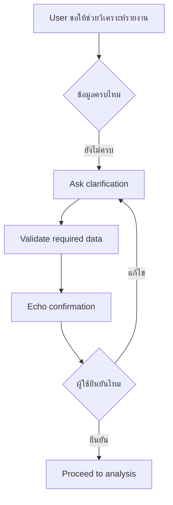

# แบบฝึกหัดที่ 1: ถามให้ชัดและยืนยันข้อมูลก่อนวิเคราะห์

แบบฝึกหัดนี้จะพาเราฝึกออกแบบบทสนทนาให้ Agent ไม่เดาคำตอบเองเมื่อข้อมูลยังไม่ครบ โดยใช้สถานการณ์ของ **Financial Report Assistant** ที่สร้างและทำ mini test cycle มาแล้วใน Module 2 เป็นฐาน และทำกิจกรรมผ่าน Microsoft Teams ได้โดยไม่ต้องแก้ Agent ใน Copilot Studio

🔧 **เครื่องมือที่ใช้ในห้องเรียน:** Microsoft Teams chat, Poll หรือ breakout room

> **⚠️ Note:** แบบฝึกหัดนี้เน้นการออกแบบ reliability pattern ไม่จำเป็นต้องเปิด Copilot Studio



---

## Practice 1: Fix the Wrong Answer

1. ให้ลองอ่านข้อความตัวอย่างนี้ใน Teams

   ```text
   User: ช่วยสรุปรายงานให้หน่อย
   Agent: ได้ครับ ผมจะสรุปรายงานการเงินเดือนพฤษภาคมของทุก BU ให้ทันที
   ```

2. ให้แต่ละคนตอบใน Teams chat ว่า Agent เดาอะไรไปเองบ้าง
3. Rewrite คำตอบใหม่ให้ Agent ถามกลับ 1 คำถามที่ชัดเจนก่อน เช่น

   ```text
   ได้ครับ ต้องการให้สรุปรายงานช่วงเวลาใด และสำหรับ Business Unit ไหนครับ

   ตัวอย่างคำตอบ:
   - May 2026, BU Trading
   - Q2 2026, ทุก Business Unit
   ```

4. แชร์คำตอบใน Teams แล้วให้เพื่อนช่วยดูว่าเป็นคำถามที่เฉพาะเจาะจงพอหรือยัง

> **💡 Tip:** คำถามที่ดีควรถามเฉพาะข้อมูลที่จำเป็นต่อขั้นตอนถัดไป ไม่ควรถามหลายเรื่องจนผู้ใช้ตอบยาก

---

## Practice 2: Missing Info Detective

1. ให้ผู้สอนส่ง scenario นี้ใน Teams

   ```text
   User: ช่วยวิเคราะห์ไฟล์รายงานนี้เป็น executive summary ให้หน่อย
   ```

2. ให้ทีมช่วยกันระบุข้อมูลที่ยังขาดก่อน Agent จะวิเคราะห์ได้อย่างปลอดภัย
3. ใช้ checklist นี้เป็นแนวทาง

   ```text
   Required data:
   - Report period
   - Business unit หรือ scope ของข้อมูล
   - Preferred report format
   - Source file หรือชื่อไฟล์
   - ผู้รับหรือระดับความละเอียดของรายงาน ถ้ามีผลต่อเนื้อหา
   ```

4. ให้แต่ละทีมเขียนข้อความถามกลับแบบสั้น กระชับ และเป็นมิตร

   ```text
   ได้ครับ ก่อนเริ่มวิเคราะห์ ขอข้อมูลเพิ่ม 3 อย่างครับ
   1. Report period ที่ต้องการวิเคราะห์
   2. Business Unit หรือขอบเขตข้อมูล
   3. ชื่อไฟล์หรือไฟล์ที่ต้องการให้ใช้เป็น source
   ```

---

## Practice 3: Echo Confirmation

1. สมมติว่าผู้ใช้ตอบกลับมาแบบนี้

   ```text
   May 2026, BU Trading, ขอเป็น Executive Summary จากไฟล์ PTT-Monthly-Financial-Report-May2026.xlsx
   ```

2. ให้ทีมเขียนข้อความยืนยันก่อน Agent เดินหน้าวิเคราะห์

   ```text
   เพื่อยืนยันนะครับ
   - Report period: May 2026
   - Business Unit: BU Trading
   - Format: Executive Summary
   - Source file: PTT-Monthly-Financial-Report-May2026.xlsx

   ต้องการให้ผมเริ่มวิเคราะห์ตามข้อมูลนี้เลยไหมครับ
   ```

3. ตรวจคำตอบของทีมด้วยคำถามนี้
   - Agent สะท้อนข้อมูลสำคัญครบไหม
   - ผู้ใช้ตอบ Yes/No ได้ง่ายไหม
   - มีคำสัญญาเกิน capability ของ Agent หรือไม่

---

## Practice 4: Teams Share-back

1. ให้แต่ละทีมเลือก 1 response ที่ดีที่สุดจาก Practice 1-3
2. ส่ง response นั้นใน Teams chat พร้อมเหตุผล 1 บรรทัด
3. ผู้สอนชวนโหวตว่า response ไหนช่วยลดความเสี่ยงจากการเดาคำตอบได้ดีที่สุด

---

## สรุป

ในแบบฝึกหัดนี้ คุณได้ฝึก 3 reliability pattern สำคัญคือ **Clarification**, **Validation** และ **Echo confirmation** เพื่อให้ Agent ถามข้อมูลที่จำเป็นก่อนวิเคราะห์ และลดโอกาสเกิดคำตอบผิดจากข้อมูลไม่ครบ

ขั้นตอนถัดไป → [ออกแบบ Escalation และ Safe Completion](../exercise-2-escalation-and-safe-completion/README.md)
