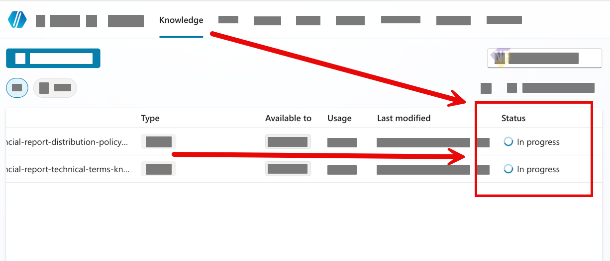

# แบบฝึกหัดที่ 2: เพิ่ม Agent-level Knowledge

เราจะเพิ่มเอกสาร operations ทั้งสี่ไฟล์ที่ระดับ Agent แล้วทดสอบ broad retrieval สำหรับคำถามที่อาจใช้หลายแหล่ง

> **License:** ต้องมีสิทธิ์เพิ่มไฟล์เป็น `Knowledge` ใน `Copilot Studio`

## Prerequisites

- [Module 3 Knowledge files](../../../files/module-3/README.md)

---

## Practice 1: เพิ่ม Knowledge ที่ระดับ Agent

**Primary target:** เชื่อมเอกสาร operations ทั้งสี่เป็น Agent-level Knowledge ที่พร้อมค้นหา

1. เปิด Agent และไปที่ `Overview` > `Knowledge` > `Add knowledge`

   

2. อัปโหลดไฟล์จาก `files/module-3/` ทั้งสี่ไฟล์
3. ใช้ชื่อ Knowledge ให้สื่อความหมาย เช่น `Operations Overview` และ `Downtime Reporting`
4. รอจนสถานะพร้อมใช้งาน แล้วกด `Save`

   

### Checkpoint

- หน้า `Knowledge` แสดงสี่แหล่งและไม่มีสถานะ error

---

## Practice 2: ทดสอบ Broad Retrieval

**Primary target:** ยืนยันว่า Agent-level Knowledge ตอบคำถามภาพรวมจากหลายแหล่งได้

1. เปิด `Test your agent` แล้วถาม:

   ```text
   ถ้าเกิด unplanned downtime ใครควรทำอะไรบ้างตั้งแต่เริ่มพบเหตุจนถึงการ escalation
   ```

2. ถามต่อ:

   ```text
   สรุปคำตอบเป็นบทบาท ขั้นตอน และข้อมูลที่ต้องบันทึก พร้อมบอกชื่อเอกสารที่ใช้
   ```

3. ตรวจคำตอบกับไฟล์ต้นทาง

### Checkpoint

- คำตอบรวมข้อมูลจากเอกสารที่เกี่ยวข้องโดยไม่สร้างขั้นตอนหรือบทบาทใหม่

---

## Summary

Agent ตอบคำถาม broad retrieval ได้แล้ว ต่อไปเราจะสร้าง Topic เพื่อเก็บ intent และตัวแปรก่อนเลือกแหล่งข้อมูลเฉพาะ

ขั้นตอนถัดไป → [สร้าง Topics, Questions, Variables, and Conditions](../exercise-3-topics-questions-variables-conditions/README.md)
