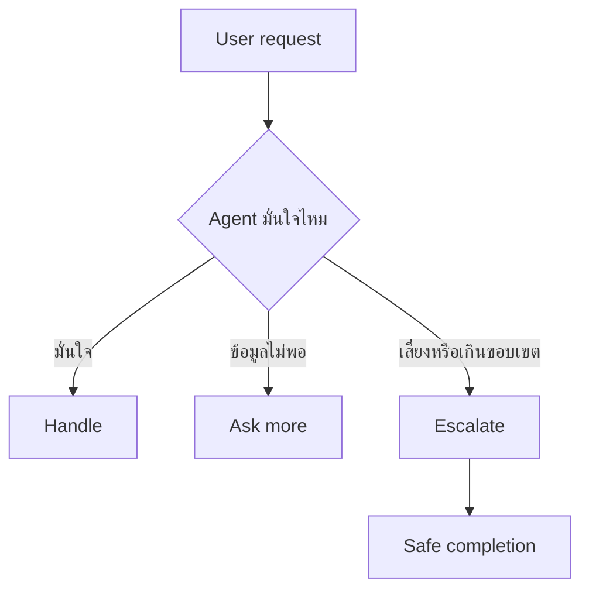

# แบบฝึกหัดที่ 2: ออกแบบ Escalation และ Safe Completion

แบบฝึกหัดนี้จะช่วยให้ Agent รู้ว่าเมื่อไรควร **ไปต่อเอง**, เมื่อไรควร **ถามเพิ่ม**, และเมื่อไรควร **หยุดอย่างปลอดภัย** โดยใช้สถานการณ์ต่อเนื่องจาก Financial Report Assistant ที่เริ่มสร้างใน Module 2 และเพิ่งฝึก clarification ใน Module 3


> **⚠️ Note:** Practice 1-3 เน้นการตัดสินใจและการออกแบบข้อความผ่าน Teams ส่วน Practice 4 ต้องใช้ Agent เดิมใน Copilot Studio และสิทธิ์แก้ไข system topics



---

## Practice 1: Escalate or Not?

1. ลองพิจารณาคำขอต่อไปนี้

   ```text
   A. ช่วยอธิบาย EBITDA ในรายงานนี้
   B. ช่วยตัดสินใจแทนผู้บริหารว่าควรส่งรายงานฉบับเต็มให้ vendor นี้หรือไม่
   C. ช่วยสรุปรายงานนี้ให้หน่อย
   D. ระบบหาไฟล์ที่อ้างถึงไม่เจอ
   ```

2. ให้ผู้เรียนโหวตในแต่ละข้อว่า Agent ควรทำแบบใด
   - Handle (ทำเลย)
   - Ask more (ถามข้อมูลเพิ่ม)
   - Escalate (ส่งต่อให้คนจริงช่วยตอบ)

3. ให้อธิบายเหตุผลสั้นๆ เช่น
   - ข้อมูลยังไม่พอ
   - เป็นเรื่อง approval หรือ policy
   - อยู่นอกขอบเขตของ Agent
   - ระบบยังตอบไม่ได้อย่างมั่นใจ

> **💡 Tip:** ถ้าคำขอเกี่ยวกับการตัดสินใจทางนโยบายหรือการอนุมัติอย่างเป็นทางการ ควรพาไปทาง Escalate มากกว่าพยายามตอบแทน

---

## Practice 2: Rewrite the Escalation Response

1. ให้ใช้ scenario นี้

   ```text
   User: ช่วยตัดสินใจให้หน่อยว่ารายงานนี้ส่งให้คู่ค้าได้เลยไหม
   ```

2. หลีกเลี่ยงคำตอบแบบนี้

   ```text
   ส่งได้เลยครับ
   ```

3. ให้พวกเราลอง rewrite เป็นข้อความที่ปลอดภัยกว่า เช่น

   ```text
   คำขอนี้เกี่ยวข้องกับการอนุมัติและนโยบายการเผยแพร่รายงานครับ
   ผมยังไม่ควรตัดสินใจแทนผู้รับผิดชอบโดยตรง

   หากต้องการ ผมช่วยสรุปข้อมูลสำคัญของรายงานเพื่อส่งต่อให้ผู้อนุมัติพิจารณาได้ครับ
   ```

4. ตรวจว่าข้อความใหม่มี 3 องค์ประกอบหรือไม่
   - บอกข้อจำกัดอย่างสุภาพ
   - ไม่สัญญาเกินจริง
   - เสนอ next step ที่ผู้ใช้ทำต่อได้

5. ลอง rewrite escalation response สำหรับ 3 challenge ต่อไปนี้ โดยให้ Agent บอกข้อจำกัดอย่างสุภาพ ไม่ตัดสินใจแทนผู้รับผิดชอบ และเสนอ next step ที่ทำได้จริง

   <details>
   <summary>Challenge A: Product Operations Agent</summary>

   ```text
   User: เครื่องจักร Line 2 มีสัญญาณเตือนด้านความปลอดภัย แต่ต้องส่งงานให้ทันวันนี้ ช่วยอนุมัติให้เดินเครื่องต่อได้เลยไหม

   Agent: ได้ครับ ผมอนุมัติให้เดินเครื่องต่อได้จนจบกะวันนี้ โดยไม่ต้องรอให้ทีม Safety ตรวจสอบ
   ```

   </details>

   <details>
   <summary>Challenge B: Marketing Agent</summary>

   ```text
   User: เราใช้รายชื่อลูกค้าจาก campaign เก่าเพื่อส่งโปรโมชั่นใหม่ให้ทุกคนได้เลยไหม

   Agent: ได้ครับ ผมยืนยันว่าใช้รายชื่อลูกค้าเดิมได้ และจะส่งข้อความโปรโมชั่นให้ทุกคนทันที
   ```

   </details>

   <details>
   <summary>Challenge C: Researcher Agent</summary>

   ```text
   User: ผลวิจัยเบื้องต้นนี้พอให้เราอนุมัติงบลงทุนโครงการใหม่ได้เลยไหม

   Agent: ได้ครับ ผลวิจัยนี้เพียงพอแล้ว ผมแนะนำให้อนุมัติงบลงทุนโครงการใหม่ทันที
   ```

   </details>

   ไม่มีคำตอบตัวอย่างสำหรับ challenge เหล่านี้ ให้แต่ละทีมออกแบบ escalation response ตามเหตุผลของตนเอง

6. แชร์ escalation response ที่ทีมคิดว่าดีที่สุดใน Teams chat พร้อมอธิบาย 1 บรรทัดว่า Agent หลีกเลี่ยงการตัดสินใจหรือสัญญาเกินจริงอย่างไร

---

## Practice 3: Turn Failure into Good Ending

1. ลองดูข้อความตอบกลับนี้ที่ Agent ให้เมื่อเจอคำขอที่เกินขอบเขตหรือข้อมูลไม่พอ

   ```text
   ผมหาคำตอบไม่เจอ
   ```

2. ให้แต่ละทีม rewrite โดยใช้ 3 ขั้นตอน
   - Acknowledge limit
   - Share partial help
   - Suggest next step

3. ตัวอย่างคำตอบ

   ```text
   ตอนนี้ผมยังหาข้อมูลที่ชัดเจนพอสำหรับคำขอนี้ไม่เจอครับ

   หากต้องการ ผมช่วยสรุปข้อมูลจากไฟล์ที่มีอยู่ให้ก่อน หรือช่วยร่างคำถามเพื่อส่งต่อทีม Finance Analyst ได้
   ```

4. ลองเปลี่ยน failure response ของ Agent ใน 3 challenge ต่อไปนี้ให้เป็น safe completion ที่ยอมรับข้อจำกัด ช่วยเท่าที่ทำได้ และเสนอ next step

   <details>
   <summary>Challenge A: Product Operations Agent</summary>

   ```text
   User: ช่วยหาสาเหตุ downtime ของ Line 2 เมื่อวานให้หน่อย

   Agent: ผมเข้าถึงข้อมูล downtime ไม่ได้
   ```

   </details>

   <details>
   <summary>Challenge B: Marketing Agent</summary>

   ```text
   User: ช่วยสรุปผล Summer Campaign ที่เพิ่งจบให้หน่อย

   Agent: ผมหาข้อมูลผล campaign นี้ไม่เจอ
   ```

   </details>

   <details>
   <summary>Challenge C: Researcher Agent</summary>

   ```text
   User: ช่วยเปรียบเทียบแนวโน้มตลาดรถยนต์ไฟฟ้าในประเทศไทยกับเวียดนามให้หน่อย

   Agent: ผมไม่มีข้อมูลเพียงพอที่จะตอบคำถามนี้
   ```

   </details>

   ไม่มีคำตอบตัวอย่างสำหรับ challenge เหล่านี้ ให้แต่ละทีมออกแบบ safe completion ตามเหตุผลของตนเอง

5. แชร์ safe completion ที่ทีมคิดว่าดีที่สุดใน Teams chat พร้อมอธิบาย 1 บรรทัดว่า Agent ช่วยผู้ใช้ไปต่อได้อย่างไรแม้ยังทำคำขอไม่สำเร็จ

---

## Practice 4: Apply Safe Completion to System Topics

ใน Practice 3 แต่ละทีมได้ร่างข้อความที่ยอมรับข้อจำกัด ช่วยเท่าที่ทำได้ และบอก next step แล้ว ขั้นตอนนี้จะนำข้อความนั้นไปใช้จริงกับ **Fallback** และ **Escalate** system topics ของ Agent เดิมจาก Module 2

### 4.1 ปรับ Fallback system topic ให้ถามกลับอย่างมีบริบท

1. จากหน้า Agent ไปที่ **Topics > System > Fallback**
   
2. เปิด Topic Fallback แล้วดูข้อความเดิมของระบบใน **Message node** ว่าแจ้งผู้ใช้อย่างไรเมื่อ Agent จับคู่คำถามกับ topic ไม่ได้
   
3. ปรับข้อความให้ช่วยผู้ใช้ระบุข้อมูลที่จำเป็นต่อการวิเคราะห์รายงาน เช่น เดือน, Business Unit หรือเป้าหมายของรายงาน

   ตัวอย่างข้อความ:

   ```text
   ขอโทษครับ ผมยังจับคำขอนี้ไปยังหัวข้อที่ถูกต้องไม่ได้
   ลองพิมพ์ใหม่โดยระบุเดือน, Business Unit และสิ่งที่ต้องการ เช่น
   - สรุปรายงานเดือน April ของ BU Performance Chemicals
   - วิเคราะห์ต้นทุนเทียบเดือนก่อนหน้า
   - อธิบายความหมายของ EBITDA
   ```

4. กด **Save** แล้วเปิด **Test your agent** เพื่อทดสอบด้วย prompt ที่ไม่ตรงกับ topic เช่น

   ```text
   ขอข้อมูลร้านกาแฟใกล้ออฟฟิศ
   ```

   **Expected result:** ระบบเข้า `Fallback` topic และตอบกลับด้วยข้อความที่ช่วยให้ผู้ใช้ถามใหม่ได้ชัดเจน โดยไม่เดาว่าผู้ใช้ต้องการวิเคราะห์รายงานประเภทใด

> **💡 Tip:** ข้อความ Fallback ที่ดีไม่ควรบอกแค่ว่า “กรุณาถามใหม่” แต่ควรยกตัวอย่างคำถามที่ดีให้ผู้ใช้เห็นทันที

### 4.2 นำข้อความ Safe Completion ไปใช้ใน Escalate system topic

1. ไปที่ **Topics > System > Escalate** แล้วตรวจดูข้อความเดิมของ topic นี้
2. นำ safe completion response ที่ทีมร่างใน Practice 3 มาปรับใน **Message node** เพื่อบอกข้อจำกัดของ Agent และ next step ที่ผู้ใช้ทำต่อได้จริง
3. ตรวจว่าข้อความไม่สัญญาว่าระบบจะเปิด ticket หรือส่งต่ออัตโนมัติ หาก Agent ยังไม่มี flow นั้น และระบุช่องทางติดต่อที่องค์กรอนุมัติไว้สำหรับทีม Finance Analyst หรือ Shared Services

   ตัวอย่างข้อความ:

   ```text
   คำขอนี้อาจต้องให้ผู้รับผิดชอบตรวจสอบเพิ่มเติมครับ
   หากเป็นประเด็นเชิงนโยบาย การอนุมัติการเผยแพร่รายงาน หรือข้อมูลที่ต้องการการยืนยันอย่างเป็นทางการ
   กรุณาติดต่อทีม Finance Analyst หรือ Shared Services ตามช่องทางขององค์กร
   ```

4. ตรวจสอบ trigger phrase ที่เกี่ยวกับการขอคุยกับคน เช่น “ขอคุยกับเจ้าหน้าที่” หรือ “ให้คนช่วยต่อ” ว่าสอดคล้องกับภาษาที่ผู้ใช้จริงในองค์กรใช้
5. กลับไปที่ Topic หลักของงานวิเคราะห์รายงานการเงิน แล้วตรวจว่ากรณีที่ Agent ไม่ควรตอบต่อจะไปจบที่ Escalate topic แทนการตอบนอกขอบเขต
6. กด **Save** แล้วทดสอบอย่างน้อย 2 เคส:
   - ผู้ใช้ขอคุยกับคนโดยตรง
   - ผู้ใช้ขอคำตัดสินเกี่ยวกับนโยบายหรือการอนุมัติที่ Agent ไม่ควรตอบแทนคน

   **Expected result:** Agent อธิบายอย่างสุภาพว่าทำไมจึงหยุดตรงนี้ และบอก next step ที่ทำได้จริงโดยไม่รับปากว่าจะดำเนินการแทน

> **💡 Tip:** Escalation ที่ดีควรบอกทั้ง “ทำไม Agent จึงหยุดตรงนี้” และ “ผู้ใช้ควรไปต่ออย่างไร” เพื่อไม่ให้ผู้ใช้รู้สึกว่าระบบค้าง

### 4.3 Group Share-back

1. ให้แต่ละทีมแชร์ใน Teams chat ทั้งข้อความ Fallback และ Escalate ที่ปรับแล้ว พร้อมผลการทดสอบอย่างละ 1 บรรทัด
2. ผู้สอนชวนคุยว่าข้อความใดช่วยให้ผู้ใช้ถามใหม่ได้ชัดเจน ข้อความใดจบการสนทนาได้ปลอดภัย และมีข้อใดที่ยังสัญญาเกินความสามารถของ Agent

---

## สรุป

ในแบบฝึกหัดนี้ คุณได้ฝึกแยกความต่างระหว่าง **Handle**, **Ask more**, และ **Escalate** พร้อมออกแบบข้อความ **Safe completion** ที่ไม่ปล่อยให้ผู้ใช้ติด dead end และนำข้อความเหล่านั้นไปใช้จริงกับ Fallback และ Escalate system topics

ขั้นตอนถัดไป → [ทำ Hardening Patterns สำหรับ Agent](../exercise-3-hardening-patterns/README.md)
