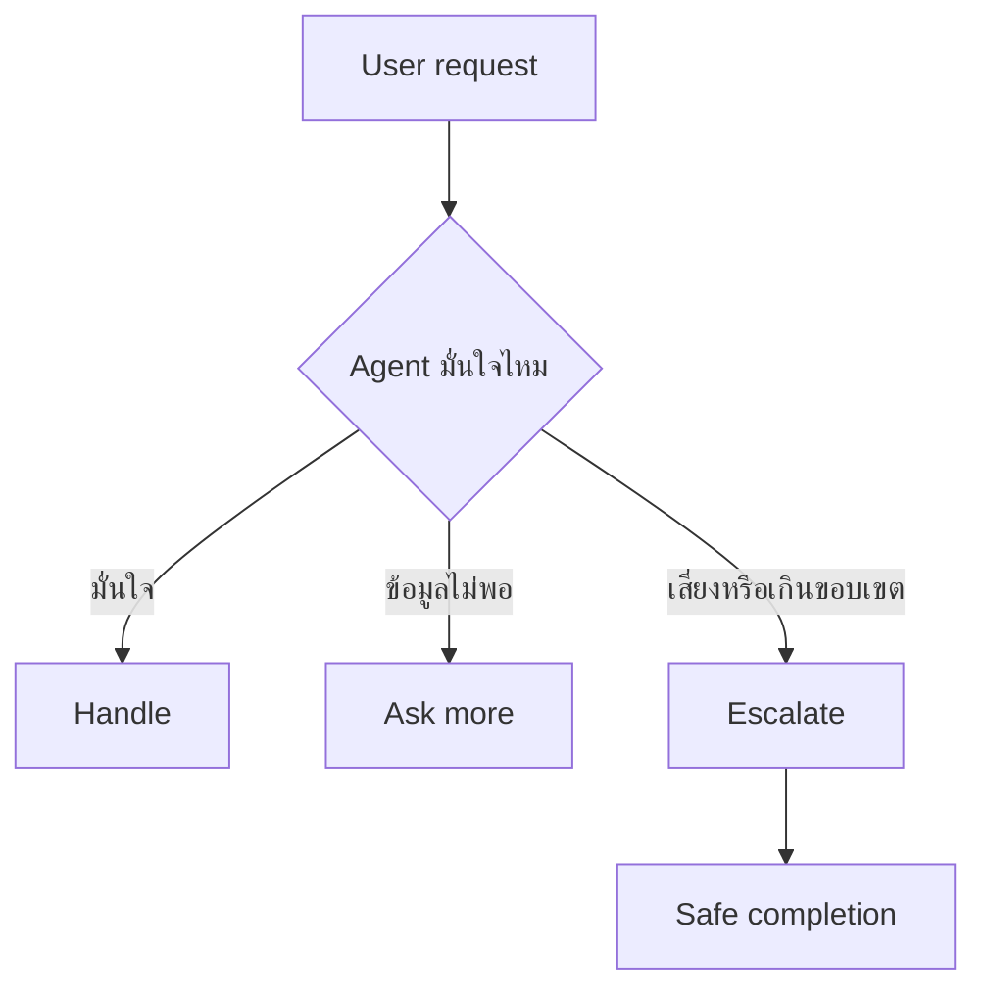

# แบบฝึกหัดที่ 2: ออกแบบ Escalation และ Safe Completion

แบบฝึกหัดนี้จะช่วยให้ Agent รู้ว่าเมื่อไรควร **ไปต่อเอง**, เมื่อไรควร **ถามเพิ่ม**, และเมื่อไรควร **หยุดอย่างปลอดภัย** โดยใช้สถานการณ์ต่อเนื่องจาก Financial Report Assistant ที่เริ่มสร้างใน Module 2 และเพิ่งฝึก clarification ใน Module 3

🔧 **เครื่องมือที่ใช้ในห้องเรียน:** Microsoft Teams chat, Poll, breakout room

> **⚠️ Note:** แบบฝึกหัดนี้เน้นการตัดสินใจและการออกแบบข้อความ ไม่จำเป็นต้องแก้ flow ใน Copilot Studio



---

## Practice 1: Escalate or Not?

1. ให้ผู้สอนส่ง scenario ต่อไปนี้ใน Teams ทีละข้อ

   ```text
   A. ช่วยอธิบาย EBITDA ในรายงานนี้
   B. ช่วยตัดสินใจแทนผู้บริหารว่าควรส่งรายงานฉบับเต็มให้ vendor นี้หรือไม่
   C. ช่วยสรุปรายงานนี้ให้หน่อย
   D. ระบบหาไฟล์ที่อ้างถึงไม่เจอ
   ```

2. ให้ผู้เรียนโหวตในแต่ละข้อว่า Agent ควรทำแบบใด
   - Handle
   - Ask more
   - Escalate

3. ให้ทีมอธิบายเหตุผลสั้นๆ เช่น
   - ข้อมูลยังไม่พอ
   - เป็นเรื่อง approval หรือ policy
   - อยู่นอกขอบเขตของ Agent
   - ระบบยังตอบไม่ได้อย่างมั่นใจ

> **💡 Tip:** ถ้าคำขอเกี่ยวกับการตัดสินใจทางนโยบายหรือการอนุมัติอย่างเป็นทางการ ควรพาไปทาง Escalate มากกว่าพยายามตอบแทน

---

## Practice 2: Rewrite the Escalation Response

1. ให้ใช้ scenario นี้

   ```text
   User: ช่วยตัดสินใจให้หน่อยว่ารายงานนี้ส่งให้คู่ค้าได้เลยไหม
   ```

2. หลีกเลี่ยงคำตอบแบบนี้

   ```text
   ส่งได้เลยครับ
   ```

3. ให้ทีม rewrite เป็นข้อความที่ปลอดภัยกว่า เช่น

   ```text
   คำขอนี้เกี่ยวข้องกับการอนุมัติและนโยบายการเผยแพร่รายงานครับ
   ผมยังไม่ควรตัดสินใจแทนผู้รับผิดชอบโดยตรง

   หากต้องการ ผมช่วยสรุปข้อมูลสำคัญของรายงานเพื่อส่งต่อให้ผู้อนุมัติพิจารณาได้ครับ
   ```

4. ตรวจว่าข้อความใหม่มี 3 องค์ประกอบหรือไม่
   - บอกข้อจำกัดอย่างสุภาพ
   - ไม่สัญญาเกินจริง
   - เสนอ next step ที่ผู้ใช้ทำต่อได้

---

## Practice 3: Turn Failure into Good Ending

1. ให้ผู้สอนส่งข้อความ failure นี้

   ```text
   ผมหาคำตอบไม่เจอ
   ```

2. ให้แต่ละทีม rewrite โดยใช้ 3 ขั้นตอน
   - Acknowledge limit
   - Share partial help
   - Suggest next step

3. ตัวอย่างคำตอบ

   ```text
   ตอนนี้ผมยังหาข้อมูลที่ชัดเจนพอสำหรับคำขอนี้ไม่เจอครับ

   หากต้องการ ผมช่วยสรุปข้อมูลจากไฟล์ที่มีอยู่ให้ก่อน หรือช่วยร่างคำถามเพื่อส่งต่อทีม Finance Analyst ได้
   ```

---

## Practice 4: Group Share-back

1. ให้แต่ละทีมเลือก 1 escalation response และ 1 safe completion response
2. แชร์ใน Teams chat
3. ผู้สอนชวนคุยว่าคำตอบไหนปลอดภัย ชัดเจน และยังช่วยให้ผู้ใช้ไปต่อได้มากที่สุด

---

## สรุป

ในแบบฝึกหัดนี้ คุณได้ฝึกแยกความต่างระหว่าง **Handle**, **Ask more**, และ **Escalate** พร้อมออกแบบข้อความ **Safe completion** ที่ไม่ปล่อยให้ผู้ใช้ติด dead end

ขั้นตอนถัดไป → [ทำ Hardening Patterns สำหรับ Agent](../exercise-3-hardening-patterns/README.md)
