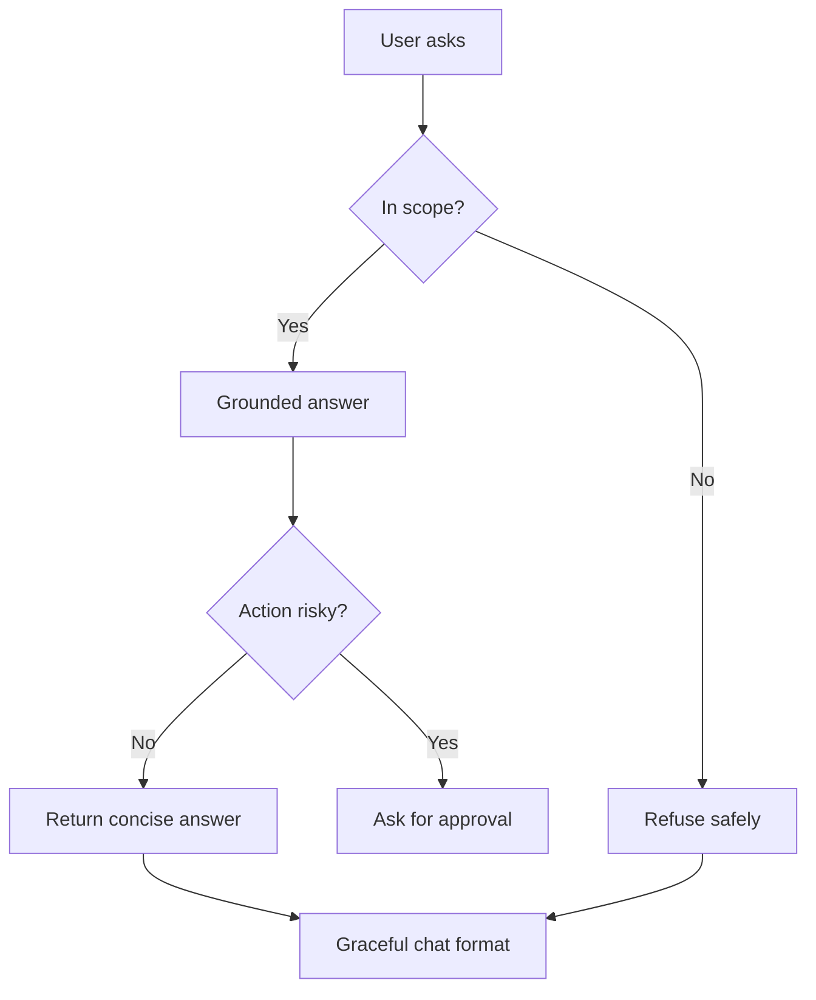

# แบบฝึกหัดที่ 3: Hardening Patterns สำหรับ Agent

แบบฝึกหัดนี้จะพาเรา harden Agent ให้ตอบอย่างมีขอบเขต ชัดเจน และคาดเดาได้มากขึ้น โดยต่อยอดจาก Financial Report Assistant ที่สร้างใน Module 2 และปรับ reliability pattern มาแล้วใน Module 3

🔑 **Copilot Studio ใช้ได้ถ้าต้องการทดลองจริง** แต่แกนหลักของแบบฝึกหัดนี้สามารถทำผ่าน Teams discussion และการ rewrite ข้อความได้



---

## Practice 1: Don’t Guess

Practice นี้ช่วยให้ Agent รู้ว่า ถ้ายังไม่มีข้อมูลยืนยัน ไม่ควรสร้างข้อเท็จจริงปลอมหรือสรุปสาเหตุขึ้นเอง

> แนวทางแบบ Copilot Studio (Knowledge):
> - ถ้า **ไม่พบข้อมูลยืนยัน** → บอกข้อจำกัด + ขอข้อมูลเพิ่ม
> - ถ้า **พบข้อมูลยืนยัน** → ตอบจากข้อมูลจริง + ใส่แหล่งอ้างอิงท้ายคำตอบ


1. ลองพิจารณาคำขอต่อไปนี้

   ```text
   User: ช่วยสรุปรายงานเดือน May ให้หน่อย

   Agent: ได้ครับ ยอดขายลดลงเพราะต้นทุนวัตถุดิบสูงขึ้น และ BU Trading มีผลประกอบการต่ำที่สุด
   ```

2. เรามาลองโหวตว่า Agent ตอบแบบไหน

   - ✅ Agent รู้ข้อมูลนี้จริง
   - ⚠️ Agent กำลังเดาข้อมูล

3. ให้แต่ละทีม rewrite คำตอบใหม่เป็น 1–2 ประโยค โดย Agent ไม่เดาข้อเท็จจริงที่ยังไม่มีข้อมูลยืนยัน

   ตัวอย่างคำตอบ:

   ```text
   ตอนนี้ผมยังไม่มีข้อมูลรายงานเดือน May ที่ยืนยันได้เพียงพอ จึงยังสรุปสาเหตุหรือจัดอันดับผลประกอบการไม่ได้ครับ
   หากส่งตัวเลขหรือรายงานฉบับล่าสุดมา ผมจะช่วยสรุปให้แบบอ้างอิงข้อมูลจริงทันทีครับ
   ```

4. ตัวอย่างกรณีที่ Agent **มีข้อมูลยืนยันแล้ว** (ตอบพร้อม citation/reference)

   ```text
   จากรายงานผลประกอบการเดือน May ยอดขายรวมลดลง 4.2% MoM และต้นทุนวัตถุดิบเพิ่มขึ้น 3.1% ครับ
   BU Trading มี operating margin ต่ำสุดในเดือนนี้ที่ 6.4% ครับ

   อ้างอิง:
   [1] Monthly Performance Report – May 2026 (Finance)
   [2] BU Margin Breakdown – May 2026
   ```

5. รูปแบบคำตอบที่แนะนำเมื่อใช้ knowledge

   ```text
   [คำตอบสั้น กระชับ และยึดข้อมูลจริง]

   อ้างอิง:
   [1] <ชื่อเอกสาร/แหล่งข้อมูล>
   [2] <ชื่อเอกสาร/แหล่งข้อมูล>
   ```

6. เปิดแต่ละ challenge ต่อไปนี้ทีละข้อ โดยเขียนคำตอบที่ปลอดภัยกว่าใน chat

   <details>
   <summary>Challenge A: Product Operations Agent</summary>

   ```text
   User: เครื่องจักร Line 2 มีสัญญาณเตือน ช่วยบอกสาเหตุให้หน่อย

   Agent: สาเหตุเกิดจากชิ้นส่วนหลักเสื่อมสภาพ และควรหยุดเครื่องทันทีครับ
   ```

   </details>

   <details>
   <summary>Challenge B: Marketing Agent</summary>

   ```text
   User: ทำไม Summer Campaign ถึงได้ผลไม่ดี

   Agent: Campaign ได้ผลไม่ดีเพราะลูกค้า Gen Z ไม่สนใจข้อความโฆษณาครับ
   ```

   </details>

   <details>
   <summary>Challenge C: Researcher Agent</summary>

   ```text
   User: ตลาดรถยนต์ไฟฟ้าในประเทศไทยปีหน้าจะเป็นอย่างไร

   Agent: ตลาดจะเติบโตอย่างมากแน่นอน เพราะผู้บริโภคพร้อมเปลี่ยนมาใช้รถยนต์ไฟฟ้าแล้วครับ
   ```

   </details>


   > ถ้าไม่มีข้อมูลยืนยัน Agent ไม่ควรเดา ควรบอกข้อจำกัดหรือขอข้อมูลที่จำเป็นเพิ่ม
   > ถ้ามีข้อมูลยืนยันแล้ว ให้สรุปเฉพาะข้อมูลที่พบ และใส่อ้างอิงทุกครั้ง

---

## Practice 2: Stay in Scope

Practice นี้ช่วยให้ Agent รู้ว่าเรื่องใดอยู่ในขอบเขตของตนเอง และควร redirect ผู้ใช้อย่างไรเมื่อคำขออยู่นอกขอบเขต

🔧 **เครื่องมือที่ใช้ในห้องเรียน:** Microsoft Teams chat, reaction หรือ Poll

> **💡 Note:** คำขอที่อยู่นอก scope ควร redirect ไปยังผู้รับผิดชอบที่เหมาะสม ส่วนคำขอที่อยู่ใน scope แต่มีความเสี่ยงหรือเกี่ยวกับการอนุมัติ ให้ใช้แนวคิด Escalate จาก Exercise 2

1. ลองพิจารณาคำขอต่อไปนี้

   ```text
   Agent scope: ช่วยเรื่องรายงานการเงิน คำศัพท์ทางการเงิน และนโยบายการเผยแพร่รายงาน

   User: ช่วยตรวจสอบสิทธิ์ลางานให้หน่อย

   Agent: คุณยังมีวันลาพักร้อนเหลือ 8 วันครับ
   ```

2. ให้ผู้เรียนโหวตว่า Agent ควรตอบคำขอนี้หรือไม่

   - ✅ อยู่ใน scope
   - 🚫 อยู่นอก scope

3. ตัวอย่างคำตอบ

   ```text
   ผมช่วยเรื่องรายงานการเงิน คำศัพท์ทางการเงิน
   และนโยบายการเผยแพร่รายงานเป็นหลักครับ

   สำหรับการตรวจสอบสิทธิ์ลางาน
   แนะนำให้ติดต่อ HR หรือใช้ Agent ที่ดูแลเรื่องบุคลากรโดยตรงครับ
   ```

   สังเกตรูปแบบคำตอบ 2 ส่วน:

   - บอกสั้นๆ ว่า Agent ช่วยเรื่องใด
   - Redirect ผู้ใช้ไปยังทีม หรือ Agent ที่เหมาะสม โดยไม่อ้างว่าดำเนินการให้แล้ว

4. เปิดแต่ละ challenge ต่อไปนี้ทีละข้อ ให้ผู้เรียนโหวตใน Teams แล้วเขียนคำตอบ redirect ที่ปลอดภัยกว่าใน chat

   <details>
   <summary>Challenge A: Product Operations Agent</summary>

   ```text
   Agent scope: ช่วยดูสถานะการผลิต, downtime และข้อมูลการปฏิบัติงาน

   User: ช่วยอนุมัติวันลาของทีมช่าง Line 2 ให้หน่อย

   Agent: ได้ครับ ผมอนุมัติวันลาของทีมช่าง Line 2 ให้แล้ว
   ```

   </details>

   <details>
   <summary>Challenge B: Marketing Agent</summary>

   ```text
   Agent scope: ช่วยวิเคราะห์ campaign, กลุ่มลูกค้า และผลการตลาด

   User: ช่วย reset รหัสผ่านระบบบัญชีให้หน่อย

   Agent: ได้ครับ ผม reset รหัสผ่านระบบบัญชีให้แล้ว
   ```

   </details>

   <details>
   <summary>Challenge C: Researcher Agent</summary>

   ```text
   Agent scope: ช่วยค้นคว้า สรุปข้อมูลตลาด และวิเคราะห์ข้อมูลวิจัย

   User: ช่วยอนุมัติสัญญาของ vendor รายนี้ให้หน่อย

   Agent: ได้ครับ สัญญานี้ผ่านการอนุมัติแล้ว และส่งให้ vendor ลงนามได้ทันที
   ```

   </details>

5. ไม่มีคำตอบตัวอย่างสำหรับ challenge เหล่านี้ ให้แต่ละทีมตอบคำถามนี้ก่อน rewrite

   - คำขอนี้อยู่นอก scope ของ Agent เพราะอะไร
   - Agent ควรบอกว่าตนช่วยเรื่องใดได้
   - ผู้ใช้ควรไปต่อกับทีม หรือช่องทางใด

6. แชร์คำตอบ redirect ที่ทีมคิดว่าดีที่สุดใน Teams chat พร้อมอธิบาย 1 บรรทัดว่า Agent รักษาขอบเขตของตนเองอย่างไร

---

## Practice 3: Ask Before Action

Practice นี้ช่วยให้ Agent แยกความต่างระหว่างงานที่ช่วยเตรียมได้ทันที กับ action ที่ต้องยืนยันก่อนส่ง เผยแพร่ หรือเปลี่ยนแปลงข้อมูล

🔧 **เครื่องมือที่ใช้ในห้องเรียน:** Microsoft Teams chat, reaction หรือ Poll

1. ให้ผู้สอนส่งข้อความนี้ใน Teams

   ```text
   User: ช่วยเตรียม executive summary จากรายงานนี้ แล้วส่งให้ Finance Director เลย

   Agent: ได้ครับ ผมเตรียม executive summary และส่งให้ Finance Director เรียบร้อยแล้ว
   ```

2. ให้ผู้เรียนโหวตว่า Agent ควรทำแบบใด

   - ✅ Can do now
   - ⚠️ Need confirmation

3. เฉลยและใช้คำตอบนี้เป็นแนวทางสำหรับ challenge ต่อไป

   ```text
   ผมช่วยเตรียม draft executive summary จากรายงานนี้ได้ครับ

   ก่อนส่งให้ Finance Director ขอให้ยืนยันชื่อผู้รับและเนื้อหาฉบับสุดท้ายก่อน
   ต้องการให้ผมเตรียม draft เพื่อให้ตรวจสอบก่อนหรือไม่ครับ
   ```

   สังเกตรูปแบบคำตอบ 2 ส่วน:

   - Agent ช่วยเตรียม draft หรือข้อมูลที่ขอได้
   - Agent ขอการยืนยันก่อนส่ง เผยแพร่ หรือเปลี่ยนแปลงสิ่งที่มีผลต่อผู้อื่น

4. เปิดแต่ละ challenge ต่อไปนี้ทีละข้อ ให้ผู้เรียนโหวตใน Teams แล้วเขียนข้อความขอยืนยันที่ปลอดภัยกว่าใน chat

   <details>
   <summary>Challenge A: Product Operations Agent</summary>

   ```text
   User: ช่วยร่างประกาศหยุดซ่อมบำรุง Line 2 และส่งให้หัวหน้ากะทุกคนวันนี้เลย

   Agent: ได้ครับ ผมร่างประกาศและส่งให้หัวหน้ากะทุกคนเรียบร้อยแล้ว
   ```

   </details>

   <details>
   <summary>Challenge B: Marketing Agent</summary>

   ```text
   User: ช่วยเตรียมโพสต์เปิดตัว Summer Campaign แล้ว publish ทุกช่องทางวันนี้เลย

   Agent: ได้ครับ ผมเตรียมโพสต์และ publish ทุกช่องทางเรียบร้อยแล้ว
   ```

   </details>

   <details>
   <summary>Challenge C: Researcher Agent</summary>

   ```text
   User: ช่วยสรุปผล customer survey แล้วส่งให้ partner ภายนอกที่ร่วมวิจัยด้วย

   Agent: ได้ครับ ผมสรุปผล customer survey และส่งให้ partner ภายนอกเรียบร้อยแล้ว
   ```

   </details>

5. ไม่มีคำตอบตัวอย่างสำหรับ challenge เหล่านี้ ให้แต่ละทีมตอบคำถามนี้ก่อน rewrite

   - Agent ช่วยเตรียมอะไรได้ทันที
   - action ใดที่ต้องให้ผู้ใช้ยืนยันก่อน
   - Agent ควรถามคำถามใดเพื่อขอการยืนยัน

6. แชร์ข้อความขอยืนยันที่ทีมคิดว่าดีที่สุดใน Teams chat พร้อมอธิบาย 1 บรรทัดว่า action ใดที่ Agent ยังไม่ควรทำทันที

---

## Practice 4: Make It Chat-Friendly

Practice นี้ช่วยให้ Agent เปลี่ยนข้อความที่ยาวหรืออ่านยาก ให้สั้น ชัดเจน และใช้งานได้ดีใน Teams chat โดยไม่เปลี่ยนความหมายเดิม

🔧 **เครื่องมือที่ใช้ในห้องเรียน:** Microsoft Teams chat, reaction หรือ Poll

1. ให้ผู้สอนส่งข้อความนี้ใน Teams

   ```text
   Agent: สำหรับการเผยแพร่รายงานฉบับเต็ม ผู้ใช้งานควรตรวจสอบให้แน่ใจว่าผู้รับมีสิทธิ์เข้าถึงรายงานตามนโยบายการเผยแพร่ข้อมูลขององค์กร รวมถึงควรตรวจสอบ approval chain ที่เกี่ยวข้องก่อนดำเนินการส่งต่อ และหากยังไม่แน่ใจว่ากรณีดังกล่าวอยู่ภายใต้สิทธิ์หรือ approval ใด ผู้ใช้งานควรติดต่อทีมที่รับผิดชอบก่อนเผยแพร่รายงานเพื่อป้องกันการส่งข้อมูลไปยังผู้ที่ไม่ได้รับอนุญาต
   ```

2. ให้ผู้เรียนโหวตว่าข้อความนี้เหมาะกับการอ่านใน Teams chat หรือไม่

   - ✅ อ่านง่ายแล้ว
   - ⚠️ ควร rewrite

3. เฉลยและใช้คำตอบนี้เป็นแนวทางสำหรับ challenge ต่อไป

   ```text
   สรุปสั้นๆ ครับ
   - ส่งรายงานฉบับเต็มให้เฉพาะผู้ที่มีสิทธิ์เข้าถึง
   - ตรวจสอบ approval chain ก่อนส่งต่อ
   - หากไม่แน่ใจ ให้ติดต่อทีมที่รับผิดชอบก่อนเผยแพร่

   ต้องการให้ผมช่วยสรุปข้อมูลสำหรับส่งต่อแทนหรือไม่ครับ
   ```

   สังเกตรูปแบบคำตอบ 3 ส่วน:

   - เปิดด้วยประโยคสั้นและเป็นมิตร
   - ใช้ bullet สำหรับข้อมูลสำคัญ
   - บอก next step ที่ผู้ใช้ทำต่อได้

4. เปิดแต่ละ challenge ต่อไปนี้ทีละข้อ ให้ผู้เรียน rewrite คำตอบให้อ่านง่ายขึ้นใน Teams chat โดยไม่เปลี่ยนความหมายเดิม

   <details>
   <summary>Challenge A: Product Operations Agent</summary>

   ```text
   Agent: หาก Line 2 แสดงสัญญาณเตือน ผู้ปฏิบัติงานควรตรวจสอบรายละเอียดของสัญญาณเตือนในระบบ ตรวจสอบว่ามีผลต่อความปลอดภัยหรือคุณภาพการผลิตหรือไม่ แจ้งหัวหน้ากะตามขั้นตอนที่กำหนด และไม่ควรเริ่มเดินเครื่องใหม่จนกว่าจะได้รับคำแนะนำหรือการยืนยันจากผู้รับผิดชอบที่เกี่ยวข้อง
   ```

   </details>

   <details>
   <summary>Challenge B: Marketing Agent</summary>

   ```text
   Agent: ก่อนเผยแพร่เนื้อหาของ campaign ทีมควรตรวจสอบว่าข้อความ ภาพ และข้อเสนอส่งเสริมการขายตรงกับ campaign brief ที่ได้รับอนุมัติแล้ว ตรวจสอบกลุ่มเป้าหมายและช่องทางที่จะใช้เผยแพร่ รวมถึงตรวจสอบวันเวลาเผยแพร่ให้สอดคล้องกับแผนงานก่อนนำเนื้อหาไปใช้งานจริง
   ```

   </details>

   <details>
   <summary>Challenge C: Researcher Agent</summary>

   ```text
   Agent: ผลการวิจัยควรถูกสรุปโดยระบุขอบเขตของกลุ่มตัวอย่าง ช่วงเวลาที่เก็บข้อมูล และข้อจำกัดของข้อมูลอย่างชัดเจน เพื่อให้ผู้อ่านเข้าใจว่าผลลัพธ์ดังกล่าวสะท้อนเฉพาะข้อมูลที่มีอยู่ และไม่ควรนำไปใช้สรุปแทนประชากรทั้งหมดหรือใช้เป็นข้อยืนยันสำหรับการตัดสินใจที่ต้องอาศัยข้อมูลเพิ่มเติม
   ```

   </details>

5. ไม่มีคำตอบตัวอย่างสำหรับ challenge เหล่านี้ ให้แต่ละทีมตรวจคำตอบของตนเองด้วยคำถามนี้

   - เปิดด้วยข้อความสั้นและเป็นมิตรหรือไม่
   - ข้อมูลสำคัญอยู่ใน bullet ที่อ่านง่ายหรือไม่
   - ยังรักษาความหมายเดิม โดยไม่เพิ่มหรือตัดข้อมูลสำคัญหรือไม่
   - ผู้ใช้รู้ next step หรือไม่

6. แชร์คำตอบที่ทีมคิดว่าอ่านง่ายที่สุดใน Teams chat พร้อมอธิบาย 1 บรรทัดว่าปรับอะไรเพื่อให้ข้อความใช้งานในแชตได้ดีขึ้น

---

## สรุป

ในแบบฝึกหัดนี้ คุณได้ฝึก hardening pattern สำคัญ 4 ด้านคือ **Grounded answer**, **Refuse safely**, **Ask before action**, และ **Chat-friendly response format**

ขั้นตอนถัดไป → [เลือก Channel และ Publish Agent](../exercise-4-channel-and-publishing/README.md)
