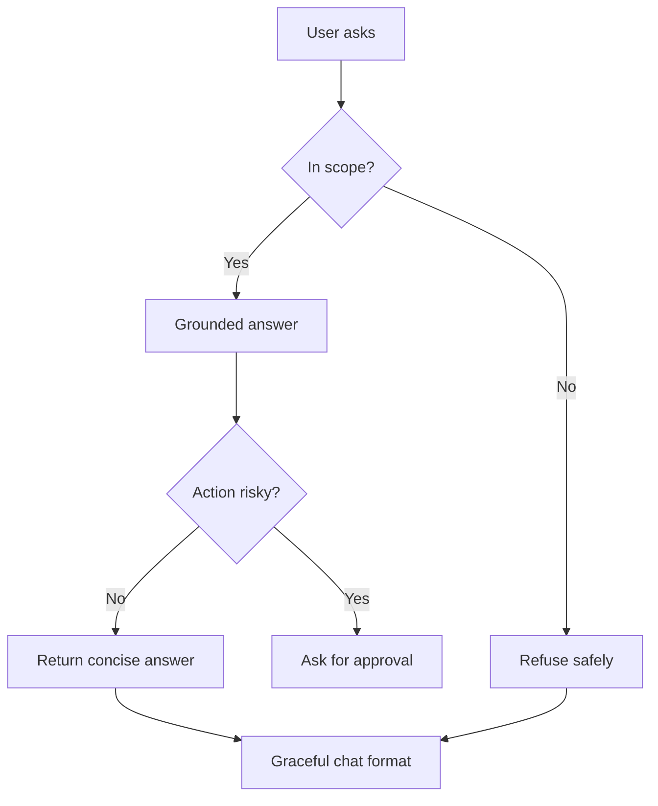

# แบบฝึกหัดที่ 3: Hardening Patterns สำหรับ Agent

แบบฝึกหัดนี้จะพาเรา harden Agent ให้ตอบอย่างมีขอบเขต ชัดเจน และคาดเดาได้มากขึ้น โดยต่อยอดจาก Financial Report Assistant ที่สร้างใน Module 2 และปรับ reliability pattern มาแล้วใน Module 3

🔑 **Copilot Studio ใช้ได้ถ้าต้องการทดลองจริง** แต่แกนหลักของแบบฝึกหัดนี้สามารถทำผ่าน Teams discussion และการ rewrite ข้อความได้



---

## Practice 1: Grounded Answer Only

1. ให้ทีมอ่านโจทย์นี้

   ```text
   Agent ต้องตอบเฉพาะเรื่อง financial reporting, report terminology, และ report distribution policy
   ```

2. ให้แต่ละทีมเขียนกติกาสั้นๆ สำหรับ Agent ว่าเมื่อไรควรตอบ และเมื่อไรควรบอกว่า "ยังไม่แน่ใจ"
3. ตัวอย่างข้อความที่ใช้ได้

   ```text
   ผมจะตอบจากข้อมูลและขอบเขตที่เกี่ยวข้องกับรายงานการเงินเท่านั้น
   หากยังไม่มีข้อมูลที่ยืนยันได้ ผมจะบอกตรงๆ ว่ายังไม่แน่ใจ และช่วยพาไปยังแหล่งข้อมูลหรือผู้รับผิดชอบที่เหมาะสม
   ```

---

## Practice 2: Refuse Template for Out-of-Scope

1. ให้ทีม rewrite คำตอบสำหรับคำขอนอกขอบเขต เช่น

   ```text
   User: ช่วยตรวจสอบสิทธิ์ลางานให้หน่อย
   ```

2. เป้าหมายคือปฏิเสธอย่างสุภาพและ redirect ให้ชัด

   ```text
   ผมช่วยหลักๆ เรื่องรายงานการเงินและการสรุปข้อมูลจากไฟล์รายงานครับ
   สำหรับคำถามด้านสิทธิ์ลางาน แนะนำให้ติดต่อ HR หรือใช้ Agent ที่ดูแลเรื่องนี้โดยตรง
   ```

---

## Practice 3: Approval Before Action

1. ใช้ scenario นี้

   ```text
   User: ช่วยเตรียม summary นี้แล้วส่งให้ผู้บริหารเลย
   ```

2. ให้ทีมออกแบบข้อความยืนยันก่อน action

   ```text
   เพื่อยืนยันนะครับ ต้องการให้ผมเตรียม summary สำหรับผู้บริหารจากข้อมูลชุดนี้ก่อน
   หากขั้นตอนถัดไปเกี่ยวข้องกับการส่งต่อหรือเผยแพร่รายงาน ควรให้ผู้รับผิดชอบตรวจสอบอีกครั้งก่อนดำเนินการ
   ```

3. ให้คุยต่อว่ามี action ไหนบ้างที่ Agent ไม่ควรทำทันทีโดยไม่มี approval

---

## Practice 4: Rewrite for Chat Format

1. ให้ผู้สอนเตรียมข้อความ policy หรือคำอธิบายยาว 1 ย่อหน้า
2. ให้แต่ละทีม rewrite ให้อ่านง่ายในแชต โดยใช้หลักต่อไปนี้
   - สั้น
   - เป็นข้อ
   - ใช้น้ำเสียงที่เป็นมิตร
3. ตัวอย่างรูปแบบ

   ```text
   สรุปให้สั้นๆ ครับ
   - ใช้รายงานฉบับเต็มเฉพาะผู้มีสิทธิ์เข้าถึง
   - ตรวจสอบ approval chain ก่อนส่งต่อ
   - หากไม่แน่ใจ ให้ส่งต่อทีมที่รับผิดชอบก่อนเผยแพร่
   ```

---

## สรุป

ในแบบฝึกหัดนี้ คุณได้ฝึก hardening pattern สำคัญ 4 ด้านคือ **Grounded answer**, **Refuse safely**, **Approval before action**, และ **Chat-friendly response format**

ขั้นตอนถัดไป → [เลือก Channel และ Publish Agent](../exercise-4-channel-and-publishing/README.md)
