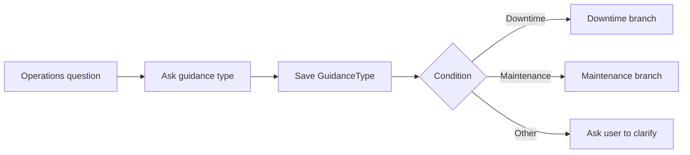

# แบบฝึกหัดที่ 3: สร้าง Topics, Questions, Variables, and Conditions

เราจะสร้าง Topic ชื่อ `Operations Guidance` เพื่อถามประเภทคำขอและ route ผู้ใช้ไปยัง downtime หรือ maintenance branch

> **License:** ต้องมีสิทธิ์แก้ไข `Topics` ใน `Copilot Studio`



---

## Practice 1: สร้าง Topic และเก็บตัวแปร

**Primary target:** สร้าง Topic ที่บันทึกประเภทคำขอไว้ในตัวแปร `GuidanceType`

1. ไปที่ `Topics` > `Add a topic` > `From blank`
2. ตั้งชื่อ `Operations Guidance`
3. กำหนด Trigger description:

   ```text
   Use this topic when the user asks for operations guidance about downtime reporting or maintenance escalation.
   ```

4. เพิ่ม `Question` node:

   ```text
   ต้องการข้อมูลด้าน Downtime reporting หรือ Maintenance escalation ครับ
   ```

5. ใช้ multiple-choice options `Downtime reporting`, `Maintenance escalation`, `Other` และบันทึกเป็น `GuidanceType`

### Checkpoint

- Topic รับคำตอบและบันทึกค่า `GuidanceType` ได้

---

## Practice 2: Route ด้วย Condition

**Primary target:** สร้าง Condition ที่แยกผู้ใช้ไปยังสาม branch ตาม `GuidanceType`

1. เพิ่ม `Condition` node ใต้ Question
2. สร้าง branch สำหรับ `Downtime reporting` และ `Maintenance escalation`
3. ใน `All other conditions` เพิ่ม Message:

   ```text
   กรุณาบอกเหตุการณ์หรือขั้นตอนที่ต้องการทราบเพิ่มเติม โดยไม่ใส่ข้อมูลการปฏิบัติงานจริงหรือข้อมูลอ่อนไหว
   ```

4. กด `Save` และทดสอบทั้งสามตัวเลือก

### Checkpoint

- แต่ละตัวเลือกไปยัง branch ที่กำหนดและไม่มี branch ใดตอบจากความรู้ที่ยังไม่ได้เลือก

---

## Summary

คุณสร้างโครง Topic ที่พร้อมเชื่อม targeted Generative answers ใน Exercise 4

ขั้นตอนถัดไป → [สร้าง Targeted Generative Answers](../exercise-4-targeted-generative-answers/README.md)
