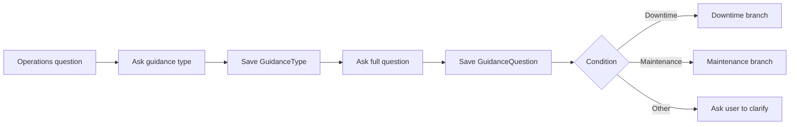

# แบบฝึกหัดที่ 3: สร้าง Topics, Questions, Variables, and Conditions

เราจะสร้าง Topic ชื่อ `Operations Guidance` เพื่อถามประเภทคำขอและ route ผู้ใช้ไปยัง downtime หรือ maintenance branch

> **License:** ต้องมีสิทธิ์แก้ไข `Topics` ใน `Copilot Studio`



---

## Practice 1: สร้าง Topic และเก็บตัวแปร

**Primary target:** สร้าง Topic ที่บันทึกประเภทคำขอใน `GuidanceType` และคำถามฉบับเต็มใน `GuidanceQuestion`

1. ไปที่ `Topics` > `Add a topic` > `From blank`
2. ตั้งชื่อ `Operations Guidance`
3. กำหนด Trigger description:

   ```text
   Use this topic when the user asks for operations guidance about downtime reporting or maintenance escalation.
   ```

4. เพิ่ม `Question` node:

   ```text
   ต้องการข้อมูลด้าน Downtime reporting หรือ Maintenance escalation ครับ
   ```

5. เลือก **identify** เป็น **multiple-choice options** 
6. ระบุตัวเลือกเป็น option ตามนี้:
   ```text
   Downtime reporting
   ```

   ```text
   Maintenance escalation
   ```
7. ในส่วนของ **Save user response as** ให้คลิกที่ **Var1** แล้วตั้งชื่อตัวแปรเป็น:

   ```text
   GuidanceType
   ```
8. ใต้ Question แรก กดปุ่ม **+** เพิ่ม `Question` node อีกหนึ่ง node แล้วใส่ข้อความ:

   ```text
   กรุณาระบุคำถามหรือข้อมูลที่ต้องการทราบ
   ```

9. ตั้ง `Identify` เป็น `User's entire response` และบันทึกคำตอบเป็นตัวแปรตามด้านล่าง

   **Variable name:**

   ```text
   GuidanceQuestion
   ```

### Checkpoint

- Topic รับคำตอบและบันทึกค่า `GuidanceType` ได้
- Topic บันทึกคำถามฉบับเต็มของผู้ใช้ใน `GuidanceQuestion` โดยไม่แทนที่ด้วยค่าจากตัวเลือก

---

## Practice 2: Route ด้วย Condition

**Primary target:** ตรวจสอบ หรือสร้าง Condition ที่แยกผู้ใช้ไปยัง branch ตาม `GuidanceType`

> ขั้นตอนนี้ถ้าระบบสร้าง Condition ให้ตรวจสอบว่า branch ถูกสร้างตาม `GuidanceType` หรือไม่ ถ้าสร้างแล้วให้ข้ามไปยังข้อ 3 ได้เลย

1. เพิ่ม `Condition` node ใต้ Question ที่บันทึก `GuidanceQuestion`
2. สร้าง branch สำหรับ `Downtime reporting` และ `Maintenance escalation`
3. ใน `All other conditions` กดปุ่ม **+**
4. เพิ่ม Send a message node:

   ```text
   คุณไม่ได้เลือกตัวเลือกตามที่กำหนด กรุณาป้อนคำสั่งใหม่อีกครั้ง
   ```

5. กด `Save` และทดสอบทั้งสามตัวเลือก โดยป้อนคำถามฉบับเต็มหลังเลือกประเภทคำขอ

### Checkpoint

- แต่ละตัวเลือกไปยัง branch ที่กำหนด
- ตัวแปร `GuidanceQuestion` แสดงคำถามฉบับเต็มที่ผู้ใช้ป้อน และไม่มี branch ใดตอบจาก Knowledge ที่ยังไม่ได้เลือก

---

## Summary

คุณสร้างโครง Topic ที่พร้อมเชื่อม targeted Generative answers ใน Exercise 4

ขั้นตอนถัดไป → [สร้าง Targeted Generative Answers](../exercise-4-targeted-generative-answers/README.md)
