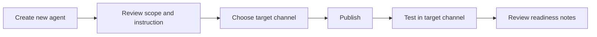

# แบบฝึกหัดที่ 4: เลือก Channel และ Publish Agent

🔑 **ต้องการ M365 Copilot License + สิทธิ์เข้าใช้ Copilot Studio**

แบบฝึกหัดนี้เป็นส่วนเดียวในชุดขยาย Module 3 ที่ให้กลับไปใช้ Copilot Studio โดยโฟกัสเฉพาะเรื่อง **Channel selection**, **Publishing**, และการตรวจความพร้อมแบบสั้นๆ หลัง publish

> **⚠️ Note:** ถ้าต้องการทำแบบ hands-on จริง ให้สร้าง **Agent ใหม่** สำหรับการฝึก publish ครั้งนี้ และไม่ใช้ Agent เดิมจาก exercise ก่อนหน้าโดยตรง



---

## Practice 1: เตรียม Agent ใหม่สำหรับการฝึก Publish

1. เปิด Copilot Studio
2. สร้าง Agent ใหม่แบบเรียบง่ายสำหรับการทดลอง publish
3. ตั้งชื่อ Agent เช่น

   ```text
   Financial Publish Demo Agent
   ```

4. ใส่ instruction สั้นๆ ให้ชัดเจนว่า Agent นี้ช่วยอะไร เช่น

   ```text
   You are a simple financial reporting demo agent.
   Answer only basic questions about financial reporting and politely refuse unrelated topics.
   ```

5. กด **Save**

---

## Practice 2: เลือก Channel ที่เหมาะกับโจทย์

1. ให้ผู้เรียนคุยกันก่อนว่า use case นี้เหมาะกับช่องทางใดมากกว่า
   - Teams
   - Web
2. ใช้คำถามช่วยคิด
   - ผู้ใช้ตัวจริงอยู่ในช่องทางไหนอยู่แล้ว
   - ต้องการ demo ภายในองค์กรหรือภายนอก
   - ต้องการความสะดวกในการเข้าถึงหรือความง่ายในการทดลอง
3. ให้แต่ละทีมเขียนเหตุผลสั้นๆ ใน Teams chat ว่าเลือก channel ใด และเพราะอะไร

---

## Practice 3: Publish Agent

1. ไปที่หน้า Overview ของ Agent
2. กด **Publish**
3. รอจนระบบแสดงว่า publish สำเร็จ
4. บันทึกว่า publish ครั้งนี้ตั้งใจใช้ channel ใดเป็นหลัก

> **💡 Tip:** ในห้องเรียน ไม่จำเป็นต้องเชื่อมหลาย channel พร้อมกัน จุดสำคัญคือเข้าใจลำดับการ publish และรู้ว่าจะทดสอบที่ไหน

---

## Practice 4: ทดสอบหลัง Publish

1. เปิด channel เป้าหมายที่เลือกไว้
2. ลองถามอย่างน้อย 3 prompt

   ```text
   ช่วยอธิบาย EBITDA แบบสั้นๆ
   ```

   ```text
   ช่วยสรุปว่ารายงานการเงินแบบ executive summary เหมาะกับใคร
   ```

   ```text
   ช่วยตอบเรื่องสิทธิ์ลางานให้หน่อย
   ```

3. ตรวจว่า Agent
   - ตอบในเรื่องที่อยู่ใน scope ได้
   - ปฏิเสธเรื่องนอก scope ได้อย่างสุภาพ
   - ใช้งานได้จริงใน channel ที่ publish ไป

---

## Practice 5: Readiness Notes

1. ให้ทีมสรุป readiness note สั้นๆ 3 ข้อ

   ```text
   - Target channel:
   - สิ่งที่พร้อมแล้ว:
   - สิ่งที่ต้องปรับก่อน demo จริง:
   ```

2. แชร์ note นี้ใน Teams หรือสรุปหน้าชั้น

---

## สรุป

ในแบบฝึกหัดนี้ คุณได้ฝึกเลือก channel, publish Agent, และตรวจความพร้อมเบื้องต้นหลัง publish โดยใช้ Agent ใหม่สำหรับการทดลองอย่างปลอดภัย

ขั้นตอนถัดไป → [นิยาม Measurement Mindset และ UAT readiness](../exercise-5-measurement-mindset/README.md)
