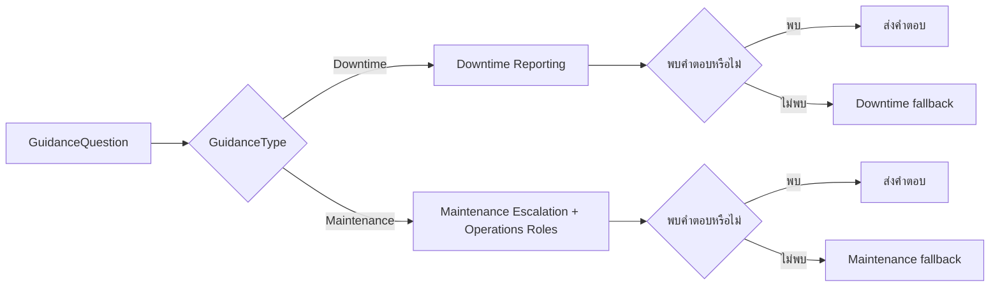

# แบบฝึกหัดที่ 4: สร้าง Targeted Generative Answers

เราจะเพิ่ม `Generative answers` node แยกตาม branch และเปิด `Search only selected sources` เพื่อให้คำถามแต่ละประเภทค้นหาเฉพาะ Knowledge sources ที่กำหนด

> **License:** ต้องมีสิทธิ์ใช้ `Generative answers` และ Knowledge sources ใน `Copilot Studio`

> **⚠️ Note:** การเลือก source เป็น retrieval scope ไม่ใช่ permission boundary ผู้ใช้ทุกคนที่คุยกับ Agent อาจได้รับคำตอบจากไฟล์ที่อัปโหลดโดยตรง ดังนั้นใช้เฉพาะไฟล์ที่อนุญาตให้ผู้เรียนทุกคนเห็น

## Prerequisites

- ทำ Exercise 2 แล้ว และ Knowledge sources `Operations Overview`, `Downtime Reporting`, `Maintenance Escalation` และ `Operations Roles` มีสถานะ `Ready`
- ทำ Exercise 3 แล้ว และ Topic `Operations Guidance` มีตัวแปร `GuidanceType`, `GuidanceQuestion` และ branch สำหรับ `Downtime reporting` กับ `Maintenance escalation`

> **Note:** เมื่อเปิด `Search only selected sources` แหล่งข้อมูลที่เลือกจะใช้แทน Agent-level Knowledge สำหรับ node นั้น หากค้นหาไม่พบ node จะไม่ค้นหา Agent-level sources อื่นโดยอัตโนมัติ

---

## Scenario: จำกัดแหล่งข้อมูลตามประเภทคำถาม

ผู้ใช้เลือกประเภทคำถามและป้อนรายละเอียด จากนั้น Topic จะส่ง `GuidanceQuestion` ไปยัง node ที่ค้นหาเฉพาะแหล่งข้อมูลของ branch นั้น



### Practice 1: ตั้ง Downtime Source

**Primary target:** เชื่อม downtime branch กับแหล่งข้อมูล downtime ที่เลือกไว้เท่านั้น

1. เปิด Topic `Operations Guidance`
2. ใต้ branch `Downtime reporting` เลือก `Add node` > `Advanced` > `Generative answers`
3. ที่ `Input` ของ `Create generative answers` node เลือกตัวแปร `Topic.GuidanceQuestion`
4. เลือกจุดสามจุด (`…`) ของ node แล้วเลือก `Properties`
5. ในส่วน `Knowledge sources` เลือก `Add knowledge` แล้วเลือกเฉพาะ `Downtime Reporting`
6. เปิด `Search only selected sources`
7. หาก Properties แสดง `Web search` หรือ `Allow the AI to use its own general knowledge` ให้ตรวจว่าปิดอยู่ เพื่อให้การทดสอบนี้ใช้เฉพาะ source ที่เลือก
8. ใน `Advanced` สร้าง global variable สำหรับบันทึกคำตอบชื่อ `Global.DowntimeAnswer` แล้วล้างตัวเลือก `Send a message`
9. ใต้ node เพิ่ม `Condition` เลือก `Change to formula` แล้วใส่สูตร `IsBlank(Global.DowntimeAnswer)`
10. ใน branch ของสูตรนี้ เพิ่ม `Message` node แล้วใส่ fallback:

    ```text
    ไม่พบคำตอบใน Downtime Reporting กรุณาตรวจสอบกับ Shift Supervisor ตามช่องทางที่องค์กรกำหนด
    ```

11. ใน `All other conditions` เพิ่ม `Message` node และแทรกค่า `Global.DowntimeAnswer`
12. กด `Save`

#### Checkpoint

- Input ของ downtime node เป็น `Topic.GuidanceQuestion`
- Downtime node แสดง `Downtime Reporting` เพียง source เดียวและเปิด `Search only selected sources`
- Topic ส่ง fallback เฉพาะเมื่อ `Global.DowntimeAnswer` ว่าง

---

### Practice 2: ตั้ง Maintenance Source

**Primary target:** เชื่อม maintenance branch กับแหล่งข้อมูล escalation ที่เลือกไว้เท่านั้น

1. ใต้ branch `Maintenance escalation` เลือก `Add node` > `Advanced` > `Generative answers`
2. ตั้ง `Input` เป็น `Topic.GuidanceQuestion`
3. เปิด `Properties` แล้วเลือก `Maintenance Escalation` และ `Operations Roles` ในส่วน `Knowledge sources`
4. เปิด `Search only selected sources` และตรวจว่าไม่ได้เลือก source อื่น
5. หากมีตัวเลือก Web search หรือการใช้ general knowledge ให้ปิดไว้เช่นเดียวกับ Practice 1
6. ใน `Advanced` สร้าง global variable `Global.MaintenanceAnswer` แล้วล้างตัวเลือก `Send a message`
7. เพิ่ม `Condition` เลือก `Change to formula` แล้วใส่สูตร `IsBlank(Global.MaintenanceAnswer)`
8. ใน branch ของสูตรนี้ เพิ่ม `Message` node แล้วใส่ข้อความ:

   ```text
   ไม่พบคำตอบใน Maintenance Escalation หรือ Operations Roles กรุณาตรวจสอบกับ Shift Supervisor ตามช่องทางที่องค์กรกำหนด
   ```

9. ใน `All other conditions` เพิ่ม `Message` node และแทรกค่า `Global.MaintenanceAnswer`
10. กด `Save`

#### Checkpoint

- Maintenance node ใช้เฉพาะ `Maintenance Escalation` และ `Operations Roles`
- Topic ส่ง fallback เฉพาะเมื่อ `Global.MaintenanceAnswer` ว่าง

---

### Practice 3: ทดสอบคำถามที่มีข้อมูลรองรับ

**Primary target:** ยืนยันว่าแต่ละ branch ตอบจาก source ที่กำหนดและอ้างอิงข้อมูลได้ถูกต้อง

1. เปิด `Test your agent` และเลือก `Start new test session`
2. เรียก Topic `Operations Guidance` เลือก `Downtime reporting` แล้วป้อนคำถาม:

   ```text
   เมื่อเกิด unplanned downtime ต้องบันทึกข้อมูลอะไรบ้าง
   ```

3. ตรวจว่าคำตอบกล่าวถึงข้อมูลที่ต้องบันทึกจาก `Downtime Reporting` และไม่เพิ่มข้อมูลที่ไม่มีในเอกสาร
4. เริ่ม test session ใหม่ เรียก Topic เดิม เลือก `Maintenance escalation` แล้วป้อนคำถาม:

   ```text
   เหตุขัดข้องซ้ำและคาดว่าจะ downtime เกิน 30 นาที ต้อง escalation ระดับใดและติดต่อใครบ้าง
   ```

5. ตรวจว่าคำตอบระบุ Level 2, Shift Supervisor และ Maintenance Supervisor ตาม source ที่เลือก

#### Checkpoint

- คำตอบทั้งสองกรณีตรงกับไฟล์ต้นทาง และแสดง citation หรือชื่อ source เมื่อช่องทางทดสอบรองรับ

---

### Practice 4: ทดสอบ Cross-domain และ Unavailable Questions

**Primary target:** ยืนยันว่า Topic ไม่ดึงข้อมูลข้าม branch หรือแต่งคำตอบเมื่อ source ไม่มีข้อมูล

1. เริ่ม test session ใหม่ เลือก `Downtime reporting` แล้วถามคำถามที่มีคำตอบอยู่เฉพาะอีก branch:

   ```text
   Maintenance Supervisor รับผิดชอบ escalation ระดับใด
   ```

2. ตรวจว่า Agent ไม่ดึงคำตอบจาก `Maintenance Escalation` หรือ `Operations Roles` และใช้ downtime fallback
3. เริ่ม test session ใหม่ เลือก `Maintenance escalation` แล้วถามคำถามที่มีคำตอบอยู่เฉพาะ downtime source:

   ```text
   ใน downtime report ต้องบันทึกวันที่และเวลาใดบ้าง
   ```

4. ตรวจว่า Agent ไม่ดึงคำตอบจาก `Downtime Reporting` และใช้ maintenance fallback
5. เริ่ม test session ใหม่ เลือก branch ใด branch หนึ่ง แล้วถามคำถามที่ไม่มีในทุกไฟล์:

   ```text
   ค่าแรงดันสูงสุดที่ปลอดภัยของอุปกรณ์หมายเลข P-101 คือเท่าไร
   ```

6. ตรวจว่า Agent ไม่ระบุตัวเลขหรือ operating limit และแนะนำให้ตรวจสอบกับ Shift Supervisor

#### Checkpoint

- Cross-domain questions ไม่ได้คำตอบจาก source ของอีก branch
- คำถาม P-101 ไม่ได้คำตอบเป็นตัวเลขและเข้าสู่ safe fallback

## Cumulative Checkpoint

- Topic มี Generative answers nodes สอง node และทั้งคู่รับ input จาก `Topic.GuidanceQuestion`
- Downtime node เลือกเฉพาะ `Downtime Reporting`
- Maintenance node เลือกเฉพาะ `Maintenance Escalation` และ `Operations Roles`
- ทั้งสอง node เปิด `Search only selected sources` และมี fallback เมื่อ output variable ว่าง
- บันทึกผลทดสอบ in-domain, cross-domain และ unavailable question ครบ

## Expected Output

- Topic `Operations Guidance` ที่ route คำถามไปยัง Knowledge sources ตามประเภทคำขอ
- ผลทดสอบที่แสดงว่า targeted retrieval ตอบคำถามในขอบเขตและไม่ค้นหา source อื่นเมื่อไม่มีคำตอบ

> **Citation note:** เมื่อปรับแต่งคำตอบโดยบันทึกผลไว้ในตัวแปร บาง channel เช่น Microsoft Teams อาจต้องกำหนดการแสดง citation เพิ่มเติม แบบฝึกหัดนี้ตรวจ source ใน `Test your agent` และยังไม่ครอบคลุมการ Publish ไปยัง Teams

---

## Summary

คุณสร้าง targeted RAG สองเส้นทางที่เลือก source ได้ชัดเจนและมี safe fallback

## Microsoft Learn Reference

- [Add a generative answers node](https://learn.microsoft.com/en-us/microsoft-copilot-studio/nlu-boost-node)
- [Use uploaded files with generative answers nodes](https://learn.microsoft.com/en-us/microsoft-copilot-studio/nlu-documents)

ขั้นตอนถัดไป → [เปรียบเทียบ Broad และ Targeted Retrieval](../exercise-5-compare-broad-targeted-retrieval/README.md)
