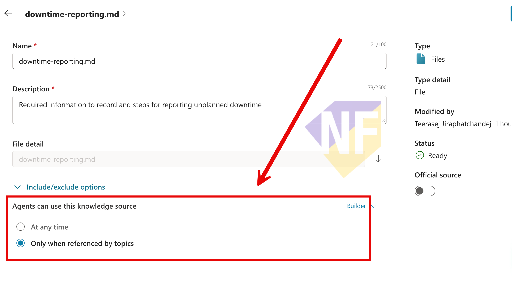

# แบบฝึกหัดที่ 4: สร้าง Targeted Generative Answers

เราจะเพิ่ม `Generative answers` node แยกตาม branch และเปิด `Search only selected sources` เพื่อให้คำถามแต่ละประเภทค้นหาเฉพาะ Knowledge sources ที่กำหนด

> **License:** ต้องมีสิทธิ์ใช้ `Generative answers` และ Knowledge sources ใน `Copilot Studio`


## Prerequisites

- ทำ Exercise 2 แล้ว และ Knowledge sources `Operations Overview`, `Downtime Reporting`, `Maintenance Escalation` และ `Operations Roles` มีสถานะ `Ready`
- ทำ Exercise 3 แล้ว และ Topic `Operations Guidance` มีตัวแปร `GuidanceType`, `GuidanceQuestion` และ branch สำหรับ `Downtime reporting` กับ `Maintenance escalation`

> **Note:** เมื่อเปิด `Search only selected sources` แหล่งข้อมูลที่เลือกจะใช้แทน Agent-level Knowledge สำหรับ node นั้น หากค้นหาไม่พบ node จะไม่ค้นหา Agent-level sources อื่นโดยอัตโนมัติ

---

### Practice 1: จำกัด Knowledge Sources ให้ใช้ผ่าน Topics เท่านั้น

**Primary target:** ตั้งค่า `Downtime Reporting`, `Maintenance Escalation` และ `Operations Roles` ให้ Agent ใช้งานได้เฉพาะเมื่อ Topic อ้างอิง source เหล่านี้

1. ไปที่หน้า `Knowledge` ของ Agent
2. เลือก Knowledge source `Downtime Reporting`
3. ขยายส่วน `Include/exclude options`
4. ในหัวข้อ `Agents can use this knowledge source` เลือก `Only when referenced by topics`

   

5. กด `Save` หรือรอให้ระบบบันทึกการเปลี่ยนแปลงจนเสร็จ
6. กลับไปที่หน้า `Knowledge` แล้วทำขั้นตอนเดียวกันกับ `Maintenance Escalation` และ `Operations Roles`
7. ตรวจว่า Knowledge source ทั้งสามรายการมีสถานะ `Ready`
8. คงการตั้งค่า `Operations Overview` เป็น `At any time` เพื่อใช้ทดสอบ Agent-level Knowledge แบบ broad retrieval

#### Checkpoint

- `Downtime Reporting`, `Maintenance Escalation` และ `Operations Roles` ตั้งค่าเป็น `Only when referenced by topics`
- `Operations Overview` ยังคงเป็น `At any time`
- Knowledge sources ทั้งสี่รายการมีสถานะ `Ready`

---

### Practice 2: ตั้ง Downtime Source

**Primary target:** เชื่อม downtime branch กับแหล่งข้อมูล downtime ที่เลือกไว้เท่านั้น

1. เปิด Topic `Operations Guidance`
2. ใต้ branch `Downtime reporting` เลือก `Add node` > `Advanced` > `Generative answers`
3. ที่ `Input` ของ `Create generative answers` node เลือกตัวแปร `Topic.GuidanceQuestion`
4. เลือกจุดสามจุด (`…`) ของ node เพื่อเปิด `Properties` panel
5. ในส่วน `Knowledge sources`  
6. เปิด `Search only selected sources`
7. แล้วเลือกเฉพาะ `Downtime Reporting`
8. หาก Properties แสดง `Web search` หรือ `Allow the AI to use its own general knowledge` ให้ตรวจว่าปิดอยู่ เพื่อให้การทดสอบนี้ใช้เฉพาะ source ที่เลือก
9.  กด `Save`

#### Checkpoint

- Input ของ downtime node เป็น `Topic.GuidanceQuestion`
- Downtime node แสดง `Downtime Reporting` เพียง source เดียวและเปิด `Search only selected sources`
- Topic ส่ง fallback เฉพาะเมื่อ `Global.DowntimeAnswer` ว่าง

---

### Practice 3: ตั้ง Maintenance Source

**Primary target:** เชื่อม maintenance branch กับแหล่งข้อมูล escalation ที่เลือกไว้เท่านั้น

1. ใต้ branch `Maintenance escalation` เลือก `Add node` > `Advanced` > `Generative answers`
2. ตั้ง `Input` เป็น `Topic.GuidanceQuestion`
3. เปิด `Properties` แล้วเลือก `Maintenance Escalation` และ `Operations Roles` ในส่วน `Knowledge sources`
4. เปิด `Search only selected sources` และตรวจว่าไม่ได้เลือก source อื่น
5. หากมีตัวเลือก Web search หรือการใช้ general knowledge ให้ปิดไว้เช่นเดียวกับ Practice 2
6.  กด `Save`

#### Checkpoint

- Maintenance node ใช้เฉพาะ `Maintenance Escalation` และ `Operations Roles`
- Topic ส่ง fallback เฉพาะเมื่อ `Global.MaintenanceAnswer` ว่าง

---

### Practice 4: ปรับ Instructions ให้เรียกใช้ Topic

**Primary target:** ปรับ Instructions เดิมให้ Agent เรียก Topic `Operations Guidance` โดยอัตโนมัติ เมื่อผู้ใช้ถามเรื่อง downtime reporting หรือ maintenance escalation

1. กลับไปที่หน้า `Overview` ของ Agent
2. ในส่วน `Instructions` ให้คงข้อความเดิมไว้ แล้วเพิ่มข้อความต่อไปนี้ท้าย Instructions:

   ```text
   - When the user's request relates to downtime reporting or maintenance escalation, always use the Operations Guidance topic.
   - Do not answer these requests directly from Agent-level Knowledge before running the topic.
   ```

3. ตรวจว่า Instructions เดิมเกี่ยวกับขอบเขต การอ้างอิง source การไม่สร้างข้อมูล และข้อมูลติดต่อที่อนุมัติแล้วยังคงอยู่ครบ
4. กด `Save`
5. เปิด `Test your agent` แล้วเลือก `Start new test session`
6. ป้อนคำถามที่เกี่ยวข้องโดยไม่เรียกชื่อ Topic:

   ```text
   ฉันต้องการคำแนะนำเกี่ยวกับการรายงาน unplanned downtime
   ```

7. ตรวจว่า Agent เรียก Topic `Operations Guidance` และถามให้เลือก `Downtime reporting` หรือ `Maintenance escalation`

#### Checkpoint

- Instructions เดิมยังอยู่ครบและมี routing rule สำหรับ `Operations Guidance`
- เมื่อผู้ใช้ถามเรื่อง downtime หรือ maintenance Agent เรียก Topic โดยไม่ต้องพิมพ์ชื่อ Topic
- Topic ถามประเภทคำขอก่อนรับคำถามฉบับเต็ม

---

### Practice 5: เพิ่ม End all topics ที่ปลายทาง

**Primary target:** จบการทำงานของ Topic หลังส่งคำตอบหรือข้อความแจ้งให้ผู้ใช้ระบุคำขอใหม่ เพื่อไม่ให้ Agent ทำงานต่อด้วย node อื่น

1. กลับไปที่ Topic `Operations Guidance`
2. ใต้ node สุดท้ายของ topic เลือก `Add node` > `Topic management` > `End all topics`
3. กด `Save`

#### Checkpoint

- Branch `Downtime reporting`, `Maintenance escalation` และ `All other conditions` จบด้วย `End all topics`
- Topic หยุดทำงานหลังส่งคำตอบหรือข้อความให้ผู้ใช้ โดยไม่ย้อนกลับไปถามคำถามเดิม

---

### Practice 6: ทดสอบคำถามที่มีข้อมูลรองรับ

**Primary target:** ยืนยันว่าแต่ละ branch ตอบจาก source ที่กำหนดและอ้างอิงข้อมูลได้ถูกต้อง

1. เปิด `Test your agent` และเลือก `Start new test session`
2. ป้อนคำถามที่เกี่ยวข้องกับ downtime เพื่อให้ Agent เรียก Topic `Operations Guidance`
3. เลือก `Downtime reporting` แล้วป้อนคำถามฉบับเต็ม:

   ```text
   เมื่อเกิด unplanned downtime ต้องบันทึกข้อมูลอะไรบ้าง
   ```

4. ตรวจว่าคำตอบกล่าวถึงข้อมูลที่ต้องบันทึกจาก `Downtime Reporting` และไม่เพิ่มข้อมูลที่ไม่มีในเอกสาร
5. เริ่ม test session ใหม่ แล้วป้อนคำถามที่เกี่ยวข้องกับ maintenance เพื่อให้ Agent เรียก Topic เดิม
6. เลือก `Maintenance escalation` แล้วป้อนคำถามฉบับเต็ม:

   ```text
   เหตุขัดข้องซ้ำและคาดว่าจะ downtime เกิน 30 นาที ต้อง escalation ระดับใดและติดต่อใครบ้าง
   ```

7. ตรวจว่าคำตอบระบุ Level 2, Shift Supervisor และ Maintenance Supervisor ตาม source ที่เลือก

#### Checkpoint

- คำตอบทั้งสองกรณีตรงกับไฟล์ต้นทาง และแสดง citation หรือชื่อ source เมื่อช่องทางทดสอบรองรับ

---

### Practice 7: ทดสอบ Cross-domain และ Unavailable Questions

**Primary target:** ยืนยันว่า Topic ไม่ดึงข้อมูลข้าม branch หรือแต่งคำตอบเมื่อ source ไม่มีข้อมูล

1. เริ่ม test session ใหม่ เลือก `Downtime reporting` แล้วถามคำถามที่มีคำตอบอยู่เฉพาะอีก branch:

   ```text
   Maintenance Supervisor รับผิดชอบ escalation ระดับใด
   ```

2. ตรวจว่า Agent ไม่ดึงคำตอบจาก `Maintenance Escalation` หรือ `Operations Roles` และใช้ downtime fallback
3. เริ่ม test session ใหม่ เลือก `Maintenance escalation` แล้วถามคำถามที่มีคำตอบอยู่เฉพาะ downtime source:

   ```text
   ใน downtime report ต้องบันทึกวันที่และเวลาใดบ้าง
   ```

4. ตรวจว่า Agent ไม่ดึงคำตอบจาก `Downtime Reporting` และใช้ maintenance fallback
5. เริ่ม test session ใหม่ เลือก branch ใด branch หนึ่ง แล้วถามคำถามที่ไม่มีในทุกไฟล์:

   ```text
   ค่าแรงดันสูงสุดที่ปลอดภัยของอุปกรณ์หมายเลข P-101 คือเท่าไร
   ```

6. ตรวจว่า Agent ไม่ระบุตัวเลขหรือ operating limit และแนะนำให้ตรวจสอบกับ Shift Supervisor

#### Checkpoint

- Cross-domain questions ไม่ได้คำตอบจาก source ของอีก branch
- คำถาม P-101 ไม่ได้คำตอบเป็นตัวเลขและเข้าสู่ safe fallback

## Cumulative Checkpoint

- `Downtime Reporting`, `Maintenance Escalation` และ `Operations Roles` ใช้งานได้เฉพาะเมื่อถูกอ้างอิงโดย Topic
- `Operations Overview` ยังคงใช้สำหรับ Agent-level Knowledge แบบ broad retrieval
- Agent Instructions กำหนดให้คำถามเรื่อง downtime reporting และ maintenance escalation เรียก Topic `Operations Guidance`
- Topic มี Generative answers nodes สอง node และทั้งคู่รับ input จาก `Topic.GuidanceQuestion`
- Downtime node เลือกเฉพาะ `Downtime Reporting`
- Maintenance node เลือกเฉพาะ `Maintenance Escalation` และ `Operations Roles`
- ทั้งสอง node เปิด `Search only selected sources` และมี fallback เมื่อ output variable ว่าง
- ทุก branch ของ Topic จบด้วย `End all topics`
- บันทึกผลทดสอบ in-domain, cross-domain และ unavailable question ครบ

## Expected Output

- Topic `Operations Guidance` ที่ route คำถามไปยัง Knowledge sources ตามประเภทคำขอ
- ผลทดสอบที่แสดงว่า targeted retrieval ตอบคำถามในขอบเขตและไม่ค้นหา source อื่นเมื่อไม่มีคำตอบ

> **Citation note:** เมื่อปรับแต่งคำตอบโดยบันทึกผลไว้ในตัวแปร บาง channel เช่น Microsoft Teams อาจต้องกำหนดการแสดง citation เพิ่มเติม แบบฝึกหัดนี้ตรวจ source ใน `Test your agent` และยังไม่ครอบคลุมการ Publish ไปยัง Teams

---

## Summary

คุณสร้าง targeted RAG สองเส้นทางที่เลือก source ได้ชัดเจนและมี safe fallback

## Microsoft Learn Reference

- [Add a generative answers node](https://learn.microsoft.com/en-us/microsoft-copilot-studio/nlu-boost-node)
- [Use uploaded files with generative answers nodes](https://learn.microsoft.com/en-us/microsoft-copilot-studio/nlu-documents)

ขั้นตอนถัดไป → [เปรียบเทียบ Broad และ Targeted Retrieval](../exercise-5-compare-broad-targeted-retrieval/README.md)
