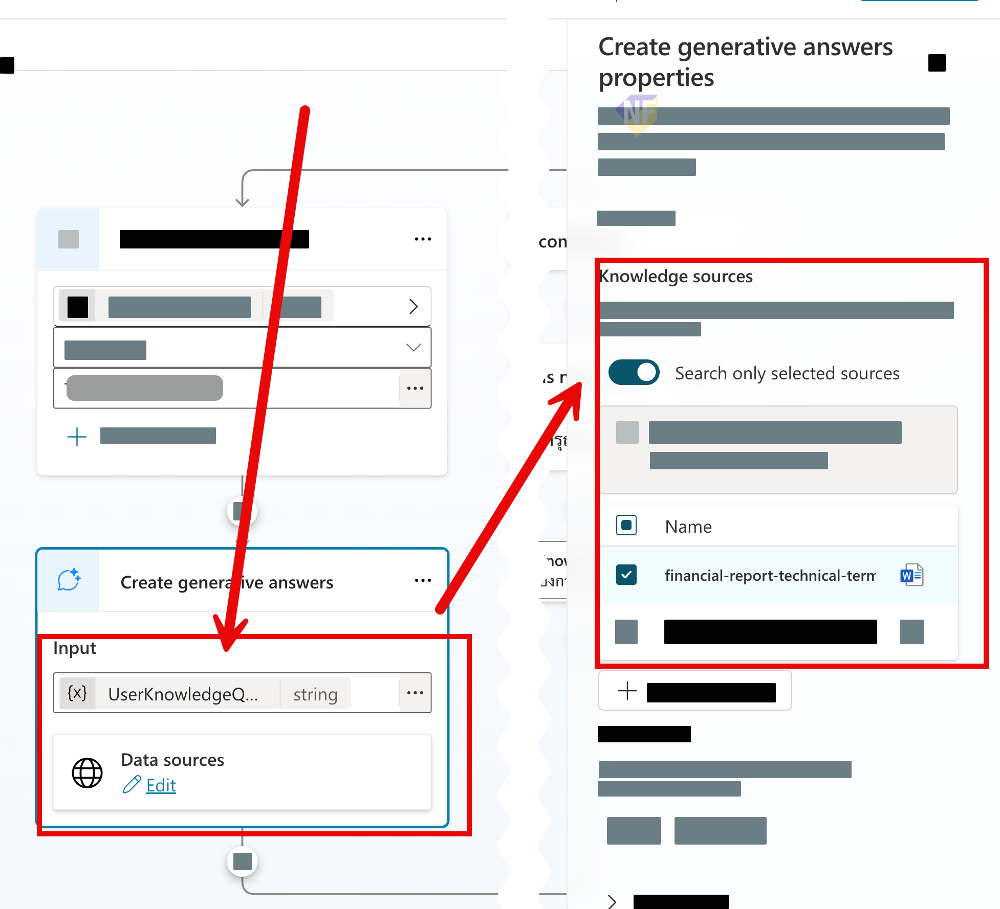

# แบบฝึกหัดที่ 4: สร้าง Targeted Generative Answers

เราจะเพิ่ม `Generative answers` node แยกตาม branch และเปิด `Search only selected sources` เพื่อให้แต่ละคำถามใช้ Knowledge ที่ตั้งใจเลือก

> **License:** ต้องมีสิทธิ์ใช้ `Generative answers` และ Knowledge sources ใน `Copilot Studio`

> **⚠️ Note:** การเลือก source เป็น retrieval scope ไม่ใช่ permission boundary ผู้ใช้ทุกคนที่คุยกับ Agent อาจได้รับคำตอบจากไฟล์ที่อัปโหลดโดยตรง ดังนั้นใช้เฉพาะไฟล์ที่อนุญาตให้ผู้เรียนทุกคนเห็น

---

## Practice 1: ตั้ง Downtime Source

**Primary target:** เชื่อม downtime branch กับแหล่งข้อมูล downtime ที่เลือกไว้เท่านั้น

1. เปิด Topic `Operations Guidance`
2. ใน downtime branch เพิ่ม `Generative answers` node
3. ตั้ง input เป็นคำถามล่าสุดของผู้ใช้
4. ที่ Properties เลือก `Add knowledge` และเลือก `Downtime Reporting`
5. เปิด `Search only selected sources`

   

6. เพิ่มข้อความ fallback:

   ```text
   ไม่พบคำตอบใน Downtime Reporting กรุณาตรวจสอบกับ Shift Supervisor ตามช่องทางที่องค์กรกำหนด
   ```

### Checkpoint

- Downtime node แสดง source ที่เลือกไว้และเปิด `Search only selected sources`

---

## Practice 2: ตั้ง Maintenance Source

**Primary target:** เชื่อม maintenance branch กับแหล่งข้อมูล escalation ที่เลือกไว้เท่านั้น

1. ใน maintenance branch เพิ่ม `Generative answers` node
2. เลือก `Maintenance Escalation` และ `Operations Roles`
3. เปิด `Search only selected sources`
4. กด `Save`

### Checkpoint

- Maintenance node ใช้เฉพาะสอง sources ที่กำหนด

---

## Practice 3: ทดสอบ Cross-domain และ Unavailable Questions

**Primary target:** ยืนยันว่า Topic ไม่ดึงข้อมูลข้าม branch หรือแต่งคำตอบเมื่อ source ไม่มีข้อมูล

1. ทดสอบ downtime branch ด้วยคำถามเรื่อง escalation level
2. ทดสอบ maintenance branch ด้วยคำถามเรื่อง downtime record
3. ถามคำถามที่ไม่มีในทุกไฟล์:

   ```text
   ค่าแรงดันสูงสุดที่ปลอดภัยของอุปกรณ์หมายเลข P-101 คือเท่าไร
   ```

### Checkpoint

- Agent ชี้แจงเมื่อคำถามอยู่นอก source ที่เลือกหรือไม่มีข้อมูล และไม่เดาค่าความปลอดภัย

---

## Summary

คุณสร้าง targeted RAG สองเส้นทางที่เลือก source ได้ชัดเจนและมี safe fallback

## Microsoft Learn Reference

- [Use node-level knowledge sources for generative answers](https://learn.microsoft.com/en-us/microsoft-copilot-studio/nlu-documents)

ขั้นตอนถัดไป → [เปรียบเทียบ Broad และ Targeted Retrieval](../exercise-5-compare-broad-targeted-retrieval/README.md)
