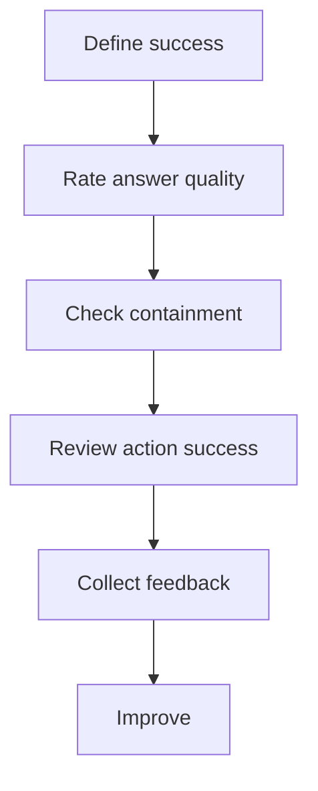

# แบบฝึกหัดที่ 5: นิยาม Measurement Mindset 

แบบฝึกหัดนี้จะช่วยให้พวกเรามอง Agent ในมุมของการวัดผลและการเตรียมตัวมากขึ้น ไม่ใช่แค่สร้างให้ทำงานได้ แต่ต้องเริ่มตอบคำถามว่า **อะไรคือคำว่า good enough สำหรับ Agent ของเรา**

🔧 **เครื่องมือที่ใช้ในห้องเรียน:** Microsoft Teams breakout room, chat, reaction และ Poll



---

## Practice 1: Define What Good Looks Like

Practice นี้ช่วยให้พวกเรากำหนดสิ่งที่จะสังเกต เพื่ออธิบายได้ว่า Agent ทำงานได้ดีเพียงใด โดยไม่ต้องตั้งเป้าตัวเลขก่อนมีข้อมูลจริง

1. ลองพิจารณาสถานการณ์ต่อไปนี้

   ```text
   Financial Report Assistant เริ่มทดลองใช้กับผู้ใช้กลุ่มเล็กแล้ว
   พวกเราได้ยินเพียงว่า “Agent ดูมีประโยชน์” แต่ยังไม่มีข้อมูล หรือข้อมูลชัดเจนว่าอะไรทำงานได้ดีหรือควรปรับ
   ```

2. มาโหวตกันว่า พวกเราควรเริ่มสังเกตเรื่องใดก่อน

   - Answer quality
   - Containment
   - Action success
   - User feedback

3. มาลองดูตัวอย่างสิ่งที่ควรสังเกตในแต่ละเรื่องกัน

   <details>
   <summary>ตัวอย่างสิ่งที่ควรสังเกต</summary>

   ```text
   Answer quality:
   ตรวจคำตอบตัวอย่างว่าถูกต้อง ชัดเจน และตอบตามคำขอหรือไม่

   Containment:
   ดูว่าผู้ใช้ทำงานต่อใน Agent ได้หรือไม่ โดยไม่ต้องเปลี่ยนไปถามคนหรือเริ่มใหม่

   Action success:
   ดูว่า Agent สร้างผลลัพธ์ตามขอบเขตที่ยืนยันไว้ เช่น สรุปรายงานตามช่วงเวลาและ Business Unit ที่ถูกต้องหรือไม่

   User feedback:
   เก็บ reaction หรือ comment สั้นๆ หลังผู้ใช้ได้รับคำตอบ
   ```

   </details>

4. ใช้รูปแบบ metric นี้เป็นแนวทาง

   - **Behavior or outcome:** ต้องการเห็นพฤติกรรมหรือผลลัพธ์ใด
   - **Evidence to review:** จะดูข้อมูลจากคำตอบ, conversation, reaction หรือ comment ใด
   - **Review cadence:** จะมาลองเช็คข้อมูลพวกนี้ตอนไหน เช่น หลังจบโครงการ pilot หรือทุกสัปดาห์

5. มาลองดู challenge พวกนี้กัน ให้แต่ละพวกเราเลือก metric หลัก 1 ข้อและบอกว่าจะเก็บข้อมูลอะไร

   <details>
   <summary>Challenge A: Product Operations Agent</summary>

   ```text
   Agent ช่วยตอบคำถามเรื่องสถานะการผลิตและ downtime ของแต่ละ Line
   ```

   </details>

   <details>
   <summary>Challenge B: Marketing Agent</summary>

   ```text
   Agent ช่วยสรุปผล campaign และเสนอประเด็นที่พวกเราการตลาดควรตรวจสอบต่อ
   ```

   </details>

   <details>
   <summary>Challenge C: Researcher Agent</summary>

   ```text
   Agent ช่วยสรุปข้อมูลตลาดจากเอกสารวิจัยที่พวกเราอัปโหลด
   ```

   </details>

6. แชร์ metric และข้อมูลที่พวกเราเลือกในช่องทางที่กำหนด พร้อมอธิบาย 1 บรรทัดว่าข้อมูลนั้นจะบอกอะไรเกี่ยวกับความพร้อมของ Agent

---

## Practice 2: Rate the Answer

Practice นี้ช่วยให้พวกเราประเมินคุณภาพคำตอบจากสิ่งที่ Agent ตอบจริง และเลือกจุดปรับปรุงที่ชัดเจนเพียงหนึ่งจุด


1. มาดูสถานการณ์นี้กัน

   ```text
   User: ทำไม gross margin ของ BU Trading ในเดือน May ลดลง

   Agent: Gross margin ลดลงเพราะต้นทุนวัตถุดิบสูงขึ้นครับ
   แนะนำให้ลดต้นทุนจาก supplier ทันที
   ```

2. มาโหวตกันว่าคำตอบนี้มีประโยชน์มากน้อยแค่ไหนสำหรับผู้ใช้

   ```text
   ✅ Helpful
   ⚠️ Partially helpful
   ❌ Not helpful
   ```

3. มาดูแนวทางการประเมินคำตอบกัน

   <details>
   <summary>ตัวอย่างการประเมินคำตอบ</summary>

   ```text
   Rating: ❌ Not helpful

   Evidence:
   Agent อ้างสาเหตุและเสนอการตัดสินใจ ทั้งที่ผู้ใช้ยังไม่ได้ให้รายงานหรือข้อมูลที่ยืนยันสาเหตุ

   One improvement:
   ให้ Agent ขอรายงานหรือข้อมูลต้นทุนที่เกี่ยวข้องก่อน แล้วสรุปจากข้อมูลที่ยืนยันได้
   ```

   ```text
   Rating: ⚠️ Partially helpful

   Evidence:
   Agent ช่วยตั้งสมมติฐานเบื้องต้นได้ว่าต้นทุนวัตถุดิบอาจสูงขึ้น
   แต่ยังไม่มีข้อมูลหรือหลักฐานจากรายงานเพื่อยืนยันสาเหตุ

   One improvement:
   ให้ Agent ระบุข้อมูลที่ต้องใช้ตรวจสอบก่อน (เช่น ต้นทุนวัตถุดิบรายเดือน, ปริมาณขาย, ราคาขายเฉลี่ย)
   แล้วค่อยสรุปสาเหตุจากข้อมูลจริง
   ```

   </details>

4. ใช้รูปแบบการ review นี้เป็นแนวทาง

   - **Rating:** Helpful, Partially helpful หรือ Not helpful
   - **Evidence from the answer:** ส่วนใดของคำตอบที่ทำให้เลือก rating นี้
   - **One specific improvement:** ถ้าปรับได้เพียงจุดเดียว ควรปรับอะไร

5. ลองดู challenge ต่อไปนี้ทีละข้อ ลองให้ rating และเสนอการปรับปรุง 1 จุดในช่องทางที่กำหนด

   <details>
   <summary>Challenge A: Product Operations Agent</summary>

   ```text
   User: Line 2 หยุดทำงานเมื่อเช้า ช่วยบอกสาเหตุให้หน่อย

   Agent: Line 2 หยุดเพราะชิ้นส่วนหลักเสื่อมสภาพครับ
   ```

   </details>

   <details>
   <summary>Challenge B: Marketing Agent</summary>

   ```text
   User: Summer Campaign ได้ผลเป็นอย่างไรบ้าง

   Agent: Campaign ประสบความสำเร็จมาก และลูกค้าทุกกลุ่มตอบรับดีครับ
   ```

   </details>

   <details>
   <summary>Challenge C: Researcher Agent</summary>

   ```text
   User: ตลาดรถยนต์ไฟฟ้าในประเทศไทยมีแนวโน้มอย่างไร

   Agent: ตลาดจะเติบโตอย่างมากแน่นอนในปีหน้า เพราะผู้บริโภคพร้อมซื้อรถยนต์ไฟฟ้าแล้วครับ
   ```

   </details>

6. แชร์คำตอบที่พวกเราคิดว่าดีที่สุดในช่องทางที่กำหนด พร้อมอธิบายว่าข้อมูลใดทำให้พวกเราเลือก rating นั้น

---

## Practice 3: Keep the User Moving

Practice นี้ช่วยให้พวกเราดูว่า Agent พาผู้ใช้ไปยังขั้นตอนถัดไปได้จริงหรือทำให้ผู้ใช้ติดอยู่ระหว่างการใช้งาน


1. มาลองดูสถานการณ์นี้กัน

   ```text
   User: ช่วยสรุปรายงานเดือน May ให้หน่อย

   Agent: ผมยังทำไม่ได้ กรุณาให้ข้อมูลเพิ่ม
   ```

2. มาโหวตกันว่า conversation นี้เป็นแบบใด

   - ✅ Contained — ผู้ใช้รู้ว่าจะทำอะไรต่อใน Agent
   - ⚠️ User stuck — ผู้ใช้ยังไม่รู้ว่าต้องทำอะไรต่อ

3. เอาล่ะ มาดูแนวทางของการพาผู้ใช้ไปต่อกัน

   <details>
   <summary>ตัวอย่าง</summary>

   ```text
   ตอนนี้ผมยังสรุปรายงานให้ไม่ได้ เพราะยังไม่ทราบ Business Unit ที่ต้องการครับ
   กรุณาระบุ Business Unit เช่น BU Trading หรือ BU Aromatics แล้วผมจะช่วยไปขั้นตอนถัดไปได้ทันที
   ```

   </details>

4. ใช้รูปแบบ containment นี้เป็นแนวทาง

   - บอกสถานะปัจจุบันอย่างชัดเจน
   - ให้ผู้ใช้มี next step ที่ทำได้เพียงหนึ่งอย่าง
   - ให้ผู้ใช้ทำต่อใน Agent ได้ หรือ redirect อย่างชัดเจนเมื่อทำต่อไม่ได้

5. ดูแต่ละ challenge ต่อไปนี้ทีละข้อ ให้พวกเราระบุจุดที่ผู้ใช้อาจหลุดออกจาก Agent และเสนอการปรับเพียงหนึ่งจุด

   <details>
   <summary>Challenge A: Product Operations Agent</summary>

   ```text
   User: เครื่องจักร Line 2 มีสัญญาณเตือน ต้องทำอย่างไร

   Agent: ผมไม่สามารถบอกได้
   ```

   </details>

   <details>
   <summary>Challenge B: Marketing Agent</summary>

   ```text
   User: ช่วยดูผล Summer Campaign ให้หน่อย

   Agent: กรุณาให้ข้อมูลที่ดีกว่านี้
   ```

   </details>

   <details>
   <summary>Challenge C: Researcher Agent</summary>

   ```text
   User: ช่วยสรุปข้อมูลตลาดรถยนต์ไฟฟ้าให้หน่อย

   Agent: ผมไม่พบข้อมูลที่ต้องการ
   ```

   </details>

6. แชร์การปรับที่พวกเราคิดว่าช่วยเพิ่ม containment ได้ดีที่สุดในช่องทางที่กำหนด พร้อมอธิบายว่าผู้ใช้จะทำอะไรต่อได้

---

## Practice 4: Turn Feedback into Improvement

Practice นี้ช่วยให้พวกเราเปลี่ยน feedback จากผู้ใช้เป็น action ที่ชัดเจนและตรวจสอบได้ในการทดสอบรอบถัดไป

🔧 **เครื่องมือที่ใช้ในห้องเรียน:** Microsoftช่องทางที่กำหนด, reaction หรือ Poll

1. มาดูตัวอย่าง feedback จากผู้ใช้กัน

   ```text
   👎 Agent สรุปรายงาน Q1 ทั้งที่ฉันขอ Q2 และฉันไม่รู้ว่าจะพิมพ์แก้อย่างไร
   ```

2. มาลองดูว่า​ พวกเราควรปรับส่วนใดก่อน

   - Instructions
   - Conversation flow
   - Test case

3. มาลองดูตัวอย่าง improvement action ต่อไปนี้กัน

   <details>
   <summary>ตัวอย่าง Improvement Action</summary>

   ```text
   Feedback signal:
   Agent ใช้ช่วงเวลารายงานผิด และผู้ใช้ไม่รู้วิธีแก้ไข

   Likely cause:
   Conversation flow ไม่ได้ถามหรือยืนยัน report period ก่อนสรุป

   Specific change:
   เพิ่มคำถามและ echo confirmation สำหรับ report period

   Retest and success signal:
   ทดสอบ prompt ที่ระบุ Q1 และ Q2 แล้วตรวจว่า Agent สรุปตามช่วงเวลาที่ผู้ใช้ยืนยัน
   ```

   </details>

4. ใช้รูปแบบนี้เป็นแนวทาง

   - **Feedback signal:** ผู้ใช้พบปัญหาอะไร
   - **Likely cause:** อะไรอาจเป็นสาเหตุ
   - **Specific change:** จะปรับอะไรให้ชัดเจน
   - **Retest and success signal:** จะทดสอบซ้ำอย่างไร และอะไรจะบอกว่าการปรับได้ผล

5. มาลองดูแต่ละ challenge ต่อไปนี้ ให้พวกเราสร้าง improvement action แบบสั้นๆ ในช่องทางที่กำหนด

   <details>
   <summary>Challenge A: Product Operations Agent</summary>

   ```text
   👎 Agent สรุปสถานะของ Line 3 ทั้งที่ฉันถาม Line 2 และไม่มีทางแก้ข้อมูลในบทสนทนา
   ```

   </details>

   <details>
   <summary>Challenge B: Marketing Agent</summary>

   ```text
   👎 Agent ตอบจาก campaign ปีที่แล้ว ทั้งที่ฉันต้องการผลของ Summer Campaign ล่าสุด
   ```

   </details>

   <details>
   <summary>Challenge C: Researcher Agent</summary>

   ```text
   👎 สรุปข้อมูลตลาดยาวเกินไป และไม่ได้บอกว่าข้อมูลมาจากแหล่งใด
   ```

   </details>

6. แชร์ improvement action ที่พวกเราคิดว่าชัดเจนที่สุดในช่องทางที่กำหนด พร้อมอธิบายว่าพวกเราจะรู้ได้อย่างไรว่าการปรับนั้นได้ผล

---

## สรุป

ในแบบฝึกหัดนี้ คุณได้ฝึกคิดเรื่อง **success metric**, **answer quality**, **containment**, และ **feedback loop** เพื่อเตรียม Agent ให้พร้อมต่อการทดสอบกับผู้ใช้จริง

ขั้นตอนถัดไป → [กลับไปที่ Module 3 Overview](../README.md)
