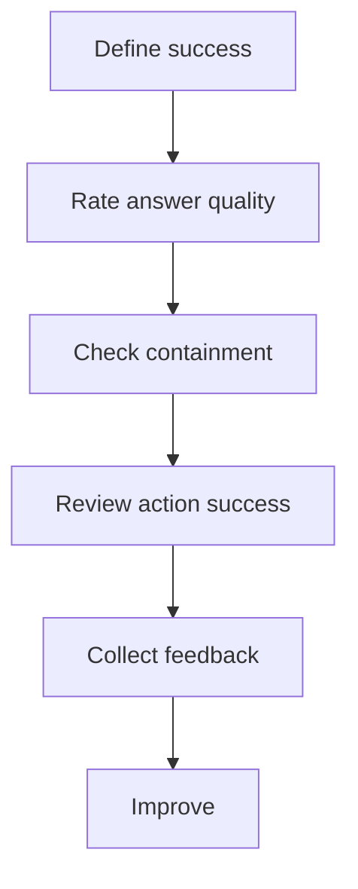

# แบบฝึกหัดที่ 5: นิยาม Measurement Mindset และ UAT Readiness

แบบฝึกหัดนี้จะช่วยให้ทีมมอง Agent ในมุมของการวัดผลและการเตรียม UAT มากขึ้น ไม่ใช่แค่สร้างให้ทำงานได้ แต่ต้องเริ่มตอบคำถามว่า **อะไรคือคำว่า good enough สำหรับ Agent ของเรา**

🔧 **เครื่องมือที่ใช้ในห้องเรียน:** Microsoft Teams breakout room, chat, Word หรือ Loop page



---

## Practice 1: Define What Good Looks Like

1. แบ่งทีมย่อยใน breakout room
2. ให้แต่ละทีมกรอก template นี้โดยอิงจาก Financial Report Assistant ของตัวเอง

   ```text
   Agent Name:
   Primary Use Case:

   Define 4 metrics:
   1. Answer Quality -> วัดอย่างไร
   2. Containment -> แบบไหนถือว่า resolve ได้ใน Agent
   3. Action Success -> งานไหนสำคัญที่สุด
   4. User Feedback -> รับ feedback แบบไหน

   Week 1 Target:
   - Quality %:
   - Containment %:
   - Action success %:
   - Feedback signal:
   ```

3. ให้แต่ละทีมแชร์ metric ที่คิดว่าสำคัญที่สุด 1 ข้อ

---

## Practice 2: Rate the Answer

1. ให้ผู้สอนเตรียม sample answer 3 แบบ
   - Helpful
   - Partially helpful
   - Not helpful
2. ให้ผู้เรียนโหวตผ่าน Teams chat หรือ Poll เช่น

   ```text
   ✅ Helpful
   ⚠️ Partially helpful
   ❌ Not helpful
   ```

3. ชวนคุยต่อว่า
   - คำตอบ grounded พอหรือยัง
   - ขาดข้อมูลอะไร
   - ถ้าจะแก้ 1 จุด ควรแก้อะไร

---

## Practice 3: Containment Challenge

1. ใช้ scenario นี้

   ```text
   ผู้ใช้ต้องการสรุปรายงาน แต่ให้ข้อมูลไม่ครบ
   ```

2. ให้แต่ละทีมร่าง mini-flow 4 ขั้นตอน

   ```text
   Step 1: Clarify question
   Step 2: Collect required info
   Step 3: Confirm input
   Step 4: Complete analysis or fallback
   ```

3. ให้คุยต่อว่าจุดไหนเสี่ยงทำให้ user หลุดออกจาก Agent หรือขอ escalate

---

## Practice 4: Feedback Improvement Loop

1. ให้ 1 ทีมรับบทเป็น user และอีก 1 ทีมเป็น agent team
2. ฝั่ง user ส่ง feedback เช่น

   ```text
   👍 / 👎
   Comment:
   ```

3. ฝั่ง agent team ต้องสรุป improvement action เช่น

   ```text
   Improvement:
   - จะปรับอะไร
   - เพราะอะไร
   ```

4. แลกเปลี่ยนผลลัพธ์หน้าชั้นหรือใน Teams chat

---

## สรุป

ในแบบฝึกหัดนี้ คุณได้ฝึกคิดเรื่อง **success metric**, **answer quality**, **containment**, และ **feedback loop** เพื่อเตรียม Agent ให้พร้อมต่อการทดสอบกับผู้ใช้จริง

ขั้นตอนถัดไป → [กลับไปที่ Module 3 Overview](../README.md)
