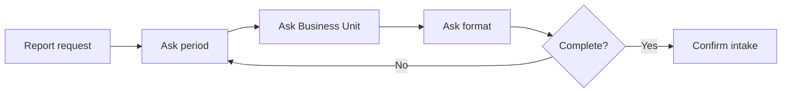
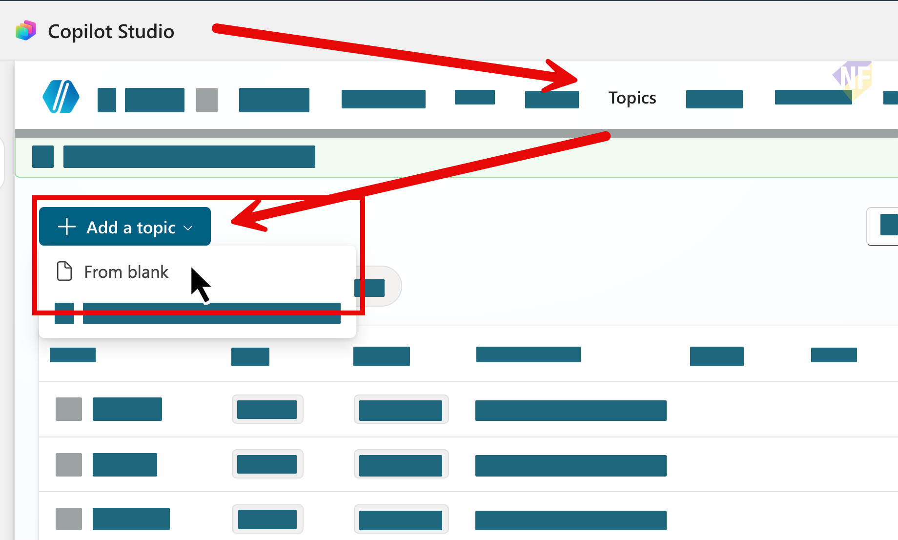
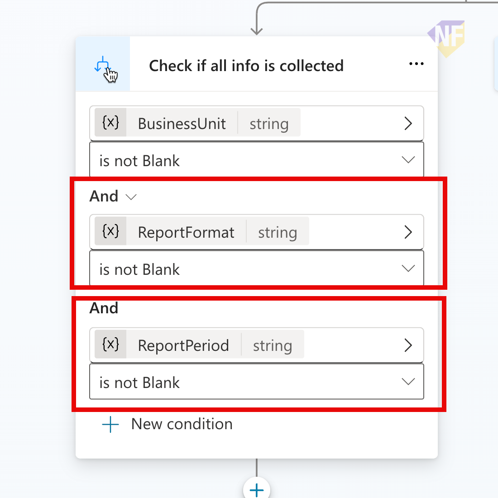

# แบบฝึกหัดที่ 1: สร้าง Financial Agent และ Intake Topic

เราจะสร้าง `Financial Report Assistant` และ Topic สำหรับเก็บช่วงเวลา Business Unit และรูปแบบรายงานให้ครบก่อนวิเคราะห์

> **License:** ต้องมีสิทธิ์เข้าใช้ `Copilot Studio`



---

## Practice 1: สร้าง Financial Report Assistant

**Primary target:** สร้าง Agent ที่มีขอบเขตงานรายงานการเงินรายเดือนชัดเจน

1. เปิด `Copilot Studio` แล้วเลือก `Agents` > `Create blank agent`
2. ตั้งชื่อ `Financial Report Assistant [ชื่อผู้เรียน]`
3. ใส่ Instructions:

   ```text
   You are Financial Report Assistant for a synthetic training scenario.
   Collect report period, Business Unit, and report format before analysis.
   Analyze only the workbook supplied by the user.
   Present a draft for review and require explicit confirmation before sending.
   Never invent financial values or send an email without confirmation.
   ```

4. กด `Save`

### Checkpoint

- Agent มีชื่อและ scope พร้อมต่อยอด Topic

---

## Practice 2: สร้าง Monthly Report Intake Topic

**Primary target:** สร้าง Topic ที่เก็บข้อมูลสามรายการในตัวแปรและยืนยันกลับให้ผู้ใช้

1. ไปที่ `Topics` > `Add a topic` > `From blank` และตั้งชื่อ `Monthly Report Intake`

   

2. ใส่ Trigger description:

   ```text
   Use this topic when the user asks for a monthly financial report or financial summary and may not provide the report period, Business Unit, or output format.
   ```

3. เพิ่ม `Question` nodes สามข้อและบันทึกเป็น:
   - ช่วงเวลา → `ReportPeriod`
   - Business Unit → `BusinessUnit`
   - รูปแบบรายงาน → `ReportFormat`
4. เพิ่ม `Condition` ตรวจว่าทั้งสามค่าไม่ Blank ถ้าขาดให้กลับไปถามข้อมูลที่ขาด

   

5. เมื่อครบ ให้ส่ง Message:

   ```text
   รับข้อมูลแล้ว: ช่วงเวลา = {Topic.ReportPeriod}, Business Unit = {Topic.BusinessUnit}, รูปแบบ = {Topic.ReportFormat}
   ```

6. กด `Save` และทดสอบคำขอที่ไม่ระบุช่วงเวลา

### Checkpoint

- Topic ถามค่าที่ขาด บันทึกตัวแปร และยืนยันค่าครบก่อนจบ intake

---

## Summary

คุณมี Financial Agent และ intake Topic ที่พร้อมรับ workbook ใน Exercise 2

ขั้นตอนถัดไป → [วิเคราะห์ Financial Workbook ด้วย Prompt](../exercise-2-analyze-financial-workbook/README.md)
