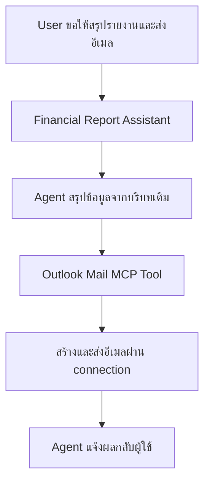
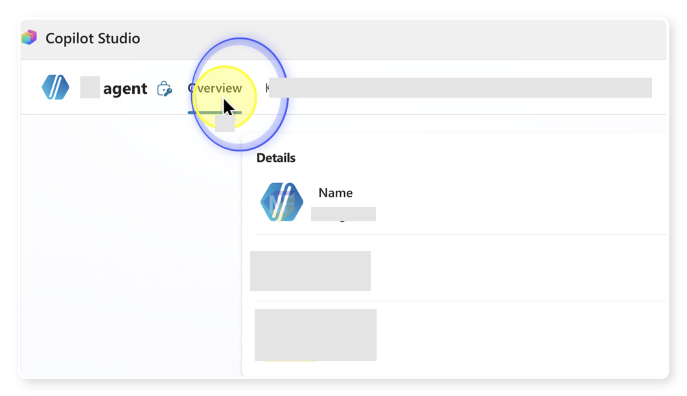
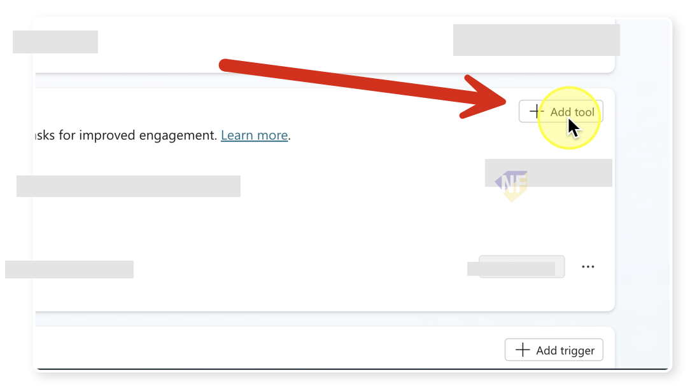
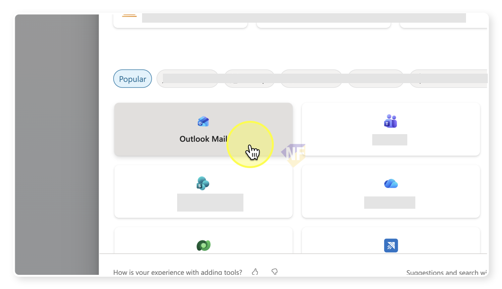
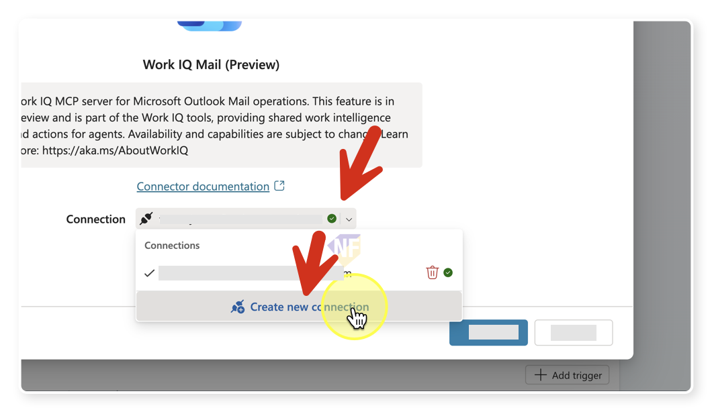
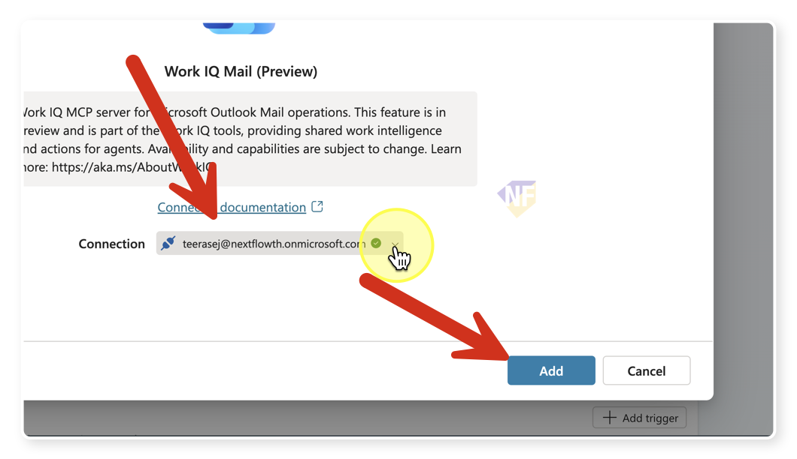
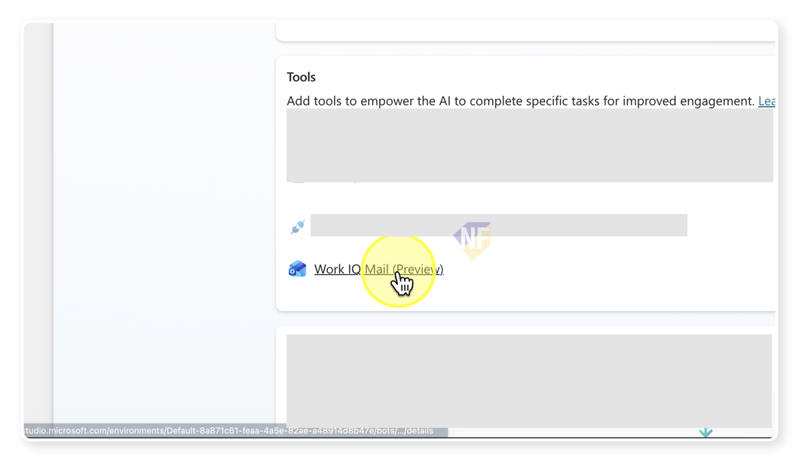
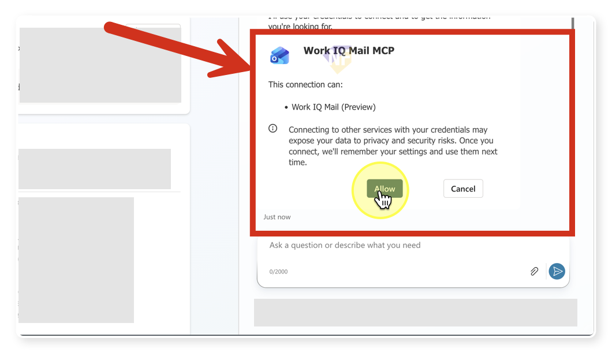

# แบบฝึกหัดที่ 2: เพิ่ม Outlook Mail MCP เป็น Tool ให้ Agent

🔑 **ต้องการ M365 Copilot License + สิทธิ์เข้าใช้ Copilot Studio**

แบบฝึกหัดนี้จะพาเราเพิ่มความสามารถแบบ **native tool** ให้กับ `Financial Report Assistant` เพื่อให้ Agent สามารถใช้ **Outlook Mail MCP** ส่งอีเมลสรุปรายงานได้โดยตรง โดยเริ่มจากการสร้าง connection, ปรับ instruction ให้ Agent ใช้ tool อย่างระมัดระวัง, และทดสอบการส่งอีเมลในสถานการณ์จริงแบบง่ายก่อนจะไปต่อในแบบฝึกหัดถัดไปที่ใช้ Agent Flow

> ⚠️ **Note:** แบบฝึกหัดนี้คาดหวังว่าอย่างน้อยผู้เรียนได้ทำ Module 2 Exercise 1-3 มาก่อน เพื่อให้มี Agent `Financial Report Assistant`, Topic `Monthly Report Intake`, และผลวิเคราะห์รายงานที่นำไปสรุปต่อได้



---

## Practice 1: ทบทวนเป้าหมายของ native tool ใน Agent

1. เปิด Agent `Financial Report Assistant`
2. ทบทวนว่าตอนนี้ Agent ทำอะไรได้แล้วบ้างจาก Module 2 และ Module 4 แบบฝึกหัดก่อนหน้า
   - รับข้อมูลจากผู้ใช้เป็นขั้นตอน
   - วิเคราะห์รายงานการเงิน
   - ตอบคำถามความรู้จาก knowledge source
3. สังเกตว่าในแบบฝึกหัดนี้เราจะยัง **ไม่สร้าง Agent Flow** แต่จะเพิ่มเครื่องมือให้ Agent ใช้งานได้โดยตรงก่อน เพื่อให้เห็นความต่างระหว่าง
   - การใช้ **native tool** สำหรับงานที่ตรงไปตรงมา
   - การใช้ **Agent Flow** สำหรับงานที่ต้องควบคุม logic, input, output, และการตอบกลับให้ละเอียดขึ้น

> 💡 **Tip:** ถ้างานที่ต้องการมีเพียงการส่งอีเมลแบบตรงไปตรงมา การเริ่มจาก native tool จะทำได้รวดเร็วกว่า และซับซ้อนน้อยกว่า และช่วยให้เข้าใจว่าควรยกระดับไปเป็น Agent Flow เมื่อไร

---

## Practice 2: เพิ่ม Outlook Mail MCP และสร้าง connection ใหม่

1. จากหน้า overview เลื่อนลงมาด้านล่าง ที่ **Tools** ของ Agent
   
2. กดปุ่ม **Add tool** 
   
3. ค้นหาคำว่า

   ```text
   Outlook
   ```

4. เลือก tool ที่เป็น **Outlook Mail MCP** หรือรายการ Outlook Mail ที่ใช้ส่งอีเมล
   
5. ถ้าระบบยังไม่มี connection สำหรับ Outlook ของคุณ ให้เลือกสร้าง connection ใหม่
   
6. เลือกวิธีการ sign in ที่องค์กรของคุณรองรับ แล้วกดสร้าง connection
7. ลงชื่อเข้าใช้ด้วยบัญชีองค์กรที่มีสิทธิ์ใช้งาน Outlook
8. หลังจากเชื่อมต่อสำเร็จ ให้เลือก connection ที่เพิ่งสร้าง แล้วกด **Add** เพื่อผูก tool เข้ากับ Agent
   
> ⚠️ **Note:** ถ้าคุณไม่เห็น tool หรือสร้าง connection ไม่ได้ ให้ตรวจ license และสิทธิ์ของบัญชี Microsoft 365 ก่อน เพราะ tool กลุ่มนี้อาศัยการเชื่อมต่อกับบริการขององค์กร

---

## Practice 3: ปรับ instruction และ general setting ให้ Agent ใช้ tool อย่างปลอดภัย

1. กลับไปที่แท็บ **Overview** ของ Agent
2. เปิดส่วน **Instructions** แล้วเพิ่มคำสั่งให้ Agent รู้ว่าเมื่อใดควรใช้ Outlook Mail MCP
3. คัดลอกข้อความด้านล่างไปวางต่อท้าย instruction เดิม

   ```text
   When the user asks you to email a summary or a report, use the Outlook Mail MCP tool.
   Always confirm the recipient email address and summarize the content before sending.
   If the recipient is missing, ask for it before using the tool.
   ```

4. กด **Save** เพื่อบันทึกการเปลี่ยนแปลง
5. ตรวจสอบในส่วนของ tool ว่ามี **"Work IQ Mail"** ปรากฏอยู่ในรายการแล้ว
   

> 💡 **Tip:** instruction สั้นๆ ที่ชัดเจนมักเพียงพอสำหรับ tool แบบ native เพราะเป้าหมายคือบอก Agent ว่า “ควรใช้เมื่อไร” และ “ต้องยืนยันอะไรกับผู้ใช้ก่อนลงมือทำ”

---

## Practice 4: ทดสอบการใช้งาน Outlook Mail MCP 

1. เปิด **Test your agent**
2. ป้อนคำสั่งตัวอย่างนี้

   ```text
   Send email for me.
   ```

3. สังเกตว่า Agent ควรทำอย่างน้อย 2 อย่าง
   - มีการขออนุญาตให้ใช้ tool
   - ถามหาอีเมลผู้รับ และข้อมูลอื่นๆ ที่จำเป็น
   
4. ถ้าต้องการ สามารถตอบด้วยข้อความตัวอย่างด้านล่าง หรือจะพิมพ์โต้ตอบเองก็ได้ เช่น

   ```text
   training@nextflow.in.th, about the monthly financial report meeting, draft message for email content, no attachment
   ```

5. อนุญาตให้ Agent ใช้งาน tool ถ้ามีหน้าต่างยืนยันการใช้ Outlook Mail MCP แสดงขึ้นมา
6. ตรวจผลลัพธ์ว่า Agent แจ้งกลับว่าดำเนินการส่งอีเมลแล้ว หรือแสดงผลลัพธ์ในลักษณะที่สื่อว่า tool ทำงานสำเร็จ

---

## Practice 5: ทดสอบกรณีที่ข้อมูลยังไม่พอ

1. เริ่มการทดสอบใหม่อีกครั้ง
2. ป้อนคำสั่งที่ยังไม่ระบุอีเมลผู้รับ เช่น

   ```text
   ช่วยส่งสรุปรายงานนี้ทางอีเมลให้หน่อย
   ```

3. Expected result ของรอบนี้คือ
   - Agent ยังไม่ควรเรียก tool ทันที
   - Agent ควรถามกลับเพื่อขออีเมลผู้รับหรือขอยืนยันรายละเอียดก่อน
4. เมื่อให้ข้อมูลผู้รับครบแล้ว จึงค่อยอนุญาตให้ Agent ใช้ tool ต่อ

> ⚠️ **Note:** ถ้า Agent พยายามส่งอีเมลทันทีโดยไม่ถามหา recipient ให้กลับไปปรับ instruction ให้ชัดขึ้นเรื่องการยืนยันอีเมลก่อนใช้งาน tool

---

## สรุป

ในแบบฝึกหัดนี้ คุณได้เพิ่ม **Outlook Mail MCP** ให้ `Financial Report Assistant` ใช้งานได้โดยตรง ผ่านการสร้าง connection ใหม่, เพิ่ม instruction สำหรับการใช้งานอย่างปลอดภัย, และทดสอบการส่งอีเมลแบบ native tool เรียบร้อยแล้ว

ขั้นตอนถัดไป → [แบบฝึกหัดที่ 3: เพิ่ม Agent Flow สำหรับส่งอีเมลรายงาน](../exercise-3-agent-flow-send-email-action/README.md)