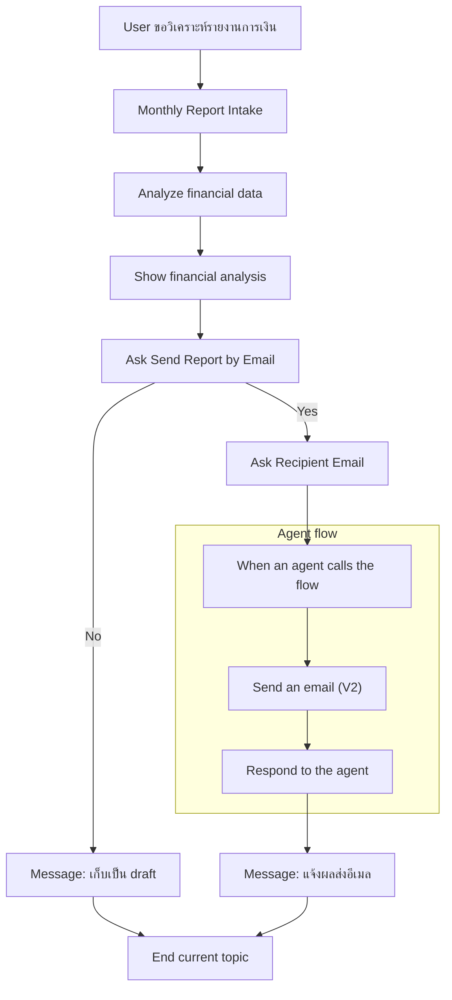
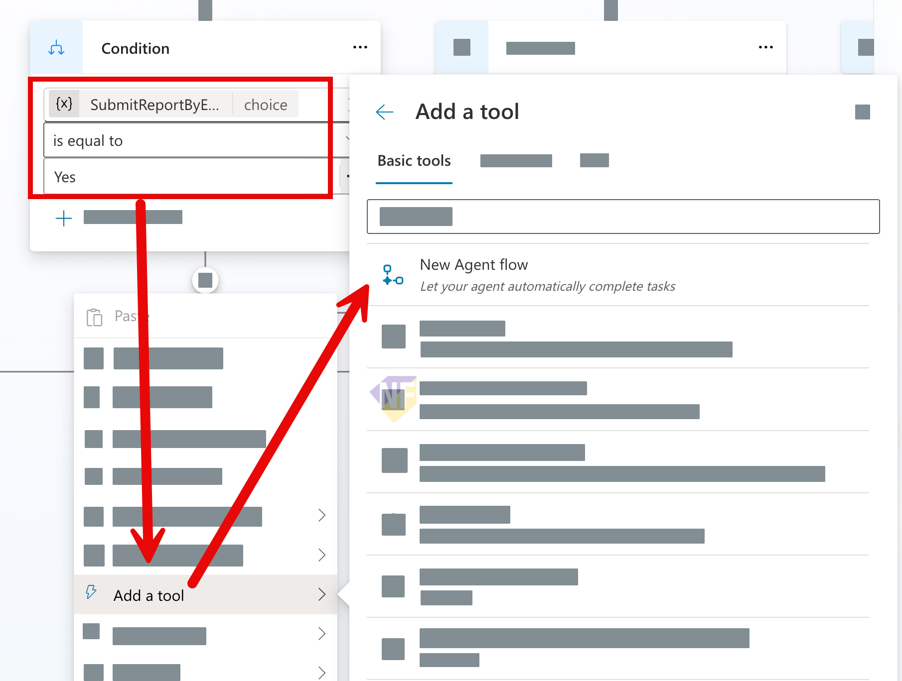
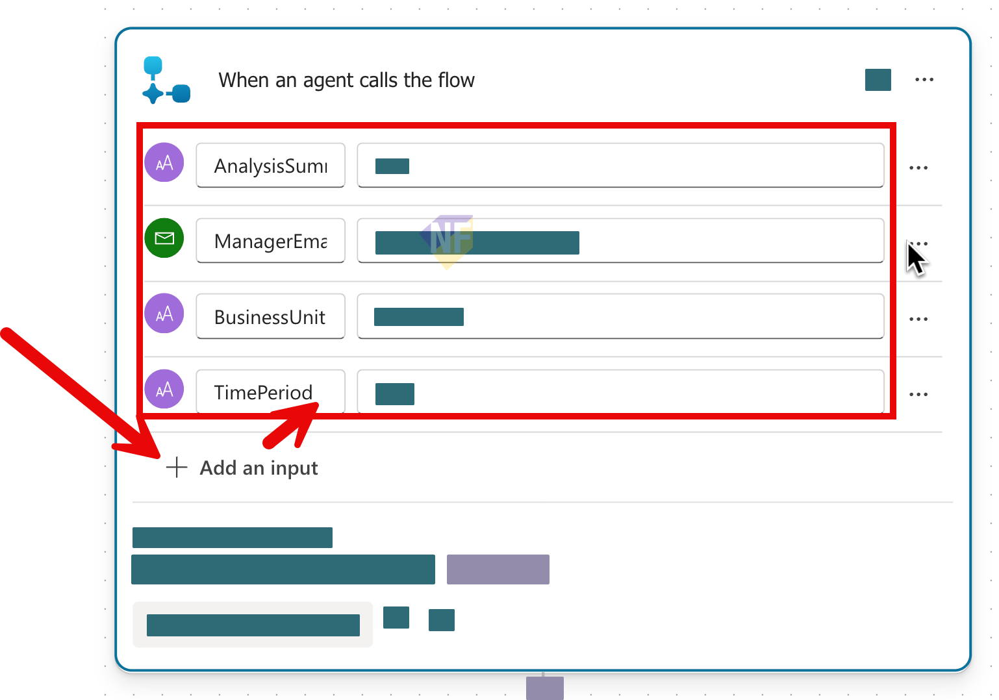
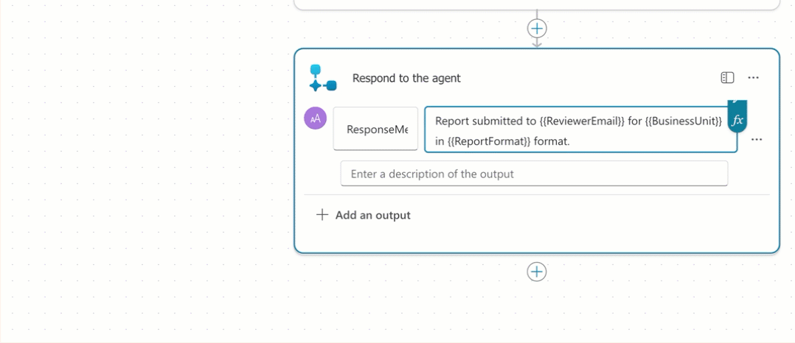

# แบบฝึกหัดที่ 2: เพิ่ม Agent Flow สำหรับส่งอีเมลสรุปรายงาน

🔑 **ต้องการ M365 Copilot License + สิทธิ์เข้าใช้ Copilot Studio**

แบบฝึกหัดนี้จะต่อยอดจาก Agent เดิมให้ทำงานแบบ end-to-end มากขึ้น หลังจากวิเคราะห์รายงานเสร็จแล้ว ผู้ใช้สามารถสั่งให้ Agent **ส่งสรุปรายงานทางอีเมล** ไปยังผู้รับที่ต้องการได้ผ่าน **Agent Flow** ที่รับค่าจาก Topic แล้วส่งผลลัพธ์กลับมาที่บทสนทนาเดิม

> ⚠️ **Note:** ก่อนเริ่มแบบฝึกหัดนี้ แนะนำให้ทำตามลำดับนี้ก่อน
> - Module 2 Exercise 1-4 เพื่อให้มี Topic `Monthly Report Intake` และตัวแปรผลวิเคราะห์
> - Module 4 Exercise 1 เพื่อคุ้นกับการออกแบบ flow/route และการ map ตัวแปรใน module นี้
>
> ในแบบฝึกหัดนี้คาดหวังว่าใน Topic `Monthly Report Intake` มี output เช่น `FinancialAnalysisResult` และมี Message node ที่แสดงผลวิเคราะห์แล้ว



---

## Practice 1: ทบทวน flow เดิมและกำหนดเป้าหมายของ action

1. เปิด Agent `Financial Report Assistant`
2. ไปที่ Topic `Monthly Report Intake` แล้วทบทวนว่า flow เดิมทำอะไรได้แล้วบ้าง เช่น
   - รับค่า `BusinessUnit`
   - รับค่า `ReportPeriod`
   - วิเคราะห์ข้อมูล
   - เก็บผลลัพธ์ในตัวแปร `FinancialAnalysisResult`
   - แสดงผลผ่าน Message node
3. กำหนดเป้าหมายของแบบฝึกหัดนี้ว่า หลังจากแสดงผลวิเคราะห์แล้ว Agent จะถามผู้ใช้ต่อว่า

   ```text
   ต้องการส่งสรุปรายงานนี้ทางอีเมลหรือไม่
   ```

4. ถ้าผู้ใช้ตอบว่าใช่ ให้ Agent เรียก Tool ที่เชื่อมกับ Agent Flow เพื่อส่งอีเมล

> 💡 **Tip:** เริ่มจาก flow ที่ simple และส่งได้จริงก่อน แล้วค่อยเพิ่มความซับซ้อนในรอบถัดไป

---

## Practice 2: เตรียม Topic ให้พร้อมสำหรับเรียก Agent Flow

1. จากเส้นทางหลังแสดงผลวิเคราะห์ ให้เพิ่ม **Question** node

   ### Node name
   ```text
   Ask Send Report by Email
   ```

   ### Message
   ```text
   คุณต้องการส่งสรุปรายงานนี้ทางอีเมลหรือไม่?
   ```

   ### Identify
   ```text
   Multiple choice of options
   ```

   ### Options
   ```text
   Yes
   ```
   ```text
   No
   ```

   ### Save user response as
   ```text
   SubmitReportByEmailAnswer
   ```

2. ที่เส้นทางคำตอบ `Yes` ให้ตั้งชื่อ node ว่า

   ```text
   Confirm submit report
   ```

3. ต่อจาก `Confirm submit report` ให้เพิ่ม **Question** node เพื่อเก็บอีเมลผู้รับ

   ### Node name
   ```text
   Ask Recipient Email
   ```

   ### Message
   ```text
   กรุณาระบุอีเมลผู้รับที่ต้องการส่งสรุปรายงาน
   ```

   ### Identify
   ```text
   Entire response
   ```

   ### Save user response as
   ```text
   ReviewerEmail
   ```

4. กด **Save**

> 💡 **Tip:** ตัวแปร `ReviewerEmail` จะถูก map เข้ากับ input ของ Agent Flow ในขั้นตอนถัดไป

---

## Practice 3: สร้าง Agent Flow และใช้ Send an email (V2)

1. ต่อจาก node `Ask Recipient Email` ให้เลือก **Add a tool > New Agent flow**
   
2. เข้า Agent flow designer แล้วกด **Save draft**
   
3. ตั้งชื่อ flow เป็น

   ```text
   Send Monthly Report Summary Email
   ```

4. ที่ action `When an agent calls the flow` ให้เพิ่ม input parameters อย่างน้อย 4 ค่า

   ```text
   BusinessUnit (text)
   ```
   ```text
   TimePeriod (text)
   ```
   ```text
   AnalysisSummary (text)
   ```
   ```text
   ReviewerEmail (email)
   ```
   

5. เพิ่ม action `Send an email (V2)` จาก Office 365 Outlook แล้วตั้งค่าหลักดังนี้

   ### To
   ```text
   ReviewerEmail
   ```

   ### Subject
   ```text
   Monthly report summary for {{BusinessUnit}} - {{TimePeriod}}
   ```

   ### Body
   ```html
   <p>Hello,</p>
   <p>Here is the monthly report summary for <strong>{{BusinessUnit}}</strong> in <strong>{{TimePeriod}}</strong>.</p>
   <p>{{AnalysisSummary}}</p>
   ```

6. ที่ action `Respond to the agent` ให้สร้าง output เช่น

   ```text
   ResponseMessage
   ```

7. กำหนดค่า output ตัวอย่าง

   ```text
   Report summary sent to {{ReviewerEmail}} for {{BusinessUnit}} in {{TimePeriod}}.
   ```

8. ทำการ map ค่าตัวแปรจาก input parameters ให้ครบ
   
9. กด **Save draft** และ **Publish**

> ⚠️ **Note:** สำหรับแบบฝึกหัดนี้ให้ใช้ `ResponseMessage` เป็นผลลัพธ์หลักที่ส่งกลับไปแสดงใน Topic

---

## Practice 4: ต่อ Topic เดิมให้เรียก Tool

1. กลับไปหน้า Agent Designer แล้วเปิด Topic `Monthly Report Intake`
2. ต่อจาก node `Ask Recipient Email` ให้เพิ่ม **Add a Tool** แล้วเลือก Agent Flow `Send Monthly Report Summary Email`
   
3. map ค่า input ของ Tool ดังนี้

   #### BusinessUnit
   ```text
   BusinessUnit
   ```

   #### TimePeriod
   ```text
   ReportPeriod
   ```

   #### AnalysisSummary
   ```text
   FinancialAnalysisResult.text
   ```

   #### ReviewerEmail
   ```text
   ReviewerEmail
   ```

4. สร้าง output variable ใหม่ เช่น

   ```text
   SubmitMonthlyReportResultMessage
   ```

5. เพิ่ม **Message** node ต่อจาก Tool node

   #### Node name
   ```text
   Show submit report result
   ```

   #### Message
   ```text
   {{SubmitMonthlyReportResultMessage}}
   ```

6. ปิดท้ายเส้นทางนี้ด้วย **End current topic**
7. ในเส้นทาง `No` ให้แสดงข้อความยืนยันว่าเก็บเป็น draft แล้ว จากนั้น **End current topic**

---

## Practice 5: ทดสอบ Happy Path และ Cancel Path

1. เปิด **Test your agent**
2. เริ่มด้วย prompt ตัวอย่าง

   ```text
   ช่วยสรุปรายงานการเงินของ BU Aromatics
   ```

3. ตอบค่าระหว่างทางจนได้ผลวิเคราะห์จาก `FinancialAnalysisResult`
4. ทดสอบ **Happy Path** โดยตอบ

   ```text
   Yes
   ```

5. ใส่อีเมลผู้รับ เช่น

   ```text
   finance-manager@pttgc.example
   ```

6. Expected result (ตัวอย่าง)

   ```text
   Report summary sent to finance-manager@pttgc.example for Aromatics in May 2026.
   ```

7. ทดสอบ **Cancel Path** อีกครั้ง โดยตอบ

   ```text
   No
   ```

8. Expected result ของเส้นทางนี้
   - ระบบไม่เรียก Tool
   - ระบบแจ้งว่าเก็บ draft ไว้เรียบร้อยแล้ว
   - Topic จบอย่างปลอดภัย

---

## สรุป

ในแบบฝึกหัดนี้ คุณได้เพิ่ม action เชิงธุรกิจให้ Agent เดิม โดยเรียก Agent Flow เพื่อส่งอีเมลสรุปรายงาน และส่งผลลัพธ์กลับมาแสดงใน Topic เดิม ทำให้ Agent ไม่ได้แค่วิเคราะห์ข้อมูล แต่เริ่มทำงานต่อเนื่องแบบ workflow ได้จริง

ขั้นตอนถัดไป → [กลับไปสารบัญ Module 4](../README.md)
