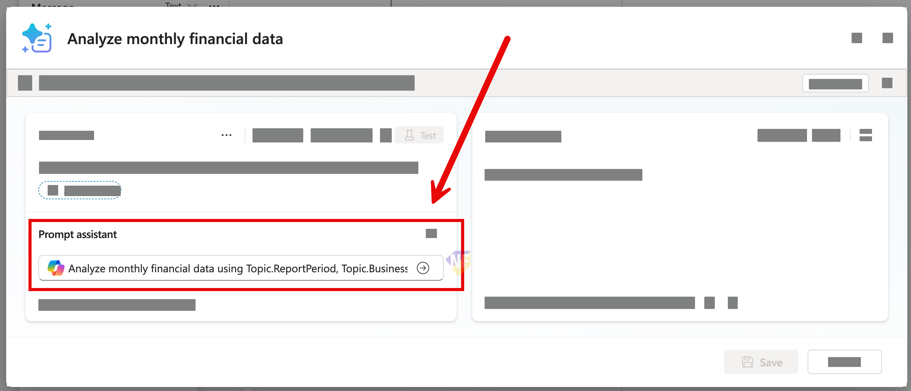
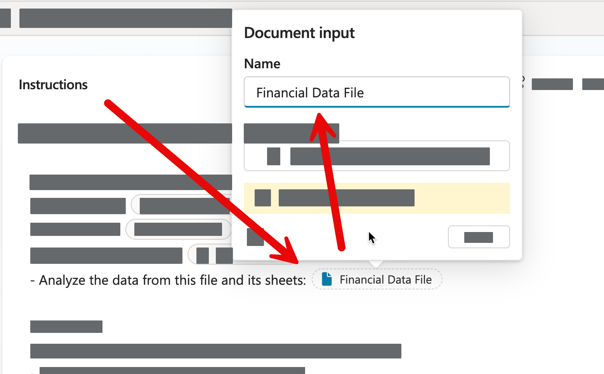

# แบบฝึกหัดที่ 2: วิเคราะห์ Financial Workbook ด้วย Prompt

เราจะเพิ่ม `Prompt` ให้ Topic วิเคราะห์ workbook หนึ่งไฟล์ และเก็บผลลัพธ์ใน `FinancialAnalysisResult`

> **License:** ต้องมีสิทธิ์ใช้ `Prompt` และ `Code interpreter` ใน `Copilot Studio`; ผู้ใช้ต้อง authenticate และความพร้อมของ Excel input ต้องตรวจสอบก่อนเริ่มอบรม

## Prerequisites

- [PTT-Monthly-Financial-Report-May2026.xlsx](../../../files/module-4/PTT-Monthly-Financial-Report-May2026.xlsx)
- Topic จาก Exercise 1

> **⚠️ Note:** Prompt นี้รับหนึ่งไฟล์ต่อการเรียกและไม่ใช้สำหรับถามต่อเนื่องหลายรอบเกี่ยวกับไฟล์เดียว หาก file input ใช้งานไม่ได้ ให้ผู้สอนใช้ prepared Prompt output เพื่อเดิน workflow ต่อ

---

## Practice 1: สร้าง Prompt วิเคราะห์ไฟล์

**Primary target:** สร้าง Prompt ที่รับ workbook หนึ่งไฟล์และคืนผลวิเคราะห์ในรูปแบบคงที่

1. เปิด Topic `Monthly Report Intake`
2. หลัง intake confirmation เพิ่ม node `Call an action` > `New Prompt`

   

3. เพิ่ม input ชนิด file ชื่อ `FinancialFile`

   

4. ใช้ Prompt:

   ```text
   Analyze the uploaded synthetic financial workbook for the requested report period and Business Unit.
   Use only values present in the workbook.
   Return Markdown with these sections:
   - Executive summary
   - KPI table
   - Major variances
   - Risks and missing information
   If a required value is unavailable, label it "Not available" and do not estimate.
   ```

5. เปิด `Code interpreter` ใน Prompt settings หาก environment รองรับ
6. ตั้ง output ของ Prompt เป็น `FinancialAnalysisResult`

### Checkpoint

- Prompt มี file input หนึ่งรายการและ output ถูก map ไปที่ `FinancialAnalysisResult`

---

## Practice 2: รัน Workbook Analysis

**Primary target:** สร้างผลวิเคราะห์จาก workbook และแสดงผลโดยไม่แต่งตัวเลข

1. เพิ่ม Message node ที่แสดง `{Topic.FinancialAnalysisResult}`
2. กด `Save` และเปิด `Test your agent`
3. ขอรายงาน ระบุ intake data และอัปโหลด workbook เมื่อ Agent ขอ
4. ตรวจ Revenue หรือ Cost อย่างน้อยสองค่ากับ workbook

### Checkpoint

- Agent แสดงผลวิเคราะห์และตัวเลขที่ตรวจตรงกับ workbook หรือแสดง prepared output เมื่อใช้ fallback

---

## Summary

คุณเชื่อม workbook หนึ่งไฟล์กับ Prompt และเก็บผลในตัวแปรที่ใช้ต่อใน revision loop

## Microsoft Learn Reference

- [Use code interpreter in prompts](https://learn.microsoft.com/en-us/microsoft-copilot-studio/code-interpreter-for-prompts)

ขั้นตอนถัดไป → [Review, Revise, and Confirm](../exercise-3-review-revise-confirm/README.md)
