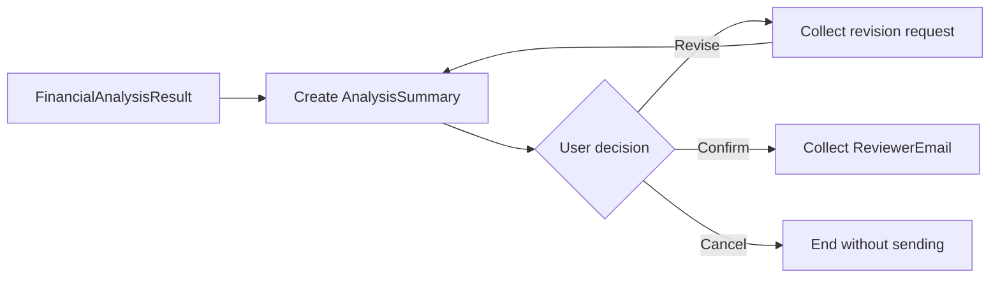

# แบบฝึกหัดที่ 3: Review, Revise, and Confirm

เราจะให้ผู้ใช้ตรวจ draft ขอ revision และยืนยัน version สุดท้ายก่อน Agent เตรียมส่งอีเมล

> **License:** ต้องมีสิทธิ์แก้ไข Topic ใน `Copilot Studio`



---

## Practice 1: สร้าง Review Loop

**Primary target:** สร้าง loop ที่เก็บ draft ใน `AnalysisSummary` และกลับมา review หลัง revision

1. หลัง Prompt node ตั้งค่า `AnalysisSummary` จาก `FinancialAnalysisResult`
2. แสดง Message:

   ```text
   นี่คือ draft สำหรับ review:
   {Topic.AnalysisSummary}
   ```

3. เพิ่ม Question ตัวเลือก `Revise`, `Confirm`, `Cancel`
4. ใน branch `Revise` ถามสิ่งที่ต้องแก้ แล้วใช้ Prompt ปรับเฉพาะรูปแบบหรือจุดที่ผู้ใช้ขอโดยไม่เปลี่ยนตัวเลขต้นทาง
5. บันทึกผลใหม่กลับ `AnalysisSummary` และวนกลับหน้า review

### Checkpoint

- ผู้ใช้ขอ revision แล้วเห็น draft ใหม่ก่อนเลือกอีกครั้ง

---

## Practice 2: เก็บ Confirmation และ Recipient

**Primary target:** เก็บอีเมลผู้รับเฉพาะเมื่อผู้ใช้ยืนยัน draft แล้ว

1. ใน branch `Confirm` เพิ่ม Question:

   ```text
   กรุณาระบุอีเมลผู้รับรายงานที่ยืนยันแล้ว
   ```

2. บันทึกเป็น `ReviewerEmail`
3. ส่งข้อความทวน `ReviewerEmail` และ `AnalysisSummary` แล้วถาม `Send now` หรือ `Cancel`
4. ใน branch `Cancel` ตั้ง `ResponseMessage`:

   ```text
   ยกเลิกแล้ว ยังไม่มีการส่งอีเมล
   ```

5. กด `Save`

### Checkpoint

- Agent เก็บ `ReviewerEmail` หลัง review เท่านั้น และ cancellation จบโดยไม่เรียก Action

---

## Summary

คุณสร้าง revision และ confirmation gate พร้อมตัวแปร `FinancialAnalysisResult`, `AnalysisSummary`, `ReviewerEmail` และ `ResponseMessage`

ขั้นตอนถัดไป → [สร้าง Required Agent Flow Email](../exercise-4-required-agent-flow-email/README.md)
