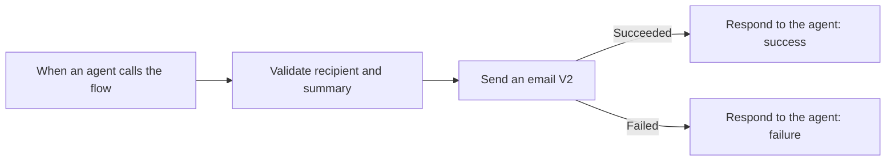
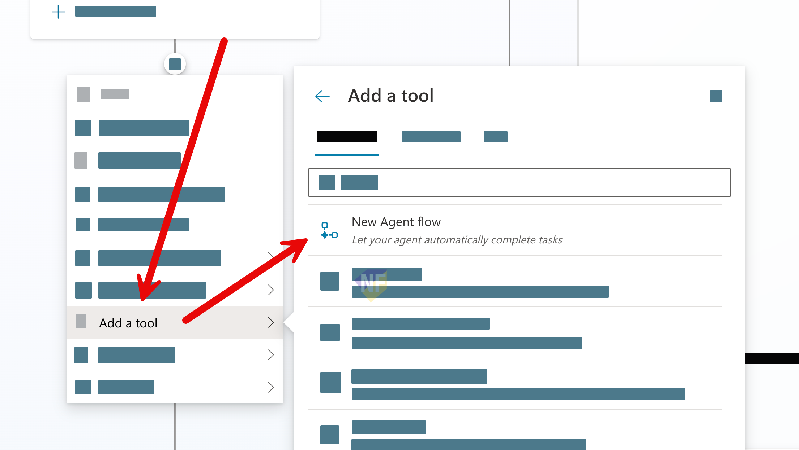
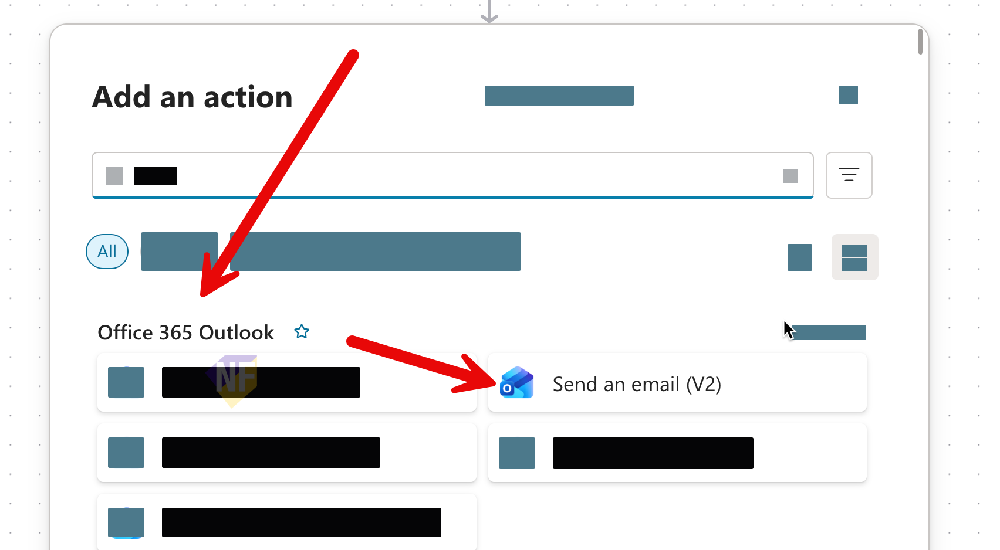
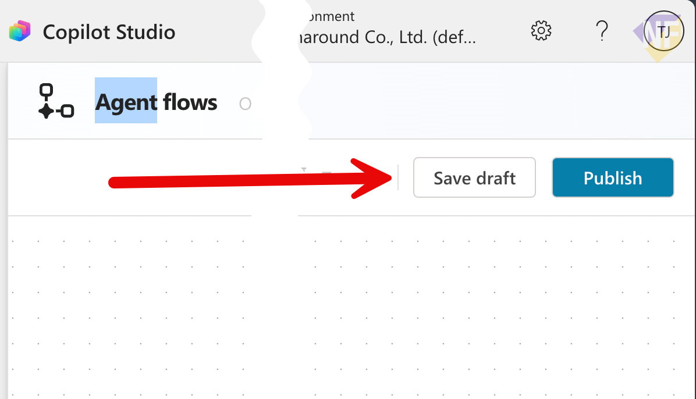

# แบบฝึกหัดที่ 4: สร้าง Required Agent Flow Email

เราจะสร้าง Agent Flow ที่ส่งรายงานด้วย `Send an email (V2)` หลังผู้ใช้ยืนยัน และคืน success message เฉพาะเมื่อ email action สำเร็จ

> **License:** ต้องมีสิทธิ์สร้างและ publish `Agent Flow` และใช้ connection ของ `Office 365 Outlook`



---

## Practice 1: สร้าง Flow Contract

**Primary target:** สร้าง Agent Flow ที่รับ recipient และ report summary แล้วตอบผลกลับ Agent แบบ real time

1. ใน Agent เลือก `Tools` > `Add a tool` > `New Agent flow`

   

2. ใช้ trigger `When an agent calls the flow`
3. สร้าง text inputs:
   - `ReviewerEmail`
   - `AnalysisSummary`
4. ตรวจ Flow settings และตั้ง `Asynchronous response` เป็น `Off`
5. เพิ่ม action `Respond to the agent` พร้อม text output ชื่อ `ResponseMessage`

### Checkpoint

- Flow มี trigger และ response action ครบ และ `Asynchronous response` เป็น `Off`

---

## Practice 2: เพิ่ม Send an Email (V2)

**Primary target:** ส่ง `AnalysisSummary` ไปยัง `ReviewerEmail` ด้วย Outlook connection ที่ได้รับอนุญาต

1. ระหว่าง trigger และ response เพิ่ม `Office 365 Outlook` > `Send an email (V2)`

   

2. ตั้งค่า:
   - `To` = `ReviewerEmail`
   - `Subject` = `Monthly financial report for review`
   - `Body` = `AnalysisSummary`
3. ใช้ `Respond to the agent` เดิมเป็น success response หลัง action สำเร็จ และตั้ง `ResponseMessage` เป็น:

   ```text
   ส่งรายงานสำเร็จแล้วไปยังอีเมลที่ยืนยัน
   ```

4. เพิ่ม `Respond to the agent` อีกหนึ่ง action สำหรับ failure response แล้วใช้ `Configure run after` ให้ทำงานเมื่อ `Send an email (V2)` มีสถานะ failed หรือ timed out
5. ตั้ง failure `ResponseMessage` เป็น:

   ```text
   ยังส่งรายงานไม่สำเร็จ กรุณาตรวจสอบ connection และลองใหม่ภายหลัง
   ```

6. ตรวจว่า success response ทำงานเฉพาะเมื่อ email action succeeded และ failure response ทำงานเฉพาะเส้นทางที่กำหนด
7. กด `Save` และ `Publish` Flow

   

### Checkpoint

- Flow อยู่สถานะ Published และ success response เกิดหลัง `Send an email (V2)` สำเร็จเท่านั้น

---

## Practice 3: เชื่อม Flow กับ Confirmed Path

**Primary target:** เรียก Flow หนึ่งครั้งจาก `Send now` branch และแสดง `ResponseMessage`

1. กลับ Topic จาก Exercise 3
2. ใต้ branch `Send now` เพิ่ม Agent Flow ที่ publish แล้ว
3. map `ReviewerEmail` และ `AnalysisSummary` ไปยัง inputs ชื่อเดียวกัน
4. map output กลับ `ResponseMessage`
5. เพิ่ม Message แสดง `{Topic.ResponseMessage}` และกด `Save`
6. ทดสอบหนึ่งครั้งด้วยอีเมลฝึกอบรมที่ได้รับอนุญาต

### Checkpoint

- Confirmed request ส่งอีเมลหนึ่งฉบับและแสดง success หลังส่งสำเร็จ ภายในเป้าหมายต่ำกว่า 100 วินาที

> **⚠️ Note:** Agent action มีเวลาตอบกลับตามข้อจำกัดของระบบ ควรออกแบบ Flow ให้เสร็จต่ำกว่า 100 วินาทีและไม่เพิ่มขั้นตอนรออนุมัติภายใน Flow นี้

---

## Summary

คุณสร้าง required Agent Flow ที่มี trigger, email action, synchronous response และ confirmation gate ครบ

## Microsoft Learn Reference

- [Add an agent flow to an agent](https://learn.microsoft.com/en-us/microsoft-copilot-studio/flow-agent)
- [Run an agent flow asynchronously](https://learn.microsoft.com/en-us/microsoft-copilot-studio/flow-asynchronous-response)

ขั้นตอนถัดไป → [ทดสอบ Email Paths](../exercise-5-test-email-paths/README.md)
