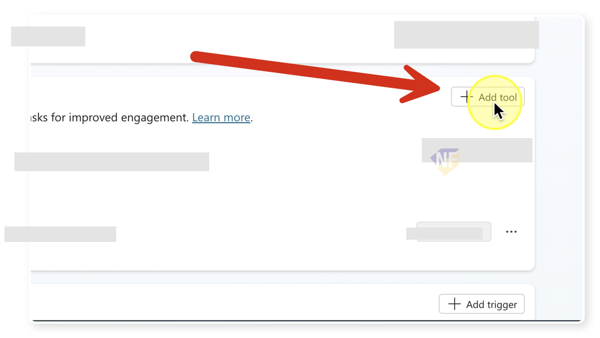
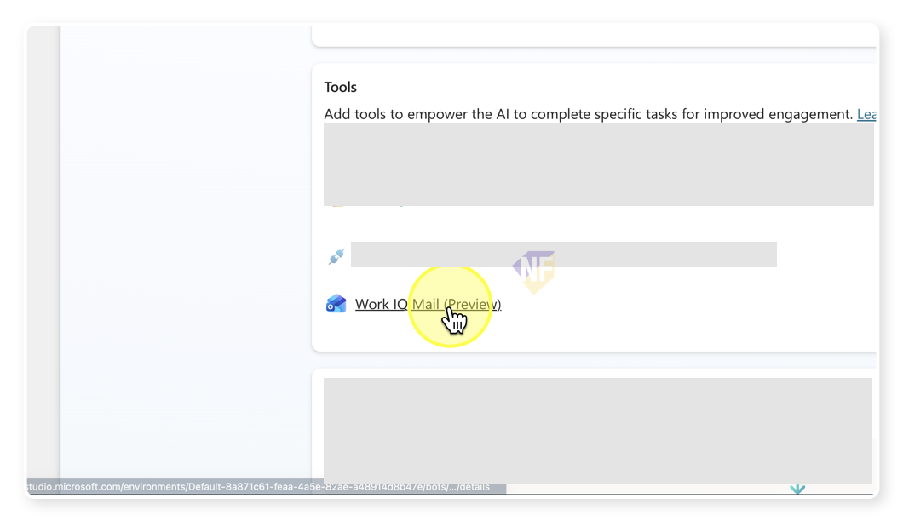

# แบบฝึกหัดที่ 6 (Optional): เปรียบเทียบ Work IQ Mail MCP

กิจกรรมเสริมนี้ให้ลอง `Work IQ Mail` ซึ่งเป็น MCP server แบบ `Preview` แล้วเปรียบเทียบกับ required Agent Flow โดยไม่ทำให้เกิดการส่งอีเมลซ้ำ

> **License:** ต้องมีสิทธิ์ใช้ Microsoft 365 Copilot, `Copilot Studio`, Outlook mailbox และ tenant ต้องอนุญาต `Work IQ Mail` Preview ก่อนเริ่ม

> **⚠️ Note:** ชื่อ capability และ parameters ของ Preview อาจเปลี่ยนได้ Exercise นี้ไม่ใช่ prerequisite ของ Module 5

---

## Practice 1: เพิ่ม Work IQ Mail เป็น Optional Tool

**Primary target:** เชื่อม Work IQ Mail กับ Agent ใน environment ที่ได้รับอนุญาต

1. สร้างสำเนา Agent สำหรับ optional test หรือปิด Agent Flow email tool ชั่วคราว
2. ตรวจให้แน่ใจว่า active email route มีเพียงหนึ่งเส้นทาง
3. ที่ `Overview` เลือก `Tools` > `Add a tool`

   

4. ค้นหา `Work IQ Mail` และสร้าง connection ตาม policy ของชั้นเรียน
5. ตรวจ actions ที่ tenant แสดง แล้วกด `Save`

   

### Checkpoint

- Work IQ Mail พร้อมทดสอบและ Agent Flow email route ไม่ active ใน Agent สำเนานี้

---

## Practice 2: เปรียบเทียบกับ Agent Flow

**Primary target:** สรุป trade-off ของ MCP และ Agent Flow จากผลทดสอบหนึ่งกรณี

1. ใช้ recipient และ body จำลองเดียวกับ required flow
2. ขอให้ Agent แสดง draft และรอ confirmation ก่อนส่ง
3. ส่งหนึ่งครั้ง แล้วตรวจ mailbox
4. เติมตาราง:

   ```text
   Route: Work IQ Mail MCP / Agent Flow
   Setup effort:
   Control and validation:
   Preview dependency:
   Observed result:
   Recommended classroom route:
   ```

5. เปิด Agent Flow route กลับเมื่อจบการทดลอง และปิด MCP route ใน Agent ที่ใช้ทดสอบ required path

### Checkpoint

- มี comparison ที่ระบุว่า Agent Flow เป็น required route และการทดสอบส่งอีเมลเพียงหนึ่งฉบับ

---

## Summary

คุณเห็นความต่างระหว่าง Preview MCP route กับ Agent Flow โดยไม่เพิ่ม dependency ให้ Module 5

## Microsoft Learn Reference

- [Work IQ Mail MCP server](https://learn.microsoft.com/en-us/microsoft-copilot-studio/mcp-mail-work-iq)

ขั้นตอนถัดไป → [Module 5](../../module-5/README.md)
