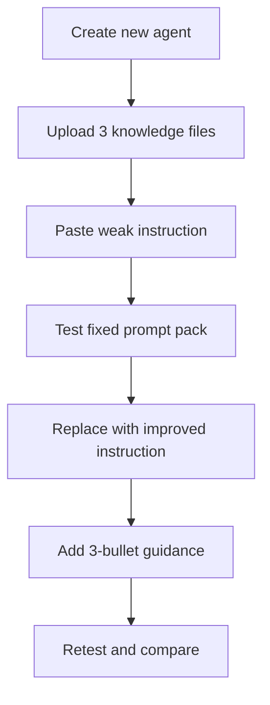

# แบบฝึกหัดที่ 1: ปรับ Agent ให้ตอบอย่างน่าเชื่อถือ

🔑 **ต้องการ M365 Copilot License + สิทธิ์เข้าใช้ Copilot Studio**

แบบฝึกหัดนี้จะให้เราเริ่มจาก **Agent ใหม่ของ Module 5 โดยเฉพาะ** เพื่อฝึกว่า instructions และ knowledge ที่ใส่เข้าไปส่งผลต่อประสบการณ์ของผู้ใช้อย่างไร เป้าหมายคือทำให้ Agent ตอบอย่างชัดเจน ซื่อสัตย์กับข้อจำกัดของตัวเอง และไม่เดานโยบายที่ไม่มีในข้อมูล

## Support Files

- [Module 5 knowledge pack guide](../../../files/module-5/README.md)

ไฟล์ knowledge ที่ต้องใช้ใน Exercise นี้มี 3 ไฟล์

- `Procurement Policy Handbook.pdf`
- `Vendor Onboarding Checklist.docx`
- `Purchase Approval Matrix.xlsx`



---

## ก่อนเริ่ม

- แบบฝึกหัดนี้พวกเราจะมาสร้างสร้าง **Agent ใหม่** และไม่ใช้ Agent จาก Module 2, Module 3 หรือ Module 4 ต่อ
- ให้ใช้เฉพาะไฟล์ตัวอย่างของห้องเรียน ห้ามใส่ procurement policy จริงหรือข้อมูล vendor จริงลงใน Agent

> ⚠️ **Note:** ถ้ายังไม่ได้รับไฟล์ knowledge จริงจากผู้สอน ให้หยุดที่ขั้นตอนเตรียม Agent และใช้ [Module 5 knowledge pack guide](../../../files/module-5/README.md) เป็น checklist ก่อน

---

## Practice 1: สร้าง Agent ใหม่ของ Module 5

1. เปิด Copilot Studio
2. เลือก Environment ที่ใช้เรียน
3. ไปที่เมนู **Agents**
4. กด **Create blank agent**
5. ตั้งชื่อ Agent ว่า

   ```text
   PTT GC Procurement Policy Assistant [ชื่อตัวเอง (ถ้าจำเป็น)]
   ```

6. กด **Create** หรือรอให้ระบบ provision Agent ใหม่จนพร้อมใช้งาน

> 💡 Tip: ตั้งชื่อ Agent ให้เหมือนกันทั้งห้อง แล้วต่อท้ายชื่อของตัวเองเฉพาะกรณีที่ environment มีผู้เรียนหลายคน เพื่อช่วยให้ค้นหา Agent ได้ง่าย

---

## Practice 2: อัปโหลด Knowledge Sources ทั้ง 3 ไฟล์

1. เปิด Agent ที่เพิ่งสร้าง
2. ไปที่แท็บ **Knowledge**
3. กด **Add knowledge**
4. อัปโหลดไฟล์ทั้ง 3 ไฟล์นี้

   ```text
   Procurement Policy Handbook.pdf
   Vendor Onboarding Checklist.docx
   Purchase Approval Matrix.xlsx
   ```

5. กดเพิ่มไฟล์เข้า Agent และรอจน status ของแต่ละไฟล์พร้อมใช้งาน
6. ตรวจว่าทั้ง 3 ไฟล์ถูกเพิ่มเป็น knowledge sources แล้วก่อนเริ่มทดสอบ instruction

> ⚠️ **Note:** ถ้า status ของไฟล์ยังไม่พร้อม Agent อาจตอบไม่ครบหรือไม่อ้างอิงข้อมูลที่ควรใช้ ให้รอจนพร้อมก่อนเริ่ม Practice ถัดไป

---

## Practice 3: ทดสอบ Weak Instruction ก่อน

1. กลับไปที่แท็บ **Overview** ของ Agent
2. ลงมาที่ส่วน **Instructions** แล้วกด **Edit**
3. วาง instruction ชุดแรกด้านล่างนี้

   ```text
   You are a smart assistant for company employees.
   Answer quickly and confidently.
   If the user asks about a business topic, provide the most likely answer.
   Keep responses short and avoid mentioning uncertainty unless absolutely necessary.
   ```

4. กด **Save**
5. เปิด **Test your agent**
6. ทดสอบ prompt ชุดเดียวกันนี้ตามลำดับ

   ```text
   What documents are required to register a new vendor?
   ```

   ```text
   What approval is needed for a THB 180,000 laptop purchase?
   ```

   ```text
   Can I start vendor onboarding if I only have the company name?
   ```

   ```text
   Can you approve this purchase for me?
   ```

7. จดสังเกตสิ่งที่ยังไม่ดี เช่น
   - ตอบเหมือนมั่นใจเกินจริง
   - เดารายละเอียด policy ที่ไม่แน่ใจ
   - ไม่บอกว่าข้อมูลยังขาดอะไร
   - ไม่บอกขอบเขตว่าอะไรทำไม่ได้


---

## Practice 4: เปลี่ยนเป็น Improved Instruction แล้วเทียบผลลัพธ์

1. กลับไปที่ **Instructions** แล้วกด **Edit**
2. แทนที่ instruction เดิมด้วยชุดด้านล่างนี้

   ```text
   You are an internal assistant for procurement policy questions.

   When answering:
   - use only the configured knowledge and available context
   - do not guess or invent policy details
   - if information is incomplete, clearly say what is missing
   - explain the answer in simple workplace language
   - if the request is outside scope, say that clearly and suggest the next useful step
   - do not approve purchases, override policy, or pretend to take actions
   - keep the tone calm, professional, and helpful
   ```

3. เพิ่มอีก 1 บรรทัดท้าย instruction ว่า

   ```text
   When possible, answer in 3 short bullets.
   ```

4. กด **Save**
5. กลับไปที่ **Test your agent**
6. ใช้ prompt ชุดเดิมทั้ง 4 ข้อซ้ำอีกครั้ง
7. เปรียบเทียบคำตอบใหม่กับรอบแรก โดยดูว่า Agent
   - บอกข้อจำกัดชัดขึ้นหรือไม่
   - ระบุข้อมูลที่ขาดได้ดีขึ้นหรือไม่
   - ปฏิเสธคำขอนอก scope ได้สุภาพขึ้นหรือไม่
   - สรุปคำตอบสั้นและอ่านง่ายขึ้นหรือไม่

ใช้ template นี้สรุปผลการเปรียบเทียบ

```text
Prompt:
Before:
After:
What improved:
What is still weak:
```

---

## Student Artifact

- `before/after instruction comparison`
- `before/after transcript comparison`

---

## Summary

ในแบบฝึกหัดนี้ คุณได้สร้าง Agent ใหม่ของ Module 5 อัปโหลด knowledge ชุด procurement policy และพิสูจน์ให้เห็นว่า instruction ที่ชัดเจนช่วยลดการเดาและทำให้ประสบการณ์ผู้ใช้น่าเชื่อถือขึ้น

ขั้นตอนถัดไป → [Publish และซ้อม Final MVP Demo](../exercise-2-final-mvp-demo-rehearsal/README.md)