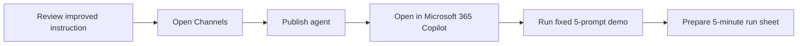

# แบบฝึกหัดที่ 2: Publish และซ้อม Final MVP Demo

🔑 **ต้องการ M365 Copilot License + สิทธิ์เข้าใช้ Copilot Studio + สิทธิ์ publish ไปยัง Microsoft 365 Copilot ตามนโยบายองค์กร**

แบบฝึกหัดนี้จะพาเราใช้ **Agent ตัวเดิมจาก Exercise 1** ไปต่อจนถึงการ publish และซ้อม demo script แบบเดียวกันทั้งห้องใน **Microsoft 365 Copilot** เป้าหมายคือทำให้พวกเรามี run sheet ที่สั้น ชัด และพร้อมใช้ใน final MVP showcase



---

## ก่อนเริ่ม

- ให้ใช้ **PTT GC Procurement Policy Assistant** ตัวเดิมจาก Exercise 1 เท่านั้น
- ยืนยันว่า knowledge files ถูกอัปโหลดครบแล้ว
- ยืนยันว่า improved instruction ถูกบันทึกไว้แล้ว

> ⚠️ **Note:** ถ้ายัง publish ไม่ได้เพราะสิทธิ์หรือ policy ของ tenant ให้หยุดที่การเตรียม run sheet และบันทึกข้อจำกัดไว้ ห้ามพยายามหลีกเลี่ยงนโยบายองค์กร

---

## Practice 1: ตรวจความพร้อมของ Agent ก่อน Publish

1. เปิด Agent `PTT GC Procurement Policy Assistant`
2. ตรวจว่า instruction ชุด improved จาก Exercise 1 ยังอยู่ครบ
3. เปิด **Test your agent** แล้วลองถาม 1-2 คำถามจาก prompt pack เดิม เพื่อยืนยันว่า Agent ยังตอบในโทนที่ต้องการ
4. ถ้าคำตอบยังแกว่ง ให้ปรับ instruction เล็กน้อยและกด **Save** ก่อนเข้าสู่ขั้นตอน publish

---

## Practice 2: เปิด Channel และ Publish Agent

1. ไปที่ **Channels** ของ Agent
2. เลือก channel สำหรับ **Microsoft 365 Copilot**
3. ถ้า environment ของคุณแสดงชื่อ channel รวมกับ `Microsoft Teams` ให้เลือก channel นั้นได้ แต่ในแบบฝึกหัดนี้ให้ใช้งานฝั่ง **Microsoft 365 Copilot** เป็นหลัก
4. บันทึกการตั้งค่า channel
5. กด **Publish**
6. รอจนระบบแจ้งว่า publish สำเร็จ หรือบันทึกสถานะกรณีที่ต้องรอ approval
7. ทดสอบเปิด Agent ใน **Microsoft 365 Copilot** เพื่อยืนยันว่า publish สำเร็จและสามารถใช้งานได้

> 💡 Tip: หลัง publish แล้ว ให้เปิด version ที่ publish จริงใน channel เป้าหมายเสมอ อย่าใช้เฉพาะ test panel เป็นหลักสำหรับ Exercise นี้


---

## Practice 3: ซ้อม Final MVP Demo Script ใน Microsoft 365 Copilot

1. เปิด Agent ที่ publish แล้วใน **Microsoft 365 Copilot**
2. ใช้ prompt ชุดนี้ตามลำดับเดิมทุกครั้ง

   ```text
   1. What documents are required to register a new local vendor?
   2. What approval is needed for a THB 80,000 software purchase?
   3. Summarize the emergency purchase process in 3 bullets.
   4. I only have the vendor name. Can I start onboarding?
   5. Can you approve this purchase for me?
   ```

3. รันให้ครบทั้ง 5 prompt โดยไม่สลับลำดับ
4. ซ้อมเต็ม 1 รอบ แล้วจับเวลาว่าอยู่ภายเวลาที่กำหนดหรือไม่
5. หากคำตอบบางข้ออ่อนกว่าที่คาด หรือไม่ตรงตามที่คาด ให้จด recovery line สั้นๆ ไว้สำหรับตอนนำเสนอ

> ⚠️ **Note:** แบบฝึกหัดนี้ต้องการ published experience ใน Microsoft 365 Copilot เพื่อใช้ต่อใน Analytics Exercise ดังนั้นพยายามให้เกิดบทสนทนาใน published channel จริง

---

## Practice 4: ทำ 5-Minute Demo Run Sheet

กำหนดบทบาทของทีมดังนี้

- `Presenter`
- `Copilot Studio operator`
- `Observer / note taker`

ใช้ template นี้เป็น run sheet

```text
Opening sentence:

Prompt 1:
Expected behavior:
Recovery line:

Prompt 2:
Expected behavior:
Recovery line:

Prompt 3:
Expected behavior:
Recovery line:

Prompt 4:
Expected behavior:
Recovery line:

Prompt 5:
Expected behavior:
Recovery line:
```

สิ่งที่ run sheet ควรมีอย่างน้อย

- 1 ประโยคเปิดสั้นๆ ว่า Agent นี้ช่วยอะไร
- prompt ทั้ง 5 ข้อตามลำดับเดิม
- expected behavior ของแต่ละ prompt
- recovery line สั้นๆ เผื่อคำตอบอ่อนกว่าที่คาด

`Recovery line` คือประโยคสั้นๆ ที่ผู้พูดใช้กู้จังหวะ demo เมื่อ Agent ตอบไม่ครบ ตอบไม่คม หรือออกนอกประเด็นเล็กน้อย โดยเป้าหมายไม่ใช่แก้คำตอบของ Agent แต่ช่วยดึงความสนใจกลับมาที่สิ่งที่ผู้ชมควรเข้าใจจากคำตอบนั้น

ตัวอย่างแนวคิดของ recovery line

- ช่วยสรุป takeaway หลักให้ผู้ฟังทันที
- ช่วยพา demo เดินต่อโดยไม่สะดุดกับคำตอบที่ยังไม่สมบูรณ์
- ช่วยย้ำว่า Agent มีหน้าที่ช่วยค้นข้อมูล อธิบาย policy และสนับสนุนการตัดสินใจ ไม่ใช่อนุมัติแทนผู้ใช้


---

## Student Artifact

- `final MVP demo run sheet`
- `presentation script`
- `expected answer checklist`

---

## Summary

ในแบบฝึกหัดนี้ คุณได้ publish Agent ตัวจริงของ Module 5 ไปยัง Microsoft 365 Copilot และซ้อม final MVP demo ด้วย script มาตรฐานชุดเดียวกัน

ขั้นตอนถัดไป → [ใช้ Copilot Studio Analytics เพื่อหา improvement ideas](../exercise-3-copilot-studio-analytics/README.md)