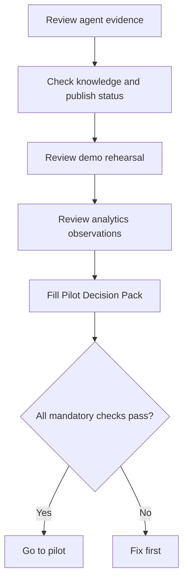

# แบบฝึกหัดที่ 4: สรุปความพร้อมด้วย Pilot Decision Pack

🔑 **ต้องการ M365 Copilot License + สิทธิ์เข้าใช้ Copilot Studio + หลักฐานจาก Exercise 2 และ Exercise 3**

แบบฝึกหัดนี้จะให้เราใช้ **Agent ตัวเดิมจากทั้ง Module 5** มาสรุปความพร้อมก่อนเข้าสู่ controlled pilot โดยใช้ decision rule เดียวกันทั้งห้อง เป้าหมายไม่ใช่ทำเอกสารให้ยาว แต่คือทำให้ทีมตอบได้ชัดว่าควร `Go to pilot` หรือ `Fix first`

## Fixed Pilot Setup

- audience: `15 Procurement Operations users`
- duration: `2 weeks`
- channel: `Microsoft 365 Copilot`
- sponsor: `Head of Procurement Operations`



---

## Practice 1: รวบรวม Evidence ที่ต้องใช้ตัดสินใจ

1. เปิด Agent `PTT GC Procurement Policy Assistant`
2. ทบทวนสิ่งต่อไปนี้
   - **Overview**
   - **Instructions**
   - **Knowledge**
   - **Channels**
   - **Publish status**
   - ผลจาก Exercise 2
    - ผลจาก Exercise 3
3. เปิด run sheet และ analytics worksheet ของทีมไว้ข้างกัน
4. ตรวจว่าทีมมี owner สำหรับ Agent นี้ชัดเจนแล้วก่อนกรอกเอกสาร

> ⚠️ **Note:** ถ้า Exercise 3 ใช้ `classroom fallback` เพราะ Analytics ยังไม่ขึ้นทันเวลา ให้ใช้ observation sheet ชุดนั้นต่อได้ แต่ต้องบอกให้ชัดว่าเป็นหลักฐาน fallback

---

## Practice 2: เติม Pilot Decision Pack แบบ 1 หน้า

ใช้ template นี้

```text
Use case:
Target users:
In scope:
Out of scope:
Owners:
Top risks:
Mitigations:
Weekly KPIs:
Pilot timeline:
```

ข้อกำหนดของ Exercise นี้

- ใช้ use case เดิมของ Module 5 เท่านั้น
- target users ใช้ค่าคงที่ตาม fixed pilot setup
- ใส่ owner ให้ชัดว่าใครดูแล content และใครดูแล pilot feedback
- KPI อย่างน้อย 2 ข้อควรเป็นสิ่งที่ทีมติดตามได้จริงระหว่าง pilot

ตัวอย่าง KPI ที่ใช้ได้

- ผู้ใช้ถามแล้วได้คำตอบที่อยู่ใน scope โดยไม่ต้องเริ่มใหม่กี่ครั้ง
- คำถามเรื่อง approval request ถูกปฏิเสธและ redirect อย่างถูกต้องหรือไม่
- ผู้ใช้เข้าใจว่าต้องเตรียมเอกสารอะไรเพิ่มหลังถาม onboarding question หรือไม่

---

## Practice 3: ใช้ Mandatory Checks list

ตรวจ mandatory checks ให้ครบ

- agent is published or submitted for approval
- knowledge files are attached
- the approval-request prompt is handled correctly
- the final demo script from Exercise 2 works acceptably
- analytics observations from Exercise 3 are completed (live Analytics or classroom fallback)
- owners are assigned
- two KPIs are filled in

ลองใช้เงื่อนไข decision rule นี้เพื่อช่วยตัดสินใจ

```text
Go to pilot = all mandatory checks pass
Fix first = any mandatory check fails
```

เมื่อสรุปแล้ว ให้เขียน final decision ของทีมเพียง 1 บรรทัด

```text
Final decision:
Reason:
Next action this week:
```

> ⚠️ **Note:** ห้ามเลือก `Go to pilot` เพียงเพราะ demo ดูลื่น ถ้ายังไม่มี owner, KPI หรือ analytics observation ที่ครบ ให้สรุป `Fix first` ตามกติกา

---

## Student Artifact

- `completed Pilot Decision Pack`
- `final readiness decision`

---

## Summary

ในแบบฝึกหัดนี้ คุณได้รวบรวมหลักฐานจาก Agent ตัวเดียวกันตลอด Module 5 แล้วใช้ decision rule ที่ชัดเจนเพื่อตัดสินใจว่าพร้อมเข้าสู่ controlled pilot หรือยัง

ขั้นตอนถัดไป → กลับไปที่ [Module 5 overview](../README.md) แล้วเตรียม final showcase สำหรับ Module 6