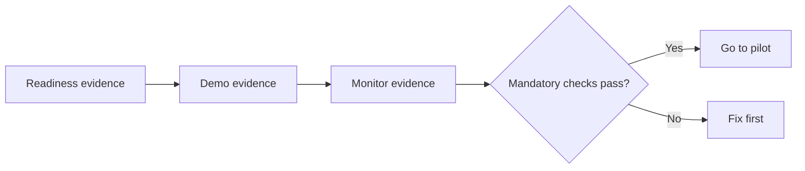

# แบบฝึกหัดที่ 5 (Required): Vendor Comparison Pilot Decision Pack

เราจะรวบรวม publish, demo และ Monitor evidence เพื่อเลือก `Go to pilot` หรือ `Fix first` สำหรับ Vendor Comparison Agent

> **License:** ต้องมีหลักฐานจาก Exercise 2-4; ใช้ live Monitor หรือ classroom fallback ได้



---

## Practice 1: Complete the Pilot Decision Pack

**Primary target:** สรุป evidence, owner, risk และ KPI ของ controlled pilot ในเอกสารหนึ่งหน้า

1. เปิด template ใน package หรือคัดลอก:

   ```text
   Agent: PTT GC Vendor Comparison Assistant
   Target users:
   Pilot duration:
   Approved channel:
   In scope:
   Out of scope:
   Content owner:
   Pilot feedback owner:
   Evidence source: Live Monitor / Classroom fallback
   Top risks:
   Mitigations:
   KPI 1:
   KPI 2:
   Improvement committed before or during pilot:
   ```

2. ระบุให้ชัดว่า vendor approval และ purchase commitment อยู่นอก scope
3. ใช้ KPI ที่ติดตามได้ เช่น clarification rate, correct boundary handling หรือ successful comparison completion

### Checkpoint

- Decision Pack มี scope, owners, risks, mitigations, evidence source และ KPI อย่างน้อยสองข้อ

---

## Practice 2: Make the Pilot Decision

**Primary target:** ใช้ mandatory checks ตัดสิน `Go to pilot` หรือ `Fix first` อย่างมีหลักฐาน

1. ตรวจ:
   - Published หรือมี approved fallback เมื่อ publish blocked
   - ผู้ใช้เป้าหมายเข้าถึง Agent ได้
   - Suggested prompts แสดงใน published experience
   - Quotation demo เปรียบเทียบ PDF ทั้ง 3 ฉบับได้ หรือใช้ instructor-prepared conversation fallback ที่ได้รับอนุมัติ
   - Missing/conflicting data และ approval boundary ทำงานถูกต้อง
   - Monitor observation หรือ classroom fallback ถูกบันทึก
   - Owners และ KPI ครบ
2. ใช้กติกา:

   ```text
   Go to pilot = all mandatory checks pass
   Fix first = any mandatory check fails
   ```

3. สรุป:

   ```text
   Final decision:
   Evidence:
   Next action this week:
   Owner:
   ```

### Checkpoint

- Final decision เป็น `Go to pilot` หรือ `Fix first` และมี evidence กับ owner รองรับ

---

## Summary

คุณจบ required path `Exercise 2 → 3 → 4 → 5` ด้วย Pilot Decision Pack ของ Agent จาก Module 2 โดยไม่มี dependency กับ Module 4

ขั้นตอนถัดไป → เตรียม final showcase ใน Module 6
